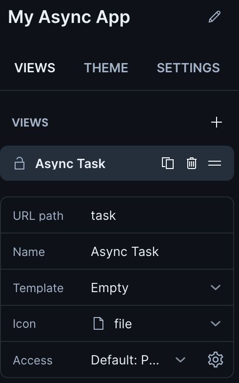
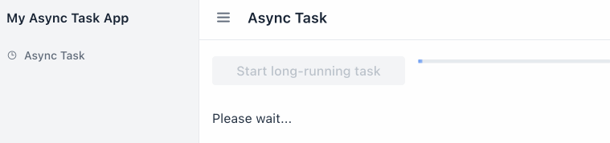

= Displaying a Progress Bar for Async Tasks

== Generate a New Vaadin Project

Generate a new https://start.vaadin.com/app[Vaadin project] with one single view like the screenshot below.

== Enable Spring's Async Method and Vaadin Server Push

Annotate your Application class with `@EnableAsync` and `@Push`.

.Application.java
[source,java]
----
package com.example.application;

import com.vaadin.flow.component.dependency.NpmPackage;
import com.vaadin.flow.component.page.AppShellConfigurator;
import com.vaadin.flow.component.page.Push;
import com.vaadin.flow.server.PWA;
import com.vaadin.flow.theme.Theme;
import org.springframework.boot.SpringApplication;
import org.springframework.boot.autoconfigure.SpringBootApplication;
import org.springframework.boot.web.servlet.support.SpringBootServletInitializer;
import org.springframework.scheduling.annotation.EnableAsync;

/**
 * The entry point of the Spring Boot application.
 *
 * Use the @PWA annotation make the application installable on phones, tablets
 * and some desktop browsers.
 *
 */
@SpringBootApplication
@EnableAsync // <1>
@Push // <2>
@Theme(value = "myasynctaskapp")
@PWA(name = "My Async Task App", shortName = "My Async Task App", offlineResources = {})
@NpmPackage(value = "line-awesome", version = "1.3.0")
@NpmPackage(value = "@vaadin-component-factory/vcf-nav", version = "1.0.6")
public class Application extends SpringBootServletInitializer implements AppShellConfigurator { // <3>

    public static void main(String[] args) {
        SpringApplication.run(Application.class, args);
    }

}
----
<1> `@EnableAsync` https://docs.spring.io/spring-framework/docs/current/reference/html/integration.html#scheduling-enable-annotation-support[enables] Spring's asynchronous method execution capability. 
<2> <<server-push/#push.configuration.enabling,`@Push`>> enables your Vaadin backend to push updates to the frontend.
<3> `@Push` can only be used on an `AppShellConfigurator` class.

== Configuring the Backend Service to Run Asynchronously

Create a new package called `service` under `com.example.application`.

Copy and paste the `BackendService` class below into the `service` package.

.BackendService.java
[source,java]
----
package com.example.application.service;

import org.springframework.scheduling.annotation.Async;
import org.springframework.scheduling.annotation.AsyncResult;
import org.springframework.stereotype.Service;
import org.springframework.util.concurrent.ListenableFuture;

@Service
public class BackendService {

    @Async // <1>
    public ListenableFuture<Void> longRunningTask() { // <2>
        try {
            Thread.sleep(6000); // <3>
        } catch (InterruptedException e) {
            return AsyncResult.forExecutionException(new RuntimeException("Error"));
        }

        return AsyncResult.forValue(null); // <4>
    }
}
----

<1> The `@Async` annotation tells Spring to run this method on a https://docs.spring.io/spring-framework/docs/current/reference/html/integration.html#scheduling-annotation-support-async[new `Thread`].
<2> `ListenableFuture` is a Spring interface that is simlar to a Java `Future`, but callbacks can be added to listen to its status.
<3> Puts the calling `Thread` to sleep for 6 seconds.
<4> Returns an `AsyncResult` after waiting.

== Safely Updating the UI Asynchronously

Replace the content of `AsyncTaskView.java` with the code below.

.AsyncTaskView.java
[source,java]
----
package com.example.application.views.asynctask;

import com.example.application.service.BackendService;
import com.example.application.views.MainLayout;
import com.vaadin.flow.component.UI;
import com.vaadin.flow.component.button.Button;
import com.vaadin.flow.component.html.Paragraph;
import com.vaadin.flow.component.orderedlayout.HorizontalLayout;
import com.vaadin.flow.component.orderedlayout.VerticalLayout;
import com.vaadin.flow.component.progressbar.ProgressBar;
import com.vaadin.flow.router.PageTitle;
import com.vaadin.flow.router.Route;
import com.vaadin.flow.router.RouteAlias;
import org.springframework.util.concurrent.ListenableFutureCallback;

@PageTitle("Async Task")
@Route(value = "task", layout = MainLayout.class)
@RouteAlias(value = "", layout = MainLayout.class)
public class AsyncTaskView extends VerticalLayout {

    private final BackendService backendService;
    private Button button = new Button("Start long-running task");
    private ProgressBar progressBar = new ProgressBar(); // <1>
    private Paragraph message = new Paragraph();

    public AsyncTaskView(BackendService backendService) {
        this.backendService = backendService;

        button.setWidth("15em");
        progressBar.setWidth("15em");

        add(new HorizontalLayout(button, progressBar), message);
        button.addClickListener(event -> startLongRunningTask()); // <2>

        // initial setup
        progressBar.setIndeterminate(true); // <3>
        progressBar.setVisible(false); // <4>
    }

    private void startLongRunningTask() {
        // setup for starting the task
        button.setEnabled(false); // <5>
        progressBar.setVisible(true); // <6>
        message.setText("Please wait...");
        UI ui = UI.getCurrent(); // get the instance before running a new thread

        backendService
                .longRunningTask() // <7>
                .addCallback(
                        new ListenableFutureCallback<>() { // <8>
                            @Override
                            public void onFailure(Throwable ex) {
                                ui.access( // <9>
                                        () -> {
                                            // setup for error
                                            button.setEnabled(true);
                                            progressBar.setVisible(false);
                                            message.setText("Error.");
                                        }
                                );
                            }

                            @Override
                            public void onSuccess(Void result) {
                                ui.access(
                                        () -> {
                                            // setup for task completed
                                            button.setEnabled(true);
                                            progressBar.setVisible(false); <10>
                                            message.setText("Task completed.");
                                        }
                                );
                            }
                        }
                );
    }

}
----
<1> We created the `ProgressBar`.
<2> The method `startLongRunningTask()` will be called on the `Button` click.
<3> Sets the `ProgressBar` mode to <<docs/latest/components/progress-bar/#indeterminatem, _indeterminate_>>.
<4> Keeps the `ProgressBar` invisible until the async task starts.
<5> Disable the `Button` after it is clicked.
<6> We can now show the `ProgressBar` because the `Button` has been clicked.
<7> Calls the method `longRunningTask()` from the `BackendService` class. Remember that this method is executed on a new Thread.
<8> Implementing `ListenableFutureCallback` so we can use it as a callback for `ListenableFuture`.
<9> <<docs/latest/advanced/server-push/#push.access, Safely pushing to the UI>> using Vaadin's `UI.access()` abstraction.
<10> We make the `ProgressBar` invisible when the async task is done.

If you have done everything correctly, your app should behave similarly to the animation below.

