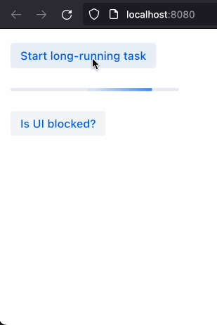
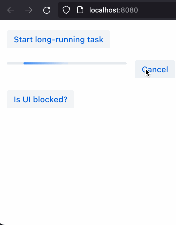

= Handling Long-Running Tasks

Often, server-side tasks can take a long time to complete.
For example, a task that requires fetching a large amount of data from the database can take a long time to finish.
In such cases, a poorly designed application can freeze the UI and prevent the user from interacting with the application.

This guide will show you how to handle long-running tasks in Vaadin applications in a way that:

. Allows the user to continue interacting with the application while the task is running, possibly allowing the user to cancel the task.
. Allows the user to see the progress of the task.

Note that the examples used here are based on Spring Boot, but a similar approach can be used with other technologies.

== The Problem With Long-Running Tasks

To illustrate how a poorly designed handling of long-running tasks can affect users, consider the following backend service that simulates a long-running task.

.BackendService.java
[source,java]
----
@Service
public class BackendService {

    public String longRunningTask() {
        try {
            // Simulate a long running task
            Thread.sleep(6000);
        } catch (InterruptedException e) {
            e.printStackTrace();
        }
        return "Some result";
    }

}
----

Consider also that the [methodname]`BackendService.longRunningTask()` method is being called from the following Vaadin UI:

.MainView.java
[source,java]
----
@Route("")
public class MainView extends VerticalLayout {

    public MainView(BackendService backendService) {
        Button startButton = new Button("Start long-running task", _startEvent -> {
            String result = backendService.longRunningTask();
            Notification.show(result);
        });

        Button isBlockedButton = new Button("Is UI blocked?", _event -> {
            Notification.show("UI is not blocked!");
        });

        add(startButton, isBlockedButton);
    }

}
----

In this example, if the user clicks the "Start long-running task" button, the application will freeze the UI and prevent the user from interacting with the other parts of the application (for example, with the `otherComponent` button).
This happens because Vaadin is waiting for the long-running task to finish before it sends the response back to the user, at which point the user can continue interacting with the application.

== Handling Long-Running Tasks Asynchronously

The recommended way to handle long-running tasks is to use an asynchronous approach.
This means that the long-running task is executed in a separate thread, and the UI is not blocked while the task is running. 

There are several ways to achieve an asynchronous model.
But in the context of a Spring Boot application, one simple way is to use the [annotationname]`@Async` annotation.
The [annotationname]`@Async` annotation is used to mark a method as an asynchronous task.
From the Vaadin UI side, a response to the user request is immediately sent back to the browser, and thus the user can continue interacting with the application right away without being blocked by the long-running task.
When the asynchronous task is finished, Vaadin uses <<{articles}/advanced/server-push#, Server Push>> to let the user know that the task is completed.

The following example shows how the [methodname]`BackendService.longRunningTask()` method can be adjusted to run asynchronously in a separate thread.

.BackendService.java
[source,java]
----
@Service
public class BackendService {

    @Async // <1>
    public ListenableFuture<String> longRunningTask() { // <2>
        try {
            // Simulate a long running task
            Thread.sleep(6000);
        } catch (InterruptedException e) {
            e.printStackTrace();
        }
        return AsyncResult.forValue("Some result"); // <3>
    }

}
----
<1> [annotationname]`@Async` annotation to mark the method for asynchronous execution.
<2> The method now returns a [classname]`ListenableFuture` object.
<3> The method's return value is a [classname]`ListenableFuture` object that contains the result of the asynchronous task.

Now the [methodname]`BackendService.longRunningTask()` method is annotated with the [annotationname]`@Async` annotation, and the long-running task is executed in a separate thread.
Note also that the [methodname]`BackendService.longRunningTask()` method now returns a [interfacename]`ListenableFuture<String>` instead of a `String` (returning a [interfacename]`ListenableFuture` or a [interfacename]`CompletableFuture` is a requirement for any asynchronous service).
The [interfacename]`ListenableFuture` is a special type of [interfacename]`Future` that allows the caller to register a callback to be notified when the task is completed.

With these changes in place, we can change the UI to allow the user to start the long-running task and still be able to interact with the application.
Vaadin can then use the [interfacename]`ListenableFuture` and the [methodname]`UI.access()` method of <<{articles}/advanced/server-push#, Server Push>> to notify the user when the task is completed.
This is how [filename]#MainView.java# could look now:

.MainView.java
[source,java]
----
@Route("")
public class MainView extends VerticalLayout {

    public MainView(BackendService backendService) {
        Button startButton = new Button("Start long-running task", startEvent -> {
            Optional<UI> ui = startEvent.getSource().getUI(); // <1>
            ListenableFuture<String> future = backendService.longRunningTask();
            future.addCallback(
                    successResult -> updateUi(ui.orElseThrow(), "Task finished: " + successResult) // <2>
                    failureException -> updateUi(ui.orElseThrow(), "Task failed: " + failureException.getMessage()) // <3>
            );
        });
        
        Button isBlockedButton = new Button("Is UI blocked?", _event -> {
            Notification.show("UI is not blocked!");
        });

        add(startButton, isBlockedButton);
    }

    private void updateUi(UI ui, String result) { // <4>
        ui.access(() -> {
            Notification.show(result);
        });
    }

}
----
<1> We save the current UI in a local variable, so that we can use it later to update the UI through the [methodname]`UI.access()` method.
<2> The callback is called when the task is completed successfully.
<3> The callback is called if the task failed.
<4> The [methodname]`UI.access()` method is used to update the UI in a thread-safe manner through server-side push.

*We are still not done.*
For the above example to work as intended, we need two extra annotations for the [annotationname]`@Async` annotation and the [methodname]`UI.access()` method to work.

* For the [annotationname]`@Async` annotation, we need to add the [annotationname]`@EnableAsync` annotation to the application.
* For the [methodname]`UI.access()` method, we need to add the [annotationname]`@Push` annotation to the class implementing the [interfacename]`AppShellConfigurator` interface.

We can make both changes in the same class as illustrated in the following [classname]`Application` class (which both extends [classname]`SpringBootServletInitializer` and implements [interfacename]`AppShellConfigurator`):

.Application.java
[source,java]
----
@SpringBootApplication
@Push
@EnableAsync
public class Application extends SpringBootServletInitializer implements AppShellConfigurator {

    public static void main(String[] args) {
        SpringApplication.run(Application.class, args);
    }

}
----

== Showing Progress to the User

With the Vaadin component <<{articles}/components/progress-bar#, ProgressBar>>, you can easily provide an indicator that a long-running action is currently in progress.
The following adjusts the above [classname]`MainView` example to show a progress bar when the user clicks the "Start long-running task" button.

.MainView.java
[source,java]
----
@Route("")
public class MainView extends VerticalLayout {

    public MainView(BackendService backendService) {
        Button startButton = new Button("Start long-running task", startEvent -> {
            Optional<UI> ui = startEvent.getSource().getUI();
            ListenableFuture<String> future = backendService.longRunningTask();

            ProgressBar progressBar = new ProgressBar(); // <1>
            progressBar.setWidth("15em");
            progressBar.setIndeterminate(true);
            addComponentAtIndex(1, progressBar); // <2>

            future.addCallback(
                    successResult -> updateUi(
                            ui.orElseThrow(),
                            "Task finished: " + successResult,
                            progressBar),
                    failureException -> updateUi(
                            ui.orElseThrow(),
                            "Task failed: " + failureException.getMessage(),
                            progressBar)
            );
        });

        Button isBlockedButton = new Button("Is UI blocked?", _event -> {
            Notification.show("UI is not blocked!");
        });

        add(startButton, isBlockedButton);
    }

    private void updateUi(UI ui, String result, ProgressBar progressBar) { // <3>
        ui.access(() -> {
            Notification.show(result);
            remove(progressBar); // <4>
        });
    }

}
----
<1> First, we create a [classname]`ProgressBar` object.
<2> After configuring the [classname]`ProgressBar`, we need to add it to the layout.
<3> We need to modify the [methodname]`updateUi()` method to additionally receive the [classname]`ProgressBar` argument.
<4> When the long-running task is completed or errors out, we remove the [classname]`ProgressBar`.

Here is the animation of the [classname]`MainView` showing the progress bar.

== Canceling a Long Running Task

For your task to be cancellable, the following conditions must be met:

. Your [annotationname]`@Async` method must return a [interfacename]`Future`.
. The running task must be https://docs.oracle.com/en/java/javase/18/docs/api/java.base/java/util/concurrent/Future.html#cancel(boolean)[interruptable].

The modified [classname]`MainView` class below shows how to add a [classname]`Button` to cancel the long-running task.

.MainView.java
[source,java]
----
@Route("")
public class MainView extends VerticalLayout {

    public MainView(BackendService backendService) {
        Button startButton = new Button("Start long-running task", startEvent -> {
            Optional<UI> ui = startEvent.getSource().getUI();
            ListenableFuture<String> future = backendService.longRunningTask();

            HorizontalLayout progressGroup = getProgressGroup(future); // <1>
            addComponentAtIndex(1, progressGroup);

            future.addCallback(
                    successResult -> updateUi(
                            ui.orElseThrow(),
                            "Task finished: " + successResult,
                            progressGroup),
                    failureException -> updateUi(
                            ui.orElseThrow(),
                            "Task failed: " + failureException.getMessage(),
                            progressGroup)
            );
        });

        Button isBlockedButton = new Button("Is UI blocked?", _event -> {
            Notification.show("UI is not blocked!");
        });

        add(startButton, isBlockedButton);
    }

    private void updateUi(UI ui, String result, HorizontalLayout progress) {
        ui.access(() -> {
            Notification.show(result);
            remove(progress); // <2>
        });
    }

    private HorizontalLayout getProgressGroup(Future<String> future){
        ProgressBar progressBar = new ProgressBar();
        progressBar.setWidth("15em");
        progressBar.setIndeterminate(true);

        Button cancelButton = new Button("Cancel", cancelEvent -> {
            future.cancel(true);
        }); // <3>

        return new HorizontalLayout(progressBar, cancelButton); // <4>
    }

}
----
<1> Because we have both a [classname]`ProgressBar` and a [classname]`Button`, it is better to group them together in a [classnane]`HorizontalLayout`.
<2> We need to remove the entire [classname]`HorizontalLayout` when the task completes or fails.
<3> The [classname]`Future` is canceled when the *Cancel* [classname]`Button` is clicked.
<4> When the task is completed or canceled, we remove the cancel [classname]`Button`.

Here is the animation of the [classname]`MainView` with a *Cancel* [classname]`Button`.

