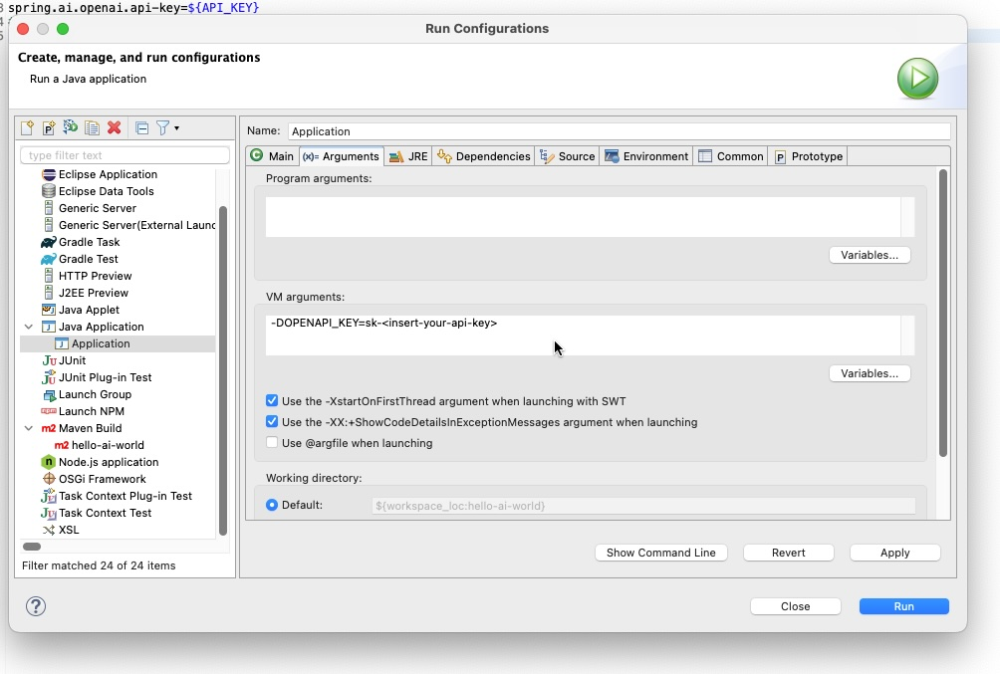

= Eclipse IDE

In Eclipse you need to add the API key explicitly in the Run Configuration.
Choose either **Environment variables** or **VM arguments**:

=== Environment variables
*Open → Run → Run Configurations → Environment → New…*
Add:

----
Name: OPENAI_API_KEY
Value: sk-your-key-here
----

=== VM arguments
*Open → Run → Run Configurations → Arguments → VM arguments*
Add:

----
-DOPENAI_API_KEY=sk-your-key-here
----

In both cases you can reference the variable in your configuration:

[source,properties]
----
spring.ai.openai.api-key=${OPENAI_API_KEY}
----
