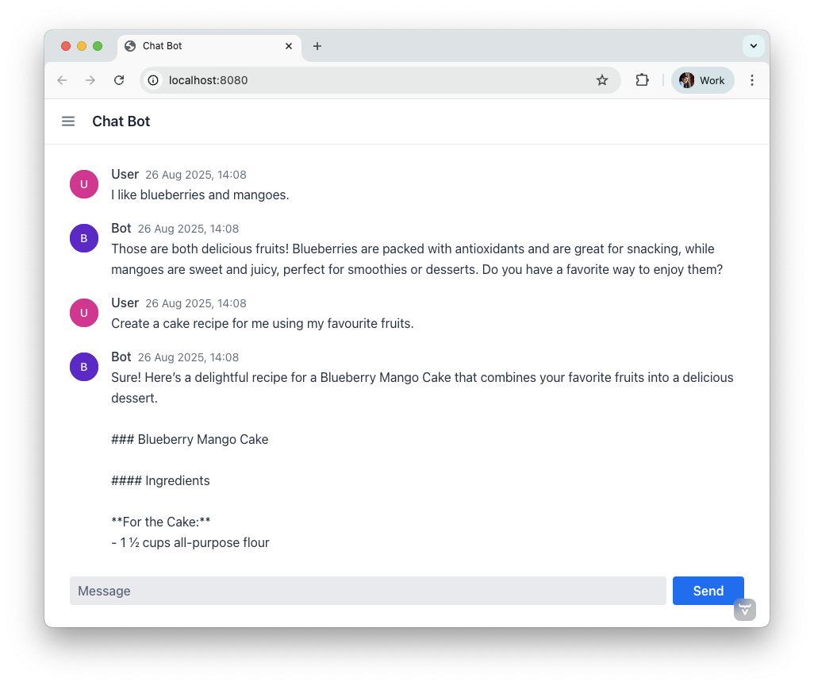

= Quick Start-Guide: Add an AI Chat Bot to a Vaadin + Spring Boot Application [badge-flow]#Flow# 

This guide shows how to connect a Large Language Model (LLM) into a Vaadin application using Spring AI and Spring Boot. You'll build a minimal chat UI with Vaadin provided components **MessageList** and **MessageInput**, stream responses token-by-token, and keep a conversational tone in the dialog with the AI.

**Audience & style:** This quick guide is for Java developers and Vaadin beginners, as well as AI rookies. The sample application is implemented in Spring style and explains in small, practical steps how to integrate AI into Vaadin. Code snippets are available for copy and paste.

== Prerequisites

* Java 17+
* Spring Boot 3.5+ (or newer)
* Vaadin 24.8+
* An OpenAI API key (`OPENAI_API_KEY`)

== 1. Start from a Vaadin Spring Skeleton

Download a Vaadin Spring starter from http://github.com/vaadin/skeleton-starter-flow-spring[GitHub], import it into your preferred IDE, and get it running in your environment.

**Pro Tip**: Starting the application with Hotswap Agent improves your development lifecycle.

Start with a cleaning and remove the default service `GreetService` and clear the existing UI content. You'll implement everything in `MainView`.

== 2. Add Spring AI dependencies

Add the Spring AI BOM and the OpenAI starter to import the necessary dependencies to your project. The BOM takes care of all Spring AI dependencies and provides the consistent version numbers to each sub dependency automatically.

**Maven (`pom.xml`):**

[source,xml]
----
<dependencyManagement>
  ...
  <dependencies>
    <dependency>
      <groupId>org.springframework.ai</groupId>
      <artifactId>spring-ai-bom</artifactId>
      <version>1.0.1</version><!-- use the latest stable -->
      <type>pom</type>
      <scope>import</scope>
    </dependency>
  </dependencies>
  ...
</dependencyManagement>

<dependencies>
    ...
    <!-- OpenAI LLM via Spring AI -->
    <dependency>
        <groupId>org.springframework.ai</groupId>
        <artifactId>spring-ai-starter-model-openai</artifactId>
    </dependency>
    ...
</dependencies>
----

*(Gradle users: import the Spring AI BOM and add the same starters.)*

== 3. Configure Your OpenAI Credentials

To access the API of OpenAI you need a license key. The preferred way to provide the key is through an environment variable, as this makes it available to other applications as well. After setting the environment variable on your system, refer to it from `application.properties` like this:

[source,properties]
----
spring.ai.openai.api-key=${OPENAI_API_KEY}
# Optional: pick a model; adjust to what your account supports
# spring.ai.openai.chat.options.model=gpt-5
----

**Tip:** use Spring profiles or your CI/CD's secret store for the key.

== 4. Enable Vaadin Push

To prevent end-users from sitting in front of a blank screen waiting for a response, you'll stream tokens asynchronously and update the UI live with response tokens. To do this, you need to enable server push:

[source,java]
----
// src/main/java/org/vaadin/example/Application.java

import com.vaadin.flow.component.page.AppShellConfigurator;
import com.vaadin.flow.component.page.Push;
import com.vaadin.flow.router.PageTitle;
import com.vaadin.flow.theme.Theme;
import org.springframework.boot.SpringApplication;
import org.springframework.boot.autoconfigure.SpringBootApplication;

@Theme("my-theme")
@PageTitle("AI in Vaadin")
@SpringBootApplication
@Push
public class Application implements AppShellConfigurator {

    public static void main(String[] args) {
        SpringApplication.run(Application.class, args);
    }
}
----

== 5. Create the Chat service (Spring AI)

Create a new class called **ChatService** and annotate it with `@Service`. This service builds a `ChatClient` with a **ChatMemory** advisor in the constructor and exposes a **reactive stream** of tokens.

[source,java]
----
// src/main/java/org/vaadin/example/ChatService.java
package org.vaadin.example;

import org.springframework.ai.chat.client.ChatClient;
import org.springframework.ai.chat.client.advisor.MessageChatMemoryAdvisor;
import org.springframework.ai.chat.memory.ChatMemory;
import org.springframework.stereotype.Service;
import reactor.core.publisher.Flux;

@Service
public class ChatService {

    private final ChatClient chatClient;

    public ChatService(ChatClient.Builder chatClientBuilder,
                       ChatMemory chatMemory) {
        // Add a memory advisor to the chat client
        var chatMemoryAdvisor = MessageChatMemoryAdvisor
                .builder(chatMemory)
                .build();

        // Build the chat client
        chatClient = chatClientBuilder
                .defaultAdvisors(chatMemoryAdvisor)
                .build();
    }

    public Flux<String> chatStream(String userInput, String chatId) {
        return chatClient.prompt()
                .advisors(advisorSpec ->
                    advisorSpec.param(ChatMemory.CONVERSATION_ID, chatId)
                )
                .user(userInput)
                .stream()
                .content();
    }
}

----

Why a chat memory? **ChatMemory** keeps context of the conversations so users don't have to repeat themselves. The `chatId` keeps the context for a specific chat and doesn't share it with other chats and users.

== 6. Build the Chat UI with Vaadin

Use `MessageList` to render the conversation as Markdown and `MessageInput` to handle the user prompts. Wrap the list in a `Scroller` so long chats don't grow the layout beyond the browser window:

[source,java]
----
// src/main/java/org/vaadin/example/MainView.java
package com.example.application.views.chatbot;

import com.example.application.services.ChatService;
import com.vaadin.flow.component.Composite;
import com.vaadin.flow.component.messages.MessageInput;
import com.vaadin.flow.component.messages.MessageList;
import com.vaadin.flow.component.messages.MessageListItem;
import com.vaadin.flow.component.orderedlayout.Scroller;
import com.vaadin.flow.component.orderedlayout.VerticalLayout;
import com.vaadin.flow.router.Menu;
import com.vaadin.flow.router.PageTitle;
import com.vaadin.flow.router.Route;
import com.vaadin.flow.router.RouteAlias;
import org.vaadin.lineawesome.LineAwesomeIconUrl;

import java.time.Instant;
import java.util.UUID;

@PageTitle("Chat Bot")
@Route("")
@RouteAlias("chat-bot")
@Menu(order = 0, icon = LineAwesomeIconUrl.ROBOT_SOLID)
public class ChatBotView extends Composite<VerticalLayout> {

    private final ChatService chatService;
    private final MessageList messageList;
    private final String chatId = UUID.randomUUID().toString();

    public ChatBotView(ChatService chatService) {
        this.chatService = chatService;

        //Create a scrolling MessageList
        messageList = new MessageList();
        var scroller = new Scroller(messageList);
        scroller.setHeightFull();
        getContent().addAndExpand(scroller);

        //create a MessageInput and set a submit-listener
        var messageInput = new MessageInput();
        messageInput.addSubmitListener(this::onSubmit);
        messageInput.setWidthFull();

        getContent().add(messageInput);
    }

    private void onSubmit(MessageInput.SubmitEvent submitEvent) {
        //create and handle a prompt message
        var promptMessage = new MessageListItem(submitEvent.getValue(), Instant.now(), "User");
        promptMessage.setUserColorIndex(0);
        messageList.addItem(promptMessage);

        //create and handle the response message
        var responseMessage = new MessageListItem("", Instant.now(), "Bot");
        responseMessage.setUserColorIndex(1);
        messageList.addItem(responseMessage);

        //append a response message to the existing UI
        var userPrompt = submitEvent.getValue();
        var uiOptional = submitEvent.getSource().getUI();
        var ui = uiOptional.orElse(null); //implementation via ifPresent also possible

        if (ui != null) {
            chatService.chatStream(userPrompt, chatId)
                    .subscribe(token ->
                            ui.access(() ->
                                    responseMessage.appendText(token)));
        }
    }
}

----

**Key UI patterns used here:**

* **Dialog character:** display prompts and responses separately so the difference remains visible.
* **Streaming output:** show tokens as they arrive for perceived performance.
* **Markdown rendering:** richer answers (lists, code blocks, emojis).
* **Sticky scroll:** keep the latest answer in view.

== 7. Run & Iterate

Start the application, open the browser, and try your first prompts.

== What You Built

* A production-ready **chat bot** using Vaadin components
* **Token-by-token streaming** with Vaadin Push
* **Conversation memory** via Spring AI advisors

== Next Possible Steps

* Add a **system prompt** field to steer the assistant (e.g., tone, persona).
* Add **clear chat** and **export** actions.
* Add **feedback** to evaluate responses
* Support **attachments** and **tool calls** (retrieval, functions).
* Log prompts/responses for observability.

== Troubleshooting

* **No streaming updates?** Ensure `@Push` is present and check reverse proxy/WebSocket settings.
* **401 Exception from OpenAI?** Verify `OPENAI_API_KEY` and environment injection in your run configuration.

== Complete File List Recap

* `src/main/java/org/vaadin/example/Application.java` — Spring Boot + `@Push`
* `src/main/java/org/vaadin/example/ChatService.java` — Spring AI client + memory
* `src/main/java/org/vaadin/example/MainView.java` — Vaadin chat UI
* `src/main/resources/application.properties` — OpenAI config
* `pom.xml` — Vaadin + Spring AI dependencies

That's it — your Vaadin application now speaks AI. 🚀
