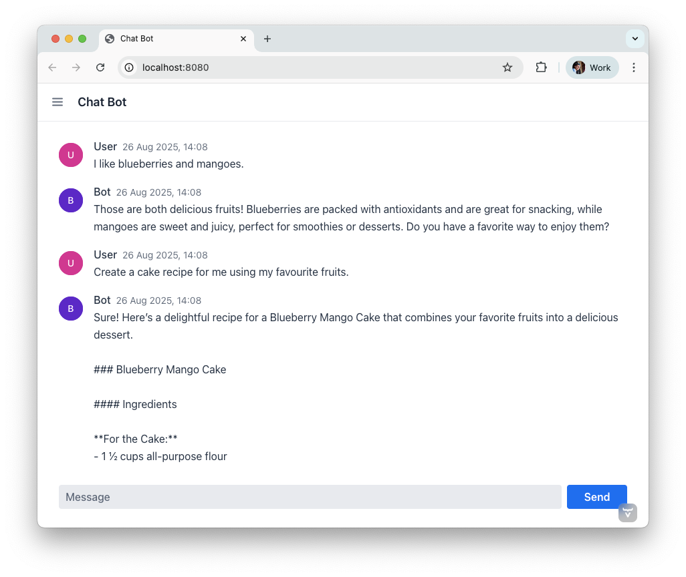

= [since:com.vaadin:vaadin@V25.1]#Quick Start-Guide: Add an AI Chat Bot to a Vaadin + Spring Boot Application# [badge-flow]#Flow#

:preview-banner-content: This guide uses the preview feature AI components. This means that it is not yet ready for production usage and may have limitations or bugs. We encourage you to try it out and provide feedback to help us improve it.
include::{articles}/_preview-banner.adoc[opts=optional]

This guide shows how to connect a Large Language Model (LLM) into a Vaadin application using Spring AI, Spring Boot, and the <<{articles}/flow/ai-support#,AI Components>>. You'll build a minimal chat UI with **MessageList** and **MessageInput**, stream responses token-by-token, and keep a conversational tone in the dialog with the AI -- all without writing boilerplate wiring code.

**Audience & style:** This quick guide is for Java developers and Vaadin beginners, as well as AI rookies. The sample application is implemented in Spring style and explains in small, practical steps how to integrate AI into Vaadin. Code snippets are available for copy and paste.

== Prerequisites

* An OpenAI API key (`OPENAI_API_KEY`)

== 1. Start from a Vaadin Spring Skeleton

Download a Vaadin Spring starter from http://github.com/vaadin/skeleton-starter-flow-spring[GitHub], import it into your preferred IDE, and get it running in your environment.

**Pro Tip**: Starting the application with Hotswap Agent improves your development lifecycle.

Start with a cleaning and remove the default service `GreetService` and clear the existing UI content. You'll implement everything in `MainView`.

== 2. Add Spring AI dependencies

Add the Spring AI BOM and the OpenAI starter to import the necessary dependencies to your project. The BOM takes care of all Spring AI dependencies and provides the consistent version numbers to each sub dependency automatically.

**Maven (`pom.xml`):**

[source,xml]
----
<dependencyManagement>
  ...
  <dependencies>
    <dependency>
      <groupId>org.springframework.ai</groupId>
      <artifactId>spring-ai-bom</artifactId>
      <version>2.0.0-M2</version><!-- use the latest stable -->
      <type>pom</type>
      <scope>import</scope>
    </dependency>
  </dependencies>
  ...
</dependencyManagement>

<dependencies>
    ...
    <!-- OpenAI LLM via Spring AI -->
    <dependency>
        <groupId>org.springframework.ai</groupId>
        <artifactId>spring-ai-starter-model-openai</artifactId>
    </dependency>
    ...
</dependencies>
----

*(Gradle users: import the Spring AI BOM and add the same starters.)*

== 3. Configure Your OpenAI Credentials

To access the API of OpenAI you need a license key. The preferred way to provide the key is through an environment variable, as this makes it available to other applications as well. After setting the environment variable on your system, refer to it from `application.properties` like this:

[source,properties]
----
spring.ai.openai.api-key=${OPENAI_API_KEY}
# Optional: pick a model; adjust to what your account supports
# spring.ai.openai.chat.options.model=gpt-5
----

**Tip:** use Spring profiles or your CI/CD's secret store for the key.

== 4. Enable Vaadin Push

To prevent end-users from sitting in front of a blank screen waiting for a response, you'll stream tokens asynchronously and update the UI live with response tokens. To do this, you need to enable server push:

[source,java]
----
// src/main/java/org/vaadin/example/Application.java

import com.vaadin.flow.component.page.AppShellConfigurator;
import com.vaadin.flow.component.page.Push;
import com.vaadin.flow.router.PageTitle;
import org.springframework.boot.SpringApplication;
import org.springframework.boot.autoconfigure.SpringBootApplication;

@PageTitle("AI in Vaadin")
@SpringBootApplication
@Push
public class Application implements AppShellConfigurator {

    public static void main(String[] args) {
        SpringApplication.run(Application.class, args);
    }
}
----

== 5. Build the Chat UI with AI Components

The <<{articles}/flow/ai-support#,AI Orchestrator>> connects your UI components to the LLM. It handles message display, token streaming, conversation memory, and UI updates automatically. You don't need to write a separate service class -- the orchestrator manages the Spring AI integration directly.

Use `MessageList` to render the conversation and `MessageInput` for user prompts. Then wire everything together with the orchestrator's builder:

[source,java]
----
// src/main/java/org/vaadin/example/MainView.java
package org.vaadin.example;

import com.vaadin.flow.component.Composite;
import com.vaadin.flow.component.ai.orchestrator.AIOrchestrator;
import com.vaadin.flow.component.ai.provider.LLMProvider;
import com.vaadin.flow.component.messages.MessageInput;
import com.vaadin.flow.component.messages.MessageList;
import com.vaadin.flow.component.orderedlayout.VerticalLayout;
import com.vaadin.flow.router.Menu;
import com.vaadin.flow.router.PageTitle;
import com.vaadin.flow.router.Route;
import com.vaadin.flow.router.RouteAlias;
import org.springframework.ai.chat.model.ChatModel;
import org.vaadin.lineawesome.LineAwesomeIconUrl;

@PageTitle("Chat Bot")
@Route("")
@RouteAlias("chat-bot")
@Menu(order = 0, icon = LineAwesomeIconUrl.ROBOT_SOLID)
public class MainView extends Composite<VerticalLayout> {

    public MainView(ChatModel chatModel) {
        // Create UI components
        var messageList = new MessageList();
        messageList.setSizeFull();
        var messageInput = new MessageInput();
        messageInput.setWidthFull();

        // Create the LLM provider
        var provider = LLMProvider.from(chatModel);

        // Wire everything together
        AIOrchestrator.builder(provider,
                        "You are a helpful assistant.")
                .withMessageList(messageList)
                .withInput(messageInput)
                .build();

        // Add UI components to the layout
        getContent().addAndExpand(messageList);
        getContent().add(messageInput);
    }
}
----

The orchestrator takes care of:

* **Displaying messages:** user prompts and assistant responses appear in the Message List automatically.
* **Streaming output:** tokens are pushed to the UI as they arrive from the LLM.
* **Conversation memory:** the provider maintains a 30-message context window, so the assistant remembers earlier messages.
* **Markdown rendering:** responses render as rich text (lists, code blocks, links).
* **Sticky scroll:** the Message List keeps the latest answer in view.

== 6. Run & Iterate

Start the application, open the browser, and try your first prompts.

== What You Built

* A production-ready **chat bot** using Vaadin AI Components
* **Token-by-token streaming** with Vaadin Push
* **Conversation memory** managed by the LLM provider

== Next Possible Steps

* Customize the **system prompt** to steer the assistant (e.g., tone, persona).
* Add **file attachments** with `UploadManager` via <<{articles}/flow/ai-support/file-attachments#,`withFileReceiver()`>>.
* Support **tool calls** via <<{articles}/flow/ai-support/tool-calling#,`withTools()`>>.
* **Persist conversation history** via <<{articles}/flow/ai-support/conversation-history#,`ResponseCompleteListener`>>.
* Log prompts/responses for observability.

== Troubleshooting

* **No streaming updates?** Ensure `@Push` is present and check reverse proxy/WebSocket settings.
* **401 Exception from OpenAI?** Verify `OPENAI_API_KEY` and environment injection in your run configuration.

== Complete File List Recap

* `src/main/java/org/vaadin/example/Application.java` -- Spring Boot + `@Push`
* `src/main/java/org/vaadin/example/MainView.java` -- AI Components + Vaadin chat UI
* `src/main/resources/application.properties` -- OpenAI config
* `pom.xml` -- Vaadin + Spring AI dependencies

That's it -- your Vaadin application now speaks AI.
