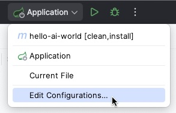

= IntelliJ IDEA

To connect your Vaadin application with an AI provider such as OpenAI, you could access the environment variable or configure the **API key** specifically for a project in IntelliJ IDEA.
The recommended approach is to use **environment variables** instead of hardcoding the key in your source code or IDE settings.

[WARNING]
====
Never commit API keys to source control.
Use environment variables or IDE run configurations instead.
====

== Using Environment Variables

You can directly reference environment variables in your `application.properties` or `application.yml`.
This allows you to reuse the same key across multiple projects and keeps your code clean.

[source,properties]
----
spring.ai.openai.api-key=${OPENAI_API_KEY}
----

== Configuring the API key in IntelliJ IDEA

If you prefer to manage the key within IntelliJ IDEA, you have several options:

* **Run/Debug configuration** - add the environment variable `OPENAI_API_KEY` in *Run → Edit Configurations → Environment Variables*.
* **Maven runner settings** - configure the key under *Settings → Build, Execution, Deployment → Build Tools → Maven → Runner*.
* **VM options** - pass the key as a system property, for example: `-DOPENAI_API_KEY=your-key`.

With these approaches, your Vaadin application can access the **OpenAI API key** securely during development.
