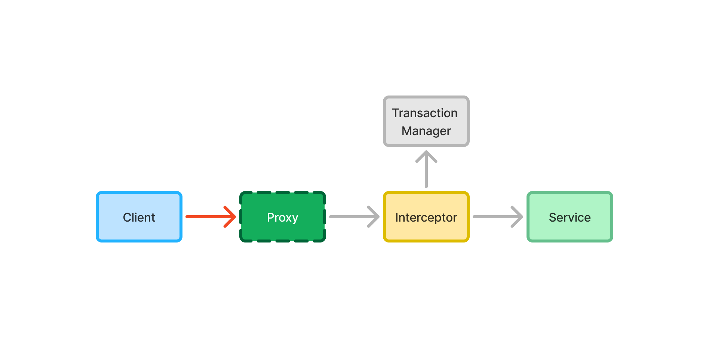

= Declarative Transactions

The easiest way to manage transactions in a Spring application is by using the `@Transactional` annotation. You can place it directly on your class, or on individual methods. It is not recommended to use the annotation on interfaces, except for <<{articles}/building-apps/application-layer/persistence/repositories/jpa#,Spring Data repositories>>.

The following example instructs Spring to run all the methods of the application service inside a new transaction:

[source,java]
----
import org.springframework.transaction.annotation.Propagation;
import org.springframework.transaction.annotation.Transactional;

@Service
@Transactional(propagation = Propagation.REQUIRES_NEW)
public class MyApplicationService {
    ...
}
----

If you use `@Transactional` on both the class and individual methods, the method level annotation takes precedence. The following example instructs Spring to use the `REQUIRED` (the default) propagation level for all application service methods, except for `myMethod()` that should use `SUPPORTS`:

[source,java]
----
import org.springframework.transaction.annotation.Propagation;
import org.springframework.transaction.annotation.Transactional;

@Service
@Transactional
public class MyApplicationService {
    ...

    @Transactional(propagation = Propagation.SUPPORTS)
    public void myMethod() {
        ...
    }
}
----

[IMPORTANT]
In earlier versions of Spring, you could only use `@Transactional` on `public` methods. As of Spring version 6.0, you can also use it on `protected` and package-visible methods if you are using class-based proxies. For interface-based proxies, the methods must always be `public`, and defined in the proxied interface. *As a rule of thumb, always make your transactional methods `public`.*

For more information about declarative transaction management, see the https://docs.spring.io/spring-framework/reference/data-access/transaction/declarative.html[Spring Documentation].

== Committing

You do not have to do anything special to commit a transaction. Spring automatically commits the transaction after the method returns, unless it has been marked for rollback.

== Rolling Back

You mark the transaction for rollback by throwing an unchecked exception. The following example causes Spring to rollback the transaction if validation fails:

[source,java]
----
@Service
public class MyApplicationService {
    ...

    @Transactional
    public void myMethod(MyInput input) {
        if (!isValid(input)) {
            throw new IllegalArgumentExcpetion("Bad input");
        }
        ...
    }
}
----

A checked exception does not cause the transaction to rollback by default. You can override this by using the `rollbackFor` annotation attribute. The following example instructs Spring to rollback the transaction if `myMethod` throws a `MyCheckedException`:

[source,java]
----
@Service
public class MyApplicationService {
    ...

    @Transactional(rollbackFor = MyCheckedException.class)
    public void myMethod() throws MyCheckedException {
        ...
    }
}
----

// TODO Write something about read-only transactions?

== Isolation Level

You can use the `@Transactional` annotation to specify the isolation level of the transaction. By default, it uses the database implementation's own default transaction level. The following example instructs Spring to execute `myMethod()` using the _read uncommitted_ isolation level:

[source,java]
----
import org.springframework.transaction.annotation.Isolation;
import org.springframework.transaction.annotation.Transactional;

@Service
public class MyApplicationService {
    ...

    @Transactional(isolation = Isolation.READ_UNCOMMITTED)
    public void myMethod() {
        ...
    }
}
----

== Caveats

When working with declarative transactions, it is important to remember that the annotations themselves do not manage any transactions. They are merely instructions for how Spring should manage the transactions. 

During application startup, Spring detects the `@Transactional` annotation and turns the service into a proxy. When a client calls the proxy, the call gets routed through a _method interceptor_. The interceptor starts the transaction, calls the actual method, and then commits the transaction when the method returns, as illustrated in this diagram:

Because of this, the `@Transactional` annotation is ignored if a service calls itself, since the call does not go via the proxy, as illustrated in this diagram:

image::images/declarative-transactions-self-call.png[A diagram of a service calling itself, bypassing the proxy]

In the following example, `myFirstMethod()` executes inside its own transaction if a client calls it directly. However, if a client calls `mySecondMethod()`, `myFirstMethod()` executes inside the transaction of `mySecondMethod()` despite being annotated differently:

[source,java]
----
@Service
public class MyApplicationService {

    @Transactional(propagation = REQUIRES_NEW)
    public void myFirstMethod() {
    }

    @Transactional
    public void mySecondMethod() {
        // myFirstMethod() will participate in the transaction of mySecondMethod(),
        // even though it has been annotated as REQUIRES_NEW.
        myFirstMethod(); 
    }
}
----

You can fix this by managing the transactions <<programmatic#,programmatically>>.
// Actually, you can fix it by using AspectJ proxies as well, but I don't want to go there. 
 
