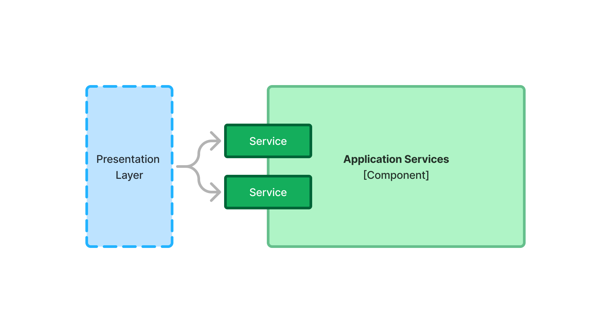
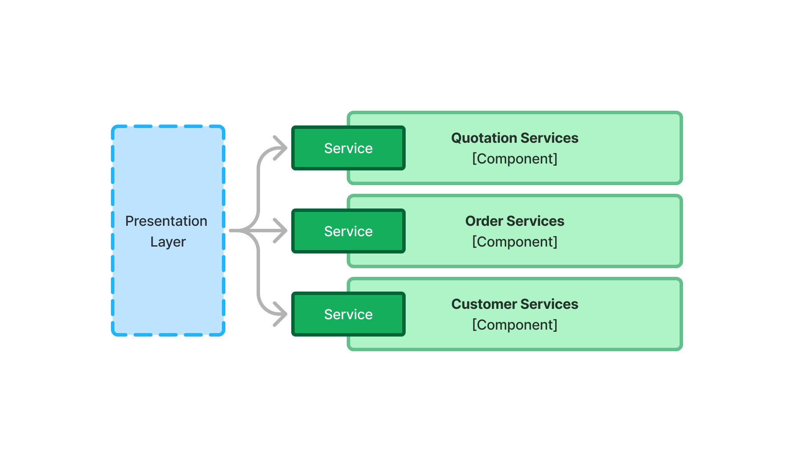

= Application Services

The application layer API consists of _application services_. In a simple Vaadin application, the application services reside inside a single <<{articles}/building-apps/architecture/components#,system component>>, as illustrated on the following diagram:

In code, the services are Spring Beans, and the components Java packages.

Services should have _high cohesion_. This means that all the methods in your service should relate to the same thing. For example, all methods in this `PaymentService` are directly related to the business activity of handling payments:

[source,java]
----
public interface PaymentService {
    PaymentId processPayment(Order order);
    PaymentStatus checkPaymentStatus(PaymentId paymentId);
    void refundPayment(PaymentId paymentId);
}
----

Application services need not be related to business activities to be highly cohesive. They could also be related to a specific view in the user interface, or even a specific user interface component.

For example, if you are using <<{articles}/components/charts#,Vaadin Charts>>, it is easier if the data returned by your service can be directly converted into <<{articles}/components/charts/data#,chart data>>. If you are building a payment summary view, you might be tempted to add such a method to the `PaymentService`.

However, adding this method to the `PaymentService` would actually lower the cohesion of the service. Although it retrieves information about payments, its primary driver is the needs of the summary view, not the business activity of handling payments.

Another way of reasoning about the cohesion of services is that any single service should only have a single reason to change. With the payment service containing methods both for handling payments, and for showing the summary, it now has two reasons to change.

In a situation like this, you should create a new `PaymentSummaryService`, and implement the method there. You now have two services with only a single reason to change. In other words, they are highly cohesive.

== Interfaces or Classes?

In the early days of Spring, services consisted of both an interface, and an implementation class. The reason for this is that Spring uses proxies to handle various cross-cutting concerns. At that time, you could only create proxies of Java interfaces, not classes. Furthermore, when writing tests, you could only mock interfaces, not classes.

Nowadays, this limitation is gone. As long as your service classes aren't final, and don't contain any final methods, Spring can make proxies of them. You can also mock them during tests.

Because of this, creating interfaces for application services is a matter of personal taste. If you like to create interfaces, you can continue to do so. In that case, you should make the implementation class package protected, like this:

[source,java]
----
@Service
class PaymentServiceImpl implements PaymentService {
    ...
}
----

However, you can also write the application service without an interface, like this:

[source,java]
----
@Service
public class PaymentService {
    ...
}
----

The advantage with this approach is that you have one Java file less to maintain. Both approaches work  fine with Vaadin.

== Input and Output

Application services often need to communicate with <<{articles}/building-apps/application-layer/persistence/repositories#,repositories>> to fetch and store data. They also need to pass this data to the presentation layer. For this, there are two options: pass the entities directly, or pass Data Transfer Objects (DTO:s). Both have their own pros and cons.

=== Entities

When the application service passes the entities directly to the presentation layer, the entities become a part of the application layer API. Many service methods delegate to the corresponding repository methods, for example like this:

[source,java]
----
@Service
public class CustomerCrudService {

    private final CustomerRepository repository;

    CustomerCrudService(CustomerRepository repository) {
        this.repository = repository;
    }

    public Page<Customer> findAll(Specification<Customer> specification, Pageable pageable) {
        return repository.findAll(specification, pageable);
    }

    public Customer save(Customer customer) {
        return repository.saveAndFlush(customer);
    }
}
----

[CAUTION]
When most of your service methods delegate to a repository, it may feel tempting to skip the service and have the presentation layer communicate with the repository directly. However, this is not a good idea because of the cross-cutting concerns that the application service should handle. This is explained later on this page.

Using entities in your application service is a good idea when your user interface and entities match each other closely. For example, you could have a form whose fields, or a grid whose columns, match the fields of the entity.

It is also a good idea when your entities are _anemic_, which means that they only contain data and little to no business logic.

In both of these cases, the user interface and the entities are likely to change at the same time, for the same reason. For example, if you need to add a field, you'll add it both to the user interface and the entity.

=== Data Transfer Objects

Some times, it is not a good idea for the application services to return the entities themselves. 

For instance, the domain model may contain business logic that must be called within some context that is not available in the presentation layer. It might require access to other services, or run inside a transaction.

In other cases, the user interface may need only a subset of the data stored inside a single entity, or a combination of data from multiple entities. Fetching and returning the full entities would be a waste of computing resources.

You may also have a situation where the domain model and user interface are changing independently of each other. For example, the domain model may have to be adjusted every year due to government regulations while the user interface remains more or less the same.

In this case, the application services should accept DTO:s as input, and return DTO:s as output. The entities should no longer be part of the application layer API.

This adds another responsibility to the application service: mapping between entities and DTO:s.

If you are using <<{articles}/building-apps/application-layer/persistence/repositories#query-objects,query objects>>, you can do the mapping in them by returning their DTO:s directly. In this case, the query object DTO:s become part of the application layer API.

For storing data, your services typically have to copy data from the DTO to the entity. For example, like this:

[source,java]
----
@Service
public class CustomerCrudService {

    private final CustomerRepository repository;

    CustomerCrudService(CustomerRepository repository) {
        this.repository = repository;
    }
    
    // In this example, CustomerForm is a Java record.

    public CustomerForm save(CustomerForm customerForm) {
        var entity = Optional.ofNullable(customerForm.getId())
            .flatMap(repository::findById)
            .orElseGet(Customer::new);
        entity.setName(customerForm.name());
        entity.setEmail(customerForm.email());
        ...
        return toCustomerForm(repository.saveAndFlush(entity));
    }

    private CustomerForm toCustomerForm(Customer entity) {
        return new CustomerForm(entity.getId(), entity.getName(), entity.getEmail(), ...);
    }
}
----

When using DTO:s, you have more code to maintain. Also, some changes, like adding a new field to the application, requires more work. However, your user interface and domain model are isolated from each other, and can evolve independently.

=== Domain Payload Objects

If you are using <<{articles}/building-apps/application-layer/domain-primitives#,domain primitives>>, you can, and should, use them in your DTO:s as well. In this case, the DTO:s are called _Domain Payload Objects_ (DPO). They are used in the exact same way as DTO:s.

== Cross-Cutting Concerns

// TODO
Security, transactions, and logging.
Mention only briefly, link to other pages for details.

== Scaling

As the application grows, it makes sense to split the application services component into smaller parts. It is recommended to split the services according to which _bounded context_ they belong to.

A bounded context is a term from domain-driven design. It is a clear boundary within a system where a specific domain model is defined and consistent. It ensures that within this context, terms and concepts have precise meanings that are not confused or conflicted with other contexts in the system. This separation helps to manage complexity by allowing different parts of the system to evolve independently.

// TODO Consider adding a separate page about bounded contexts only.

For example, on this diagram, the presentation layer interacts with three different bounded contexts through their service components: Quotation Management, Order Management, and Customer Relations Management:

Bounded contexts are often associated with <<{articles}/building-apps/architecture/microservices#,microservices>>, but in Vaadin applications, it is easier to implement them as a <<{articles}/building-apps/architecture/monolith#,modular monlith>>.

// TODO continue here