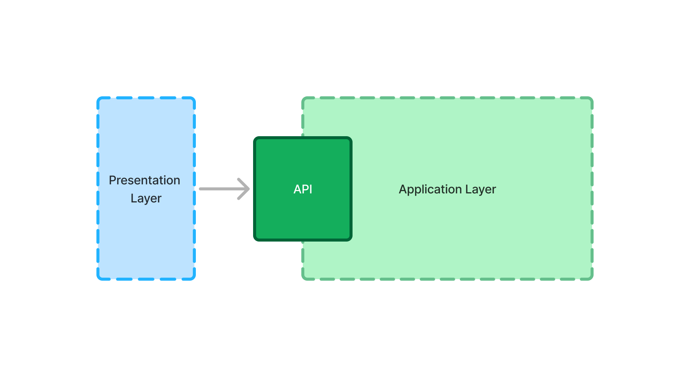

= The Application Layer

Vaadin applications consist of two <<{articles}/building-apps/architecture/layers#,conceptual layers>>: the presentation layer, and the application layer. The presentation layer contains the user interface, and the application layer everything else in the application.

From the point of view of the presentation layer, the application layer is a black box with an API. The presentation layer calls this API to interact with the application layer:

The presentation layer only cares about the API. As long as it remains the same, the rest of the application layer can change and grow as needed. Because of this, getting this API right is key to building extendable and evolvable Vaadin applications.

In practice, the API consists of application services. These services can then talk to other system components, like the domain model, repositories, external systems, background jobs, and so on.

// TODO Finish the introduction

== Topics

section_outline::[]