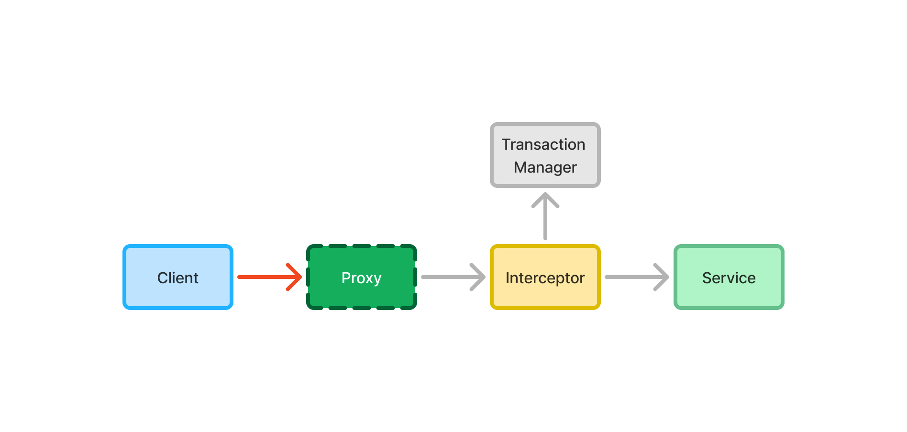

= Transactions

Database transactions ensure Atomicity, Consistency, Isolation, and Durability (ACID) of database write operations.

Atomicity means that the transaction is treated as a single unit. Either all updates succeed, or none of them do. Even if only a single update fails, the transaction is rolled back, and all the other updates are undone.

Consistency means that the database is in a valid state after each committed transaction. All integrity constraints, like unique keys, foreign keys, and check constraints, are met after each transaction.

Isolation means that transactions are isolated from each other so that they do not interfere. The end result should be the same regardless of whether two transactions execute in parallel, or one after the other. This is also useful for queries that only read data from the database, without making any changes to it.

Durability means that once a transaction is committed, the changes are permanent. They should even survive a system crash. In practice, this means writing the changes to a durable storage medium, such as a hard drive.

[NOTE]
Although transactions are not specific to relational databases, they are discussed form the point of view of a relational database on this page.

== Transaction Isolation

Databases typically use locks to achieve isolation. A _read lock_, or _shared_ lock, allows multiple transactions to read the same data concurrently. It prevents any transaction from modifying it while others are reading.

A _write lock_, or _exclusive_ lock, is used when a transaction needs to modify data. It prevents other transactions from reading or writing the data until the lock is released.

Depending on the implementation and configuration of the database, and the needs of a transaction, locks can be applied at different levels of granularity. For example, a database may be able to lock individual cells, rows, pages, tables, or even entire databases.

These locks have an impact on performance. Because of this, there are different levels of isolation. They allow you to relax the isolation requirement in favor of improved performance. To understand what these levels mean, you first need to understand some phenomena that can happen when you are reading and writing data at the same time.

Dirty Reads:: A dirty read happens when transaction A reads changes made by transaction B, before transaction B has been committed. If transaction B is then rolled back, transaction A has read data that does not exist. This happens when there are no locks at all.

Non-repeatable Reads:: A non-repeatable read happens when transaction A reads the same data twice, but gets different results because transaction B has updated or deleted the data between the reads. This can happen if transaction A only holds the read lock while it is reading the data instead of keeping it for its entire duration.

Phantom Reads:: A phantom read is a special kind of non-repeatable read. It happens when transaction A performs a query that should have included data from transaction B. However, at the time of the query, transaction B had not yet written that data yet. If transaction A was to run the same query later, the data would show up. This can happen if transaction A holds the read lock for its entire duration, but only locks the rows it has read instead of locking the entire table.

The ANSI/ISO SQL standard defines four isolation levels: read uncommitted, read committed, repeatable reads, and serializable.

Read Uncommitted:: This is the lowest isolation level, where transactions behave as if there were no locks or isolation at all. It allows dirty reads, non-repeatable reads, and phantom reads.

Read Committed:: This is the second-lowest isolation level. It prevents dirty reads, but allows non-repeatable reads and phantom reads. 

Repeatable Reads:: This is the second-highest isolation level. It prevents dirty reads and non-repeatable reads, but allows phantom reads.

Serializable:: This is the highest, but also the most expensive isolation level. Transactions on this level behave as if they were executed sequentially. It prevents dirty reads, non-repetable reads, and phantom reads.

Database implementations may also define their own isolation levels, and choose to implement the standard isolation levels in different ways. For instance, a specific database may prevent certain bad behaviors on a lower isolation level, even though they would be possible in theory.

Furthermore, their default isolation levels may be different. For instance, PostgreSQL, Microsoft SQL Server, H2, and Oracle use _read committed_ as the default isolation level, whereas MariaDB and MySQL use _repeatable reads_.

Check the documentation of your database if you are not familiar with how it handles transaction isolation.

=== Deadlocks

Whenever you work with locks, there is always a risk of deadlocks. A deadlock occurs when transaction A waits for a lock that transaction B holds, and transaction B waits for a lock that transaction A holds. The following example demonstrates this:

[cols="1,1"]
|===
|Transaction A |Transaction B

|Try lock row X
|Try lock row Y

|*Lock X acquired*
|*Lock Y acquired*

|Try lock row Y
|Try lock row X

|_Waiting for transaction B to release lock Y_
|_Waiting for transaction A to release lock X_

|===

One way of avoiding deadlocks is to acquire and release locks in the same order. This is demonstrated in the following example:

[cols="1,1"]
|===
|Transaction A |Transaction B

|Try lock row X
|Try lock row X

|*Lock X acquired*
|_Waiting for transaction A to release lock X_

|Try lock row Y
|...

|*Lock Y acquired*
|...

|Release locks X and Y
|...

|
|*Lock X acquired*

|
|Try lock Y

|
|*Lock Y acquired*

|
|Release locks X and Y

|===

It is not always clear why transaction deadlocks occur. In some databases, even read-only queries can cause deadlocks. You may be able to fix some deadlocks by changing the isolation level of your transaction, but this may have other negative consequences on the data consistency.

If you cannot avoid deadlocks, you have to be prepared to deal with them. Most databases are able to detect when a deadlock occurs. When this happens, they pick a victim transaction and roll it back, allowing the other transaction to proceed. Your application then has to execute the victim transaction again. 

You should check your database documentation how it handles deadlocks.

== Transaction Propagation

Transaction propagation controls how Spring manages transactions across multiple methods in your application. A method can run inside a _transactional context_. If one such method calls another method that also runs inside a transactional context, the propagation decides how the called method should behave. It could, for instance, join the existing transaction, start a new one, or fail.

Spring supports the following propagation levels:

`REQIRED`:: If there is an active transaction, Spring executes the method inside it. Otherwise, Spring creates a new transaction. This is the default propagation level.

`REQUIRES_NEW`:: If there is an active transaction, Spring suspends it and creates a new one. Once the new transaction has completed, Spring resumes the earlier one. This is the recommended propagation level for <<{articles}/building-apps/application-layer/application-services#,application services>>.

`MANDATORY`:: If there is an active transaction, Spring executes the method inside it. Otherwise, Spring throws an exception and does not execute the method. This is the recommended level for <<{articles}/building-apps/application-layer/persistence/repositories#,repositories>>.

`SUPPORTS`:: If there is an active transaction, Spring executes the method inside it. Otherwise, the method is executed without a transaction.

`NOT_SUPPORTED`:: If there is an active transaction, Spring suspends it. The method is then executed without a transaction. Once the method has completed, Spring resumes the earlier one.

`NEVER`:: If there is an active transaction, Spring throws an exception and does not execute the method.

Spring also has a `NESTED` propagation level, but it has some limitations. For more information, see the https://docs.spring.io/spring-framework/reference/data-access/transaction/declarative/tx-propagation.html[Spring Documentation].

== Declarative Transactions

The easiest way to manage transactions in a Spring application is by using the `@Transactional` annotation. You can place it directly on your class, or on individual methods. It is not recommended to use the annotation on interfaces, except for <<{articles}/building-apps/application-layer/persistence/repositories/jpa#,Spring Data repositories>>.

The following example instructs Spring to run all the methods of the application service inside a new transaction:

[source,java]
----
import org.springframework.transaction.annotation.Propagation;
import org.springframework.transaction.annotation.Transactional;

@Service
@Transactional(propagation = Propagation.REQUIRES_NEW)
public class MyApplicationService {
    ...
}
----

If you use `@Transactional` on both the class and individual methods, the method level annotation takes precedence. The following example instructs Spring to use the `REQUIRED` (the default) propagation level for all application service methods, except for `myMethod()` that should use `SUPPORTS`:

[source,java]
----
import org.springframework.transaction.annotation.Propagation;
import org.springframework.transaction.annotation.Transactional;

@Service
@Transactional
public class MyApplicationService {
    ...

    @Transactional(propagation = Propagation.SUPPORTS)
    public void myMethod() {
        ...
    }
}
----

[IMPORTANT]
In earlier versions of Spring, you could only use `@Transactional` on `public` methods. As of Spring version 6.0, you can also use it on `protected` and package-visible methods if you are using class-based proxies. For interface-based proxies, the methods must always be `public`, and defined in the proxied interface. *As a rule of thumb, always make your transactional methods `public`.*

For more information about declarative transaction management, see the https://docs.spring.io/spring-framework/reference/data-access/transaction/declarative.html[Spring Documentation].

=== Specifying Transaction Isolation Level

You can use the `@Transactional` annotation to specify the isolation level of the transaction. By default, it uses the database implementation's own default transaction level. The following example instructs Spring to execute `myMethod()` using the _read uncommitted_ isolation level:

[source,java]
----
import org.springframework.transaction.annotation.Isolation;
import org.springframework.transaction.annotation.Transactional;

@Service
public class MyApplicationService {
    ...

    @Transactional(isolation = Isolation.READ_UNCOMMITTED)
    public void myMethod() {
        ...
    }
}
----

=== Committing Transactions

You do not have to do anything special to commit a transaction. Spring automatically commits the transaction after the method returns, unless it has been marked for rollback.

=== Rolling Back Transactions

You mark the transaction for rollback by throwing an unchecked exception. The following example causes Spring to rollback the transaction if validation fails:

[source,java]
----
public class MyApplicationService {
    ...

    @Transactional
    public void myMethod(MyInput input) {
        if (!isValid(input)) {
            throw new IllegalArgumentExcpetion("Bad input");
        }
        ...
    }
}
----

A checked exception does not cause the transaction to rollback by default. You can override this by using the `rollbackFor` annotation attribute. The following example instructs Spring to rollback the transaction if `myMethod` throws a `MyCheckedException`:

[source,java]
----
@Service
public class MyApplicationService {
    ...

    @Transactional(rollbackFor = MyCheckedException.class)
    public void myMethod() throws MyCheckedException {
        ...
    }
}
----

=== Declarative Transaction Management Caveats

When working with declarative transactions, it is important to remember that the annotations themselves do not manage any transactions. They are merely instructions for how Spring should manage the transactions. 

During application startup, Spring detects the `@Transactional` annotation and turns the service into a proxy. When a client calls the proxy, the call gets routed through a _method interceptor_. The interceptor starts the transaction, calls the actual method, and then commits the transaction when the method returns, as illustrated in this diagram:

Because of this, the `@Transactional` annotation is ignored if a service calls itself, since the call does not go via the proxy, as illustrated in this diagram:

In the following example, `myFirstMethod()` executes inside its own transaction if a client calls it directly. However, if a client calls `mySecondMethod()`, `myFirstMethod()` executes inside the transaction of `mySecondMethod()` despite being annotated differently:

[source,java]
----
@Service
public class MyApplicationService {

    @Transactional(propagation = REQUIRES_NEW)
    public void myFirstMethod() {
    }

    @Transactional
    public void mySecondMethod() {
        // myFirstMethod() will participate in the transaction of mySecondMethod(),
        // even though it has been annotated as REQUIRES_NEW.
        myFirstMethod(); 
    }
}
----

You can fix this by managing the transactions programmatically.
// Actually, you can fix it by using AspectJ proxies as well, but I don't want to go there. 

== Programmatic Transactions
 
