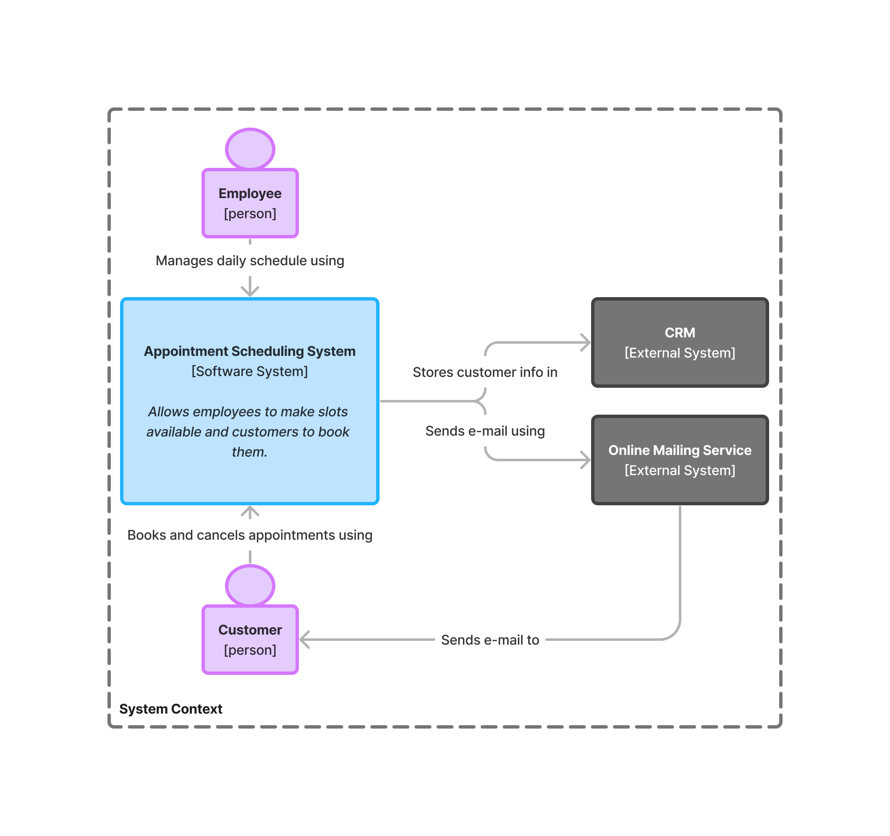
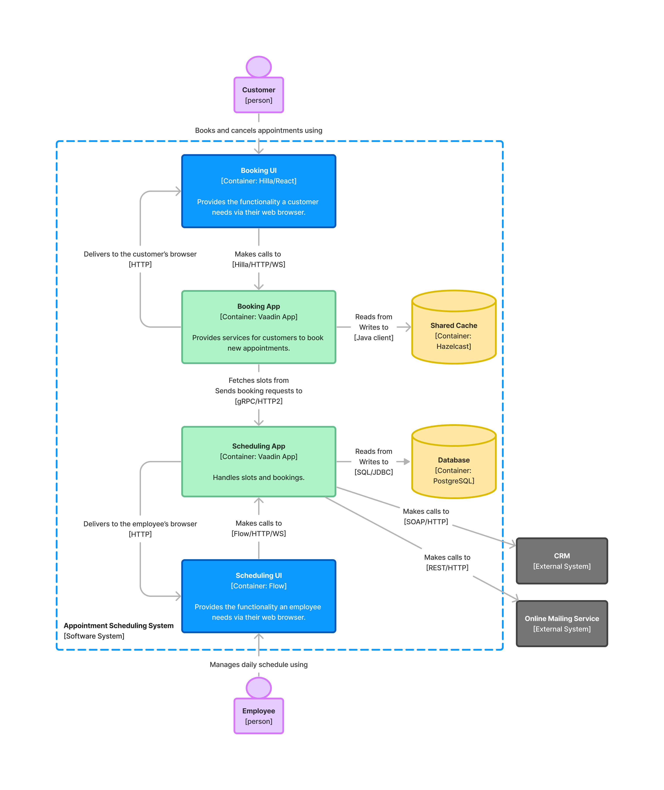
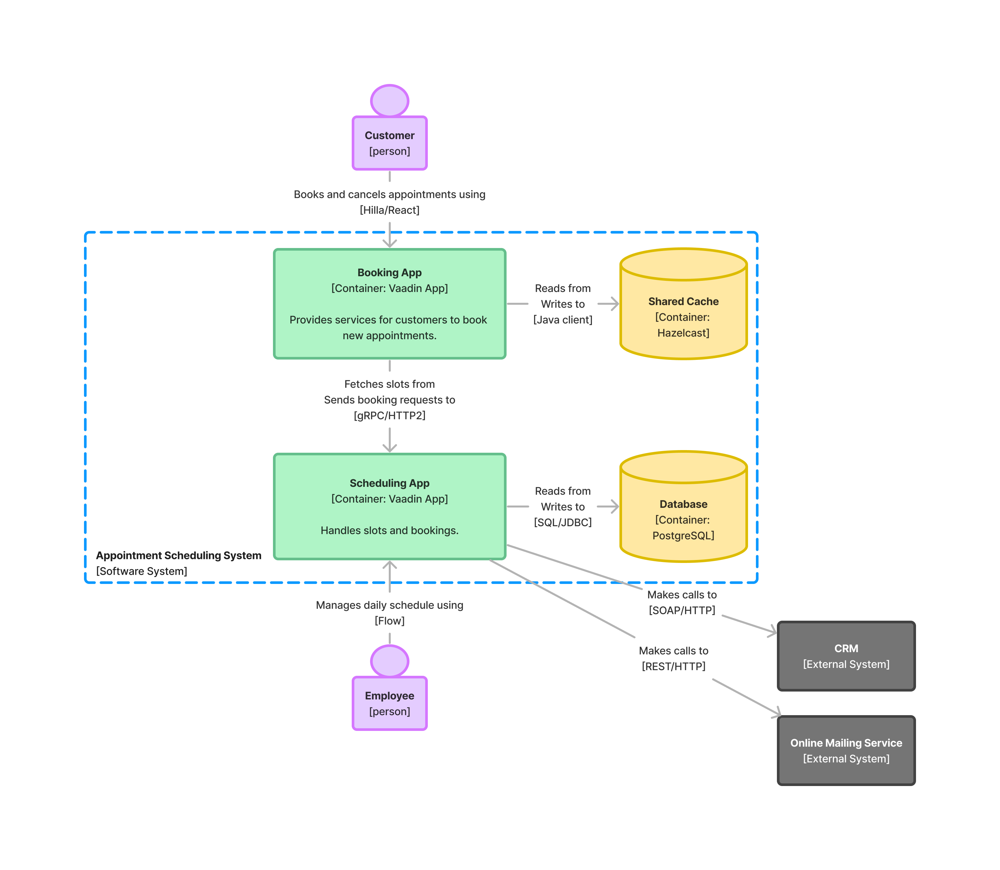
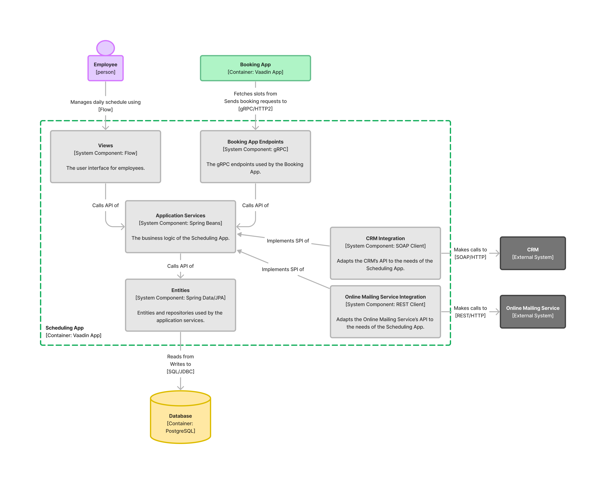

// TODO Can you make the images zoomable by clicking on them?

# Designing the Architecture

Software architecture is a wide concept. You can't point at a single thing and say "this is the software architecture". Software architecture has many aspects and can be looked at from various points of view. On this page, you'll only look at one of them: the structure of the software.
// If you are interesting in the other aspects, have a look at the <<{articles}/building-apps/architecture/deep-dive#,Deep Dive>> section of the documentation.

To explain your software architecture designs to other developers (and to yourself in the future), you need a good way of visualizing it. If you have been in the software business for a while, you have probably seen - or maybe even yourself drawn - an architecture diagram that could be described as an incoherent and inconsistent mess of boxes and arrows that confuses rather than clarifies.

At the other end of the spectrum you'll find dedicated modeling tools that use industry standard notations such as UML or SysML. These are without doubt useful, but require you to learn a new notation and purchase a dedicated modeling tool. Isn't there some kind of middle way, where you could draw simple diagrams that get the job done using your everyday generic diagramming tool?

Fortunately, there is a middle way and it is called the C4 model. C4 is a model for visualising software architecture in a notation and tooling independent manner. The model is presented in detail at https://c4model.com:[c4model.com], but the main ideas are summarized on this page.

The C4 model takes its inspiration from digital maps, where you can zoom in and zoom out. Higher zoom levels provide better overview but have less details, whereas lower levels have more details while providing less overview. C4 allows you to create "maps" of your code and provides four zoom levels for you to use: Context, Containers, Components and Code. You are not required to use all levels - it is perfectly fine to leave out a level if you don't find it valuable. There is no point in drawing diagrams for their own sake.

## Context

A _system context diagram_ is the highest zoom level and also a good starting point for your new architecture. It depicts how the system you are going to build fits into the world around it. It includes information about the users that are going to use the system and any external system that the system is going to integrate with. It does not contain any technical information at all - that is reserved for the lower levels.

Here is an example system context diagram of a fictional appointment scheduling system:

You can see that the system has two different types of users: employees and customers. You can also see that the system integrates with two external systems: a customer resource management (CRM) system, for storing customer information, and an online mailing service, for sending e-mails to customers.

The notation is very simple: it consists of boxes, circles, lines and text. It is important to remember to annotate the lines as well, as they describe the dynamics of the system. Observing the dynamics of a system can often tell you more than just looking at its static structure. For instance, if you left out the text from all the boxes in the diagram above, you could still figure out what they mean by only looking at the annotated arrows.

You can add as much or as little text as you want, as long as it tells the story you want to tell. In the diagram above you could, for instance, make the user's bigger and include more detailed descriptions of why the users want to use the system.

## Containers

If you "zoom in" on the software system in the context diagram, you get to the second level: a _container diagram_. In the C4 context, a container is either a deployable _application_ or a _data store_. It has nothing to do with Docker containers (even though you may end up packaging your applications as Docker containers). A container diagram shows the deployable parts of the system and how they interact with each other and any external systems.

Continuing with the fictional appointment scheduling system example, zooming in on the system box gives the following container diagram:

As you can see, the diagram reveals a lot more details than the context diagram. You can see that the system consists of six containers: two web browsers (the employee's and the customer's), two Vaadin applications, a Hazelcast shared cache and a PostgreSQL database. You can see that the employee facing user interface is using Flow and the customer facing user interface is using Hilla and React. You can also see how the containers communicate with each other and with the external systems.

The notation follows the same pattern as the system context diagram: boxes, circles, lines and text. You can add as much details as you need. For instance, if modeling the web browsers as separate containers is not relevant to you, you could simplify the diagram like this:

A Vaadin developer is able to deduce from this diagram that the users are using their web browsers to interact with the applications.

## Components

If you "zoom in" on a container in the container diagram, you get the the third level: a _component diagram_. The term _component_ is used quite liberally in the software industry, often for different things depending on the context. In the C4 context, the term component is defined as an encapsulation of related functionality that has a well-defined interface and that can be instantiated. 

However, as Vaadin also uses components to construct user interfaces, it makes sense to further quality the scope and type of a component with a prefix. Therefore, the components that you find in a component diagram are _system components_ and the components you find in a Vaadin user interface are _UI components_.

A component diagram shows how a container - like a Vaadin app - is constructed from system components. It includes information about the components' responsibilities, how they are implemented and how they interact.

Continuing with the fictional appointment scheduling system example, zooming in on the sheduling application container gives the following component diagram:

As you can see, the notation is again the same as in the previous two levels. 

If you had access to the source code of the scheduling application, this diagram would already be quite helpful in navigating it. You can see that there are six system components:

* The _Views_ system component contains the user interface and is built with Flow.
* The _Booking App Endpoints_ system component contains the https://grpc.io[gRPC] endpoints that the Booking App uses.
* The _Application Services_ system component contains the "busines logic" of the entire application. It has an API that is called by both _Views_ and _Booking App Endpoints_.
* The _Entities_ system component contains the entities and repositiories and uses Spring Data and JPA. It has an API that is called by _Application Services_.
* The _CRM Integration_ and _Online Mailing Service Integration_ system components act as adapters between the scheduling app and the external CRM system and online mailing service, respectively. They both implement SPIs that _Application Services_ has defined.

Because getting the system components right is an essential part of succeeding with building Vaadin applications, a separate <<{articles}/building-apps/architecture/components#,page>> has been devoted to that subject. There, you will learn more about APIs and SPIs of system components and how to turn system components into Java code.

## Code

If you "zoom in" on a system component in the component diagram, you get to the fourth and final level: a _code diagram_. This shows how a system component has been implemented in code and is typically drawn using UML or some other standard notation for code design. It is the most detailed of all the diagrams and, therefore, likely the one you will use the least.

The code is the ultimate source of truth and it changes often, especially in the beginning of the project. This means that any code diagrams you draw are likely to become outdated very quickly. It is therefore recommended to make code diagrams only for the most complex components. Whether you keep them up to date or discard them when they are no longer useful is up to you. The main point is, again, to only draw the diagrams that help you get the story told - or the job done.

// TODO Add links to articles once they have been written
