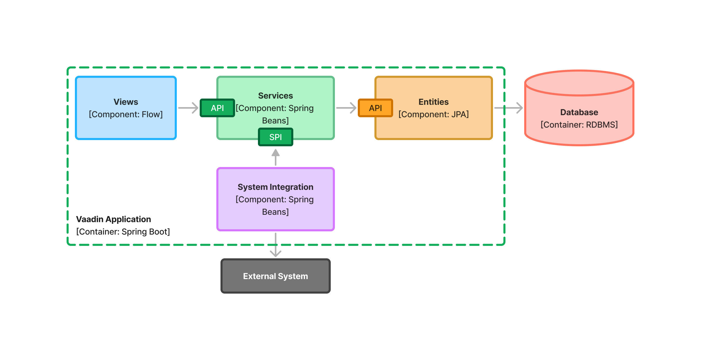
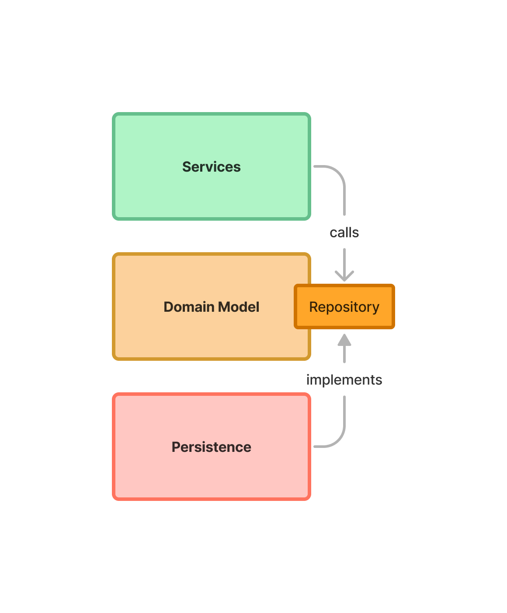
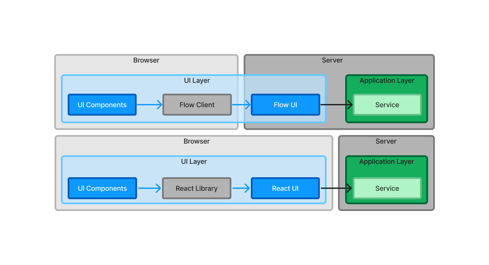

# Designing the Architecture

Software architecture is a wide concept. You can't point at a single thing and say "this is the software architecture". On this page, you'll look at one of the aspects of software architecture: the structure of the software. It will teach you everything you need to get started building Vaadin apps.

For a closer look at software architecture as a whole, go to the <<deep-dive, Deep Dive>> section of the documentation.

## What is a Component?

The term _component_ is used quite liberally in the software industry, often for different things depending on the context. In this context, the term component is defined as an encapsulation of related functionality that has a well-defined interface and that can be instantiated. Furthermore, the scope and type of a component can be qualified by a prefix. In a Vaadin app, there are two types of components: _UI components_ and _system components_.

Vaadin user interfaces are composed from UI components. Vaadin applications are composed from system components, of which at least one is the user interface. In this section, the focus is going to be on system components alone.

## System Components

Vaadin applications are composed from system components. The number of system components depends on the size and complexity of the application. A small application could have only one component, a large application tens of components. Here is an example of a Vaadin app with three components:

image:images/three-components.png[A diagram of three system components and a database]

Here, the views component talks to the services component. The services component in turn talks to the entities component, which uses JPA to communicate with a relational database.

The Java programming language has no component concept. Instead, you use Java packages to model components. Thus, the component diagram above would correspond to the following Java package structure:

* `com.example.application` - root package that contains the Spring Boot application class.
* `com.example.application.views` - package corresponding to the _views_ system component.
* `com.example.application.services` - package corresponding to the _services_ system component.
* `com.example.application.entities` - package corresponding to the _entities_ system component.

But how do components communicate with each other? You'll learn about that next.

### API

A system component can have an _Application Programming Interface_ (API) that allows other components to _call_ it. We say _can have_, because system components are not required to make themselves available to other components. For instance, a user interface system component will typically only be called by the web browser and never by other system components. It therefore does not need an API at all.

In Java, the API consist of all _public_ classes, interfaces and methods inside the system component package. In other words, the simplest possible component with an API is a package, that contains a single public Java class, that in turn contains a single public method.

All classes or methods that are not considered a part of the API should have a diffrerent visibility than public, such as package private.

A system component can inherit the API of another component that it depends on. For instance, in the example above, the services component can inherit the API of the entities component, like this:

.OrderService.java
[source,java]
----
package com.example.application.services;

import com.example.application.entities.OrderRepository;
import com.example.application.entities.DraftOrder;
import com.example.application.entities.CompletedOrder;

import org.springframework.stereotype.Service;
import org.springframework.transaction.annotation.Transactional;

@Service
public class OrderService { // <1>

    private final OrderRepository repository;

    OrderService(OrderRepository repository) { // <2>
        this.repository = repository;
    }

    @Transactional
    public CompletedOrder completeOrder(DraftOrder draftOrder) { // <3>
        var completedOrder = draftOrder.complete();
        return repository.save(completedOrder);
    }
}
----
<1> `OrderService` is a part of the API, so it is _public_.
<2> The services system component takes care of instantiating the service itself. The constructor is _package private_, as it is not part of the API.
<3> `completeOrder` is a part of the API, so it is _public_. `DraftOrder` and `CompletedOrder` are inherited from the API of the entities system component.

As you can see, you are not required to use Java interfaces for the API unless you need or want to. There is, however, one usecase where you are required to use Java interfaces. You'll learn about that next.

### SPI

A system component can also have a _Service Provider Interface_ (SPI) that allows other components to _plug into_ it. This is especially useful in cases where a component needs to interact with an external system, or when a component needs to externalize some business rules to another component, for example because they are so complex or change often.

An SPI is an interface that one component _declares_, and another component _implements_ (in other words, the adapter design pattern). In Java, it consists of at least one Java interface and optionally other types that the interface needs. For example, if the interface needs a Java class or a Java record as an input argument or return value, this would be a part of the SPI as well. An SPI is also allowed to include types from the system component's API.

For instance, in the example above, the services system component may need to integrate with an external system. Instead of putting all the code inside a single component, the services components declares an SPI. Then, a new system integration component is created that implements this SPI and handles the actual interaction with the external system:

This not only separates the concerns, but also protects the application from changes in the external system. If the external system's API changes, you only need to fix the system integration component. The rest of the system components can remain unchanged.

To distinguish between API and SPI classes interface, we recommend that the SPI classes and interfaces are put inside their own subpackage called `spi`. In the example above, the SPI could look like this:

.ShippingSystem.java
[source,java]
----
package com.example.application.services.spi; // <1>

import com.example.application.entities.CompletedOrder;

public interface ShippingSystem {

    void shipCompletedOrder(CompletedOrder completedOrder); // <2>
}
----
<1> The interface is in the `spi` subpackage to make it clear that it is intended to be implemented by another system component.
<2> The `CompletedOrder` class, which is inherited from the API of the entities system component, can also be used by the SPI.

There are also cases where an interface can act as both the API and the SPI of the component at the same time. A typical example of this is the repository interface of a domain model component:

The repository interface is a part of the API of the domain model and called by the services system component. However, the repository interface is also a part of the SPI of the domain model and implemented by the persistence system component (that in turn talks to the database). In this case, using a subpackage `spi` is only confusing. Instead, JavaDocs or custom annotations (like `@API` or `@SPI`) should be used to explain the roles of the interface. Sometimes you just have to be pragmatic.

### Instantiating Components

As Java has no component concept, a component instance consists of ordinary Java objects during runtime. These objects are instantiated by Spring, which also takes care of setting up the dependencies between them through dependency injection. We recommend using _constructor injection_ into _final_ fields, rather then autowiring into mutable fields, like this:

.InvoiceGenerationService.java
[source,java]
----
@Service
public class InvoiceGenerationService {
    
    private final InvoiceRepository invoiceRepository;
    private final AccountingSystem accountingSystem;
    private final ApplicationEventPublisher eventPublisher;

    InvoiceGenerationService(InvoiceRepository invoiceRepository,
                             AccountingSystem accountingSystem,
                             ApplicationEventPublisher eventPublisher) {
        this.invoiceRepository = invoiceRepository;
        this.accountingSystem = accountingSystem;
        this.eventPublisher = eventPublisher;
    }
}
----

There are three reasons for this recommendation: it becomes immediately clear what the dependencies of the class are, it is impossible to even instantiate the class without the necessary dependencies, and it is impossible to accidentally modify the dependencies after instantiation. If the number of constructor arguments grows too big, the class has too many responsibilities and needs to be split up into smaller parts.

In most cases, using Spring's component scanning and stereotype annotations (`@Component`, `@Service`, etc.) is enough to instantiate all the objects in your system component, regardless of whether they are public or package private. However, if you need more finegrained control over the object creation, you can utilize Spring's Java-based container configuration. Inside your component, create a `@Configuration`-annotated class and use `@Bean`-methods to create the objects.

Unless you need to `@Import` the configuration class into some other configuration class, you can make it package private to make it clear that it is not considered a part of the system component's API.

If you are not familiar with Spring's Java-based container configuration, or you want to learn more about it, please read the https://docs.spring.io/spring-framework/reference/core/beans/java/basic-concepts.html:[Spring Framework Documentation].

## Conceptual Layers

If you have any previous experience with software architectures, you have probably heard about layers. You may have ran into terms like "presentation layer", "business logic laye", "infrastructure layer", etc. Layers can help you reason about the structure of the application, but they can also impose unneccessary restrictions. For instance, if you require that a layer can only depend on the layers below it, you cannot use SPIs. Because of this, we recommend you focus on components rather than layers in your Vaadin apps.

That said, there are two layers that make sense to use in Vaadin apps as well: _presentation layer_ and _application layer_.

In traditional web apps, you have the _frontend_ and the _backend_. The frontend of the application runs inside the user's web browser whereas the backend runs on the server. Furthermore, the frontend is more or less synonymous with the user interface of the application and the backend is the "business logic" or simply "everything else". In a Vaadin application, however, the terms frontend and backend can be confusing. Take a look at this diagram:

When you are building your user interface with Flow, the user interface is written in Java and runs on the server - the backend. Unless you have created any web components of your own, all the code that runs in the browser - the frontend - is provided by Vaadin in one way or the other. There is a frontend and a backend, but they do not map directly onto user interface and business logic.

On the other hand, when you are building your user interface with Hilla, the user interface is written in React and runs in the browser while the rest of the application runs on the server. In this case, the frontend and backend correspond to user interface and business logic.

It is also possible to write hybrid applications, where some parts of the user interface are written in Java and other parts are written in React. In this case, you will have parts of your user interface running in the browser and parts on the server.

Because of this, it makes more sense to talk about presentation layer and application layer, as opposed to frontend and backend (or user interface and business logic). It is important to note that these layers are _conceptual_ rather than physical: in a Flow or hybrid application, the presentation layer covers both the browser and a part of the server, wheras in a Hilla application, the presentation layer is confied to the browser alone. In all cases, the application layer resides on the server.
