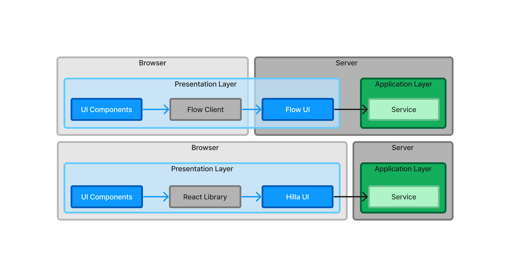

// TODO Expand this page and add links and references to other pages

= Conceptual Layers

If you have any previous experience with software architectures, you have probably heard about layers. You may have run into terms like “presentation layer”, “business logic layer”, “infrastructure layer”, etc. Layers can help you reason about the structure of the application, but they can also impose unnecessary restrictions. For instance, if you require that a layer can only depend on the layers below it, you can't use Service Provider Interfaces (SPI). Because of this, you should focus on system components with clear <<api-spi#,APIs and SPIs>> rather than layers in your Vaadin applications.

That said, two layers make sense to use in Vaadin applications as well: the _UI layer_ (also known as the _presentation layer_) and the _application layer_.

In traditional web applications, you have the _frontend_ and the _backend_. The frontend of the application runs inside the user's web browser whereas the backend runs on the server. Furthermore, the frontend is more or less synonymous with the user interface of the application and the backend is the "business logic" or "everything else". In a Vaadin application, however, the terms frontend and backend can be confusing. Take a look at this diagram:

[.fill]
[link=images/layers.png]

When you are building your user interface with Flow, you write the user interface in Java and run it on the server - the backend. Unless you have created any web components of your own, all the code that runs in the browser -- the frontend -- is provided by Vaadin in one way or the other. The frontend and backend don't map directly onto the user interface and business logic.

When you are building your user interface with Hilla, you write the user interface in React and run it in the browser. The rest of the application runs on the server. In this case, the frontend and backend correspond to the user interface and business logic.

It's also possible to write hybrid applications, where you write some parts of the user interface in Java and other parts in React. In this case, parts of the user interface run in the browser and parts on the server.

Because of this, it makes more sense to talk about the UI layer and the application layer, as opposed to the frontend and the backend, or the user interface and the business logic. It's important to remember that these layers are _conceptual_ rather than physical. In a Flow or hybrid application, the UI layer covers both the browser and a part of the server. In a Hilla application, the UI layer is limited to the browser alone. In all cases, the application layer resides on the server.
