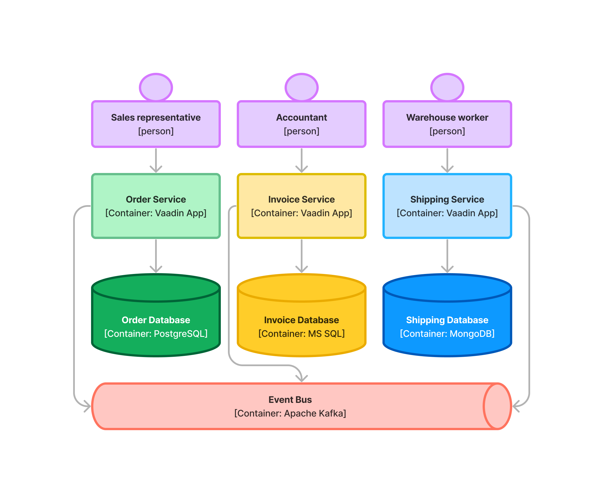
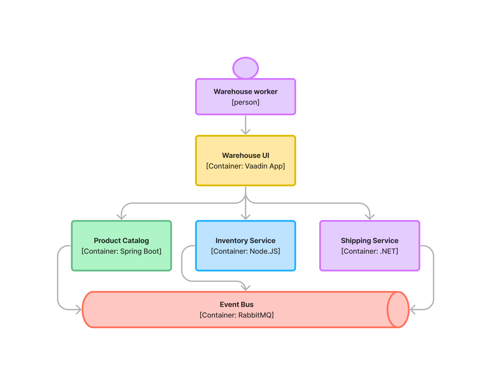

= Microservices

Microservices is an architectural style that deconstructs a system into a collection of _loosely coupled_ and _independently deployable_ services. Each microservice is centered around a specific business capability and is developed, deployed and scaled independently, typically by one team. A microservice typically has its own database that's not shared with any other service.

Microservices interact over network calls and can therefore be built using different programming languages and frameworks, as long as the communication protocols (such as gRPC and JSON/REST/HTTP) are compatible. Because microservices can go down and back up at any time, they have to be resilient by design. A service calling another service should remain operational even if the other service is unavailable.

You can read more about microservices at, for example, https://martinfowler.com/microservices/[martinfowler.com], https://microservices.io/[microservices.io], or https://microservices.io/[Wikipedia].

// TODO Add link to page about architectural styles once written

== Microservices & Vaadin

Vaadin is not itself a platform for building microservices. However, you can build and deploy Vaadin applications for microservice environments. Since Vaadin applications are Spring Boot applications, they function well together with https://spring.io/projects/spring-cloud[Spring Cloud].

The two primary use cases for Vaadin in a microservice environment are building _dedicated_ user interfaces, and building _aggregating_ user interfaces. These are described next. If your use case doesn't fall in either of these categories, you may need to use something else for your user interface.

=== Dedicated User Interfaces

Some microservices can have their own user interfaces. For example, if a particular department within a larger organization has its own microservice, it makes sense that the user interface is also specific to that department. Since the microservice is designed for internal use, it's not likely to require as much scaling as, for example, a public-facing web shop. Therefore, it makes more sense to build the microservice as a Vaadin application, with its own Vaadin user interface. The service can still expose an API for other microservices to use.

Look at the following example:

[.fill]
[link=images/microservices-dedicated.png]

In this fictional organization, orders, invoicing and shipping are handled by separate departments. Each department has its own microservice with a Vaadin UI specialized for their needs. The microservices are also communicating with each other through an event bus.

=== Aggregating User Interfaces

Sometimes, you may have to build a user interface for a specific group of users that need to interact with multiple microservices through some API. In this case, the user interface alone becomes a microservice itself, but without an API. The user interface aggregates multiple microservices into a holistic user experience, preventing the user from having to jump between multiple user interfaces in their day-to-day work.

Look at the following example:

[.fill]
[link=images/microservices-aggregating.png]

In this fictional organization, the warehouse workers need access to both the product catalog, the inventory service and the shipping service. These microservices are all maintained by different teams, who use different frameworks (such as Spring Boot, Node.js and .NET) to build them. The microservices expose REST API:s for the user interface to use while communicating with each other through an event bus.

The warehouse UI is a Vaadin application that provides not only the user interface itself but also acts as its own _API gateway_. In other words, there's no need to set up a separate API gateway since the Vaadin application can communicate directly with the other microservices. This is effectively the Backend For Frontend (BFF) pattern.

// TODO Is there a link to more information about BFF?

== Advantages

Microservices emerged over a long period in response to a particular set of problems that they are good at solving. Here are the main benefits of building microservice-based systems:

=== Targeted Scalability

You can scale specific microservices according to demand. This is beneficial if different parts of the system have varying loads. By only scaling the parts that need it, you can use the hardware resources more efficiently, thereby saving money.

=== Flexibility in Technology

Since the microservices are decoupled and communicate over standardized network protocols, the teams can choose the best technology stack for their requirements. This also reduces the risk of vendor-lock-in.

=== Resilience

Well-designed microservices can handle failures gracefully, either by degrading functionality or by employing fallback mechanisms. Given the fact that they are also loosely coupled and independently deployable, the system as a whole becomes more resilient to disturbances. The failure of a single service won't take down the entire system.

=== Continuous Deployment

Teams can work on their own microservices at their own pace and deploy them as often as they like, without affecting the rest of the system. Microservices can be developed in parallel and features can be deployed faster.

== Disadvantages

Microservices are useful for solving a certain class of problems. For other problems, they may be overkill -- or perhaps not suitable at all. Here are the main drawbacks of building microservice-based systems:

=== Increased Complexity

As the number of microservices increases, so does the number of moving parts. Getting these parts to interact efficiently and consistently isn't easy. Data integrity is harder to achieve when multiple services are involved in implementing the same business process, especially when any of these services can go down at any time.

If you're not careful, your efforts may result in a distributed monolith that has none of the advantages of microservices, but all the disadvantages. In the worst case, you may end up with a _Distributed Ball of Mud_, which is even worse than a "Big Ball of Mud".

=== Technology Creep

Letting teams choose their own technology stacks was listed earlier as an advantage, but that can also be a disadvantage. Having too many technology stacks can make it more difficult to move developers between teams, which is a risk for the organization. Furthermore, the development and deployment environment -- with its continuous delivery chains and all -- becomes more complicated the more technology stacks it needs to support.

=== Communication Overhead

Microservices communicate over network calls, which are inherently slower than function calls. Furthermore, network calls are inherently less secure than function calls: They require more overhead for encryption, decryption, authentication, etc. If not managed, this leads to poor performance of the system.

=== Testing & Debugging Challenges

A distributed system consisting of multiple processes is more difficult to test and debug than a single process running on a single machine. The root cause of an issue observed in one microservice may be in a different microservice.

== When to Use

Microservices have their advantages and disadvantages. It's important to know when it's a good choice. In summary, here are some factors that should exist for it to be the right choice:

- You have more than one team working on the system.
- Your system is providing more than one service to more than one group of users.
- You need to be able to redeploy parts of your system without affecting others.
- Different parts of the system have different loads, requiring different scaling.
- You know how to build microservices or already have a microservice environment up and running.

Before you start a new microservice-based project, you should consider whether a <<monoliths#,monolith>> would be enough to get the job done.
