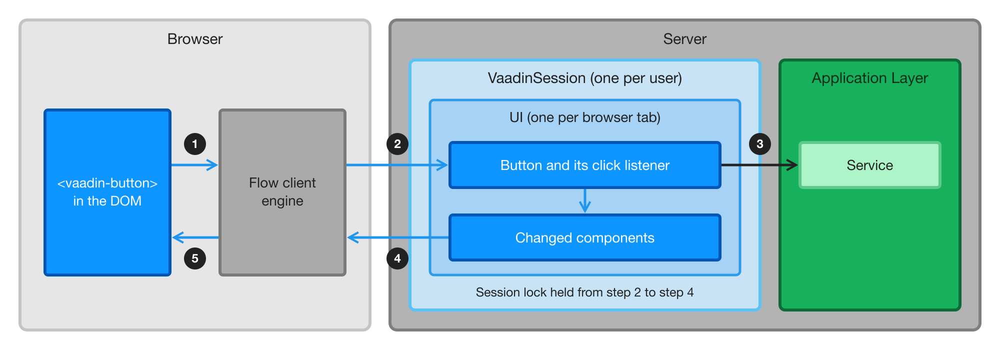

= How a Vaadin Application Works

A Flow view looks like a desktop user interface written in Java, but it runs as a web application with many concurrent users. Its UI state lives on the server, and every interaction that runs Java code is a network round trip. The server handles the requests of one user one at a time. This server-side model is what makes Vaadin productive: you don't design an API for your own user interface, and your UI code can call any Java service directly. It also shapes how you write views, how you run slow work, and how you deploy the application.

This page explains the runtime model of Flow views, and how React views differ from it. Read it before you make decisions about deployment, scaling, or which kind of view to use.

== At a Glance

* *UI state lives on the server.* The server keeps a Java object for every component that a user sees, in every browser tab that the user has open.
* *Interactions are round trips.* When a user clicks a button with a server-side listener, the browser sends the click to the server, and waits for the resulting changes to come back.
* *One user, one lock.* The server handles the requests of one user's session one at a time. Requests from different users run in parallel.
* *Sessions live in server memory.* Scaling out requires sticky sessions. Surviving the loss of a server requires session replication.
* *Two copies, kept in sync.* The browser and the server each hold a copy of the UI, and Flow keeps them in sync. A Flow view can't run any Java code while the connection is down. When the connection returns, the user continues where they left off -- if the server still has their UI.

== What Happens When a User Clicks a Button

The following diagram shows what happens when a user clicks a button in a Flow view:

[.fill]
[link=images/request-flow.png]

. The user clicks a button. The button is a web component, such as `<vaadin-button>`, that Vaadin has added to the page. The Flow client engine -- the part of Vaadin that runs in the browser -- receives the click event.
. The client engine sends the event to the server, by default in an HTTP request. The server finds the user's [classname]`VaadinSession`, and locks it. It then finds the [classname]`UI` of the browser tab that sent the event, and calls the click listeners of the corresponding [classname]`Button` object.
. Your click listener runs on the server as ordinary Java code. It can read the values of the fields in the view, because the browser has sent them to the server when they changed. It can call an application service directly, in the same thread, without an API layer.
. When the listener returns, Flow collects the changes made to components during the request, and releases the session lock. It then sends the changes to the browser as JSON in the HTTP response.
. The client engine applies the changes to the page, and the user sees the result.

If you use <<{articles}/building-apps/server-push#,server push>> with the `WEBSOCKET` transport, the event and the changes travel over the push connection's WebSocket instead of an HTTP request and response. The server handles them the same way, but servlet filters -- such as a filter that adds a request ID to log messages -- don't run for them. The default transport, `WEBSOCKET_XHR`, uses the WebSocket only for messages from the server, so events still arrive as HTTP requests.

Navigating between Flow views, and loading more rows as the user scrolls a <<{articles}/building-apps/forms-data/add-grid#,grid>>, work the same way. <<{articles}/flow/what-is-flow#,What Is Flow?>> describes these in more detail.

=== Which Interactions Need the Server

Every interaction that runs your Java code needs a round trip. This includes clicks and other events that have server-side listeners, navigation between Flow views, and fetching data lazily. The browser sends field values to the server when they change -- by default, when the user commits the value by pressing kbd:[Enter] or moving the focus away from the field.

Behavior that's built into the web components runs in the browser without a round trip. Typing into a field, opening a date picker, showing hover and focus effects, and adapting a responsive layout to the screen size don't involve the server.

This has practical consequences:

* *Latency adds up.* Each interaction takes one network round trip plus the time your listener needs. Over a local network, this is hard to notice. Over a mobile or intercontinental connection, every interaction pays the network delay. Try your views with network throttling turned on in the browser's developer tools before you commit to a deployment region.
* *Listeners should be fast.* While a listener runs, the user waits. If a response takes longer than 300 milliseconds, Vaadin shows a <<{articles}/flow/advanced/loading-indicator#,loading indicator>>. Move work that takes longer than that to a background thread, as described in <<#threads-and-the-session-lock,Threads and the Session Lock>>.
* *Eager fields cost requests.* A text field can send its value on every keystroke, which is useful for filtering as the user types. Each keystroke is then a request, so for that purpose, prefer a value change mode that waits for the user to pause, such as `LAZY`. The <<{articles}/components/text-field#,Text Field>> documentation lists the modes.

== Where State Lives

For Flow views, the server is the source of truth. The browser holds a copy of the UI, which is the page that the user sees. Flow keeps that copy in sync with the server, as described in <<#keeping-the-browser-and-server-in-sync,Keeping the Browser and Server in Sync>>. On the server, the state is organized as follows:

[cols="1,2,2,3",options="header"]
|===
|Object |How many |Lives until |Holds

|[classname]`VaadinSession`
|One per user and browser, tied to the HTTP session
|The HTTP session expires or is invalidated, for example at logout
|The user's UIs, and beans in the `@VaadinSessionScope`

|[classname]`UI`
|One per browser tab
|The tab is closed or reloaded, or the session ends
|The component tree of the current view, and beans in the `@UIScope`

|View
|One per UI at a time
|The user navigates to another view, or the UI ends
|The fields of your view class, such as the form that the user is editing, and data that you've loaded

|Singleton bean
|One per application instance (JVM)
|The application stops
|Application services, repositories, caches, and anything else shared by all users
|===

For more information about the scopes, see <<{articles}/flow/integrations/spring/scopes#,Vaadin Spring Scopes>>.

This model has the following consequences:

* *Each tab starts over.* Every browser tab gets its own UI, and its own instances of your views. Reloading the page creates new view instances, so anything the user hasn't saved is lost -- unless the view has <<{articles}/flow/advanced/preserving-state-on-refresh#,`@PreserveOnRefresh`>>. To make a view survive a reload or a new tab, keep its state in the database, or in the URL as described in <<{articles}/building-apps/views/pass-data#,Pass Data to a View>>.
* *Memory grows with open tabs.* A user with five open tabs has five UIs in memory. How much each one costs depends on what your views hold. A grid that keeps 10,000 entities in a list costs more than a <<{articles}/building-apps/forms-data/add-grid/paginated-data#,paginated grid>>, which fetches only the rows the user scrolls to. Measure the memory of a realistic session, for example with a <<{articles}/flow/testing/load-testing#,load test>>, rather than relying on a rule of thumb.
* *Closed tabs are cleaned up.* When the user closes a tab or leaves the page, the browser notifies the server, and the server removes the UI. If that notification never arrives -- for example, because the browser crashed or the device lost its network -- the server removes the UI after it has missed three heartbeats. The browser sends a heartbeat every five minutes by default. Views with `@PreserveOnRefresh` always wait for the heartbeats, so that a reload can still find them.
* *Open tabs keep the session alive.* Heartbeats count as activity, so by default a session with an open tab never expires, even when nobody uses it. To end idle sessions, set the `closeIdleSessions` <<{articles}/flow/configuration/properties#,configuration property>> to `true`. The session timeout is then counted from the last request that isn't a heartbeat. See <<{articles}/flow/advanced/application-lifecycle#application.lifecycle.session-expiration,User Session Expiration>> for details.

== Threads and the Session Lock

The server handles each request in a thread of its own. Before Flow calls any of your listeners, it locks the user's [classname]`VaadinSession`, and it keeps the lock until it has collected the resulting changes. This has the following consequences:

* *UI code is single-threaded per user.* You don't need to synchronize access to components or to the fields of a view, because only one thread at a time works with a session. Requests from different users run in parallel, in different threads.
* *A user's tabs wait for each other.* The lock covers the whole session, not a single UI. If a listener in one tab takes ten seconds, the user's other tabs can't do anything during those ten seconds either.
* *Other threads have to take the lock.* To update the UI from a background thread, call [methodname]`UI.access()`, which runs your code while holding the lock, and enable <<{articles}/building-apps/server-push#,server push>> to deliver the changes to the browser. You can also bind the components to <<{articles}/flow/ui-state#,signals>>, which you can update from any thread. Do the slow work outside [methodname]`access()`, and only update the UI inside it: [methodname]`access()` holds the same lock as a request does.
* *Thread-local state stays behind.* [methodname]`UI.getCurrent()` and [methodname]`VaadinSession.getCurrent()` return `null` in a background thread, so get the [classname]`UI` instance before you start the thread. Spring Security keeps the current user in a thread-local `SecurityContext` too. A service that's protected with method security denies a call made from a background thread, even though the same call works in a click listener.

<<{articles}/building-apps/server-push/threads#,User Interface Threads>> shows how to start background work from a view, and <<{articles}/building-apps/business-logic/background-jobs#,Background Jobs>> covers work that runs independently of any user. To find listeners that hold the lock for too long, you can [since:com.vaadin:vaadin@V25.3]#measure lock wait and hold times# through the <<{articles}/flow/advanced/session-lock-and-rpc-listeners#,service event bus>>.

== Keeping the Browser and Server in Sync

The browser and the server each hold a copy of the UI. The browser has the page that the user sees, including anything that the user has typed but that hasn't reached the server yet. The server has the component tree. A change counts only once it has reached the server: until then, your Java code doesn't know about it.

Flow keeps the two copies in sync by exchanging messages: events from the browser, and changes from the server. It numbers the messages in both directions, so that each side can tell whether it has missed one:

* The browser sends one message at a time. While it waits for the response, it queues any new events, and sends them after the response has arrived.
* If no response arrives, the browser sends the same message again. The server recognizes a message that it has already handled, and sends the same response again instead of calling the listeners a second time. A click that's resent because of a network problem is therefore handled only once.
* The browser applies the changes from the server in the order in which the server made them.

=== When the Connection Is Lost

When the browser can't reach the server, the view stays on the screen as it was, and Vaadin shows that it's trying to reconnect. The browser keeps trying to deliver the waiting message, by default every five seconds.

The user can keep typing and clicking in the meantime. The browser queues the events, but nothing that needs the server happens: no listener runs, no dialog opens, and no server-side validation takes place. Until the events reach the server, what the user enters exists only in the browser.

What happens when the connection returns depends on whether the server still has the user's UI:

* *The UI still exists.* The browser delivers the queued events, and the user continues where they left off.
* *The UI is gone.* This happens if the browser was offline long enough to miss three heartbeats, the session expired, or the server was restarted. Vaadin then reloads the page, which creates a new UI. Anything the user hadn't saved is lost, including the events that were waiting to be delivered. If the application requires login, the user also has to log in again. You can show a message before the reload, or redirect elsewhere, by <<{articles}/flow/advanced/customize-system-messages#,customizing the system messages>>.

A Flow view can't work offline. If a part of your application has to keep working without a connection, implement it as a React view.

=== When the Copies Drift Apart

A message from the server can also go missing while the connection seems to work, and the UI still exists on the server. The browser notices this when the next message arrives with a number that it doesn't expect. If the missing message doesn't arrive within five seconds, the browser asks the server for the complete state of the UI, and rebuilds the page from it without reloading. This is called _resynchronization_.

Resynchronization typically happens because of:

* An unreliable network that loses packets.
* A proxy, load balancer, firewall, or virus scanner that closes or interferes with push connections -- for example, a proxy whose connection timeout is shorter than the push timeout.

Resynchronization repairs the page, but it has side effects that your code has to tolerate:

* *Components are detached and attached again.* The server runs the detach and attach listeners of every component in the UI, including your [methodname]`onDetach()` and [methodname]`onAttach()` methods, even though the user didn't navigate anywhere. Make sure that code in them can run more than once. For example, a view that subscribes to updates when it's attached has to unsubscribe when it's detached, or it ends up with two subscriptions.
* *Pending JavaScript calls are discarded.* Calls made with [methodname]`executeJs()` that haven't reached the browser are dropped. If the page depends on such a call, make it from [methodname]`onAttach()`, so that it runs again after a resynchronization.

The server logs a warning every time it resynchronizes a UI. If the warning shows up often, check the network infrastructure between the browser and the server. See <<{articles}/flow/advanced/server-client-communication#,Sync Server & Client UI States>> for the details of the mechanism and its configuration.

== What This Means for Deployment

Because each user's UI state lives in the memory of one server, deploying a Flow application differs from deploying a stateless REST API:

* *Load balancers need sticky sessions.* All requests of a session have to reach the server that holds it. Without sticky sessions, requests reach servers that don't have the user's session, and users get unexpected reloads that lose their unsaved work. See <<{articles}/flow/production/distributed-deployment#,Distributed Deployment Architecture>>.
* *Losing a server loses its sessions.* A server can stop because it crashed, because the cluster scaled down, or because you deployed a new version. Its users then get a reload on their next interaction, and lose anything they hadn't saved. To avoid this, replicate the sessions to other servers. Replication requires everything in the UI to be serializable, and generic replication solutions don't work with the Vaadin session lock. The commercial <<{articles}/tools/kubernetes#,Kubernetes Kit>> provides session replication and rolling updates on Kubernetes.
* *Memory decides capacity.* The number of concurrent users a server can handle depends on how many UIs they keep open, and on what those UIs hold. Size your servers by load testing your own views.
* *In-memory state is per instance.* Each instance has its own caches, <<{articles}/building-apps/server-push/updates#broadcasting-to-all-users,shared signals>>, and other singletons. A change on one instance doesn't reach users connected to another one.
* *Proxies have to allow push.* If you use server push, reverse proxies and load balancers have to support long-lived connections, such as WebSockets. See <<{articles}/flow/production/reverse-proxy#,Reverse Proxy>>.

.Compact Object Headers Save Memory
[TIP]
Java 27 enables https://openjdk.org/jeps/534[compact object headers] by default, which makes most Java objects smaller. In a measurement of an example Vaadin application, running the same JAR on Java 27 instead of Java 25 reduced the memory used per user by about 14 percent. On Java 25, you can get the same effect by starting the JVM with the `-XX:+UseCompactObjectHeaders` option.

== How React Views Differ

A <<{articles}/building-apps/react#,React view>> runs in the browser. Its state lives in JavaScript, and it contacts the server only when your code calls a <<{articles}/building-apps/react/call-services#,browser-callable service>>. Flow views and React views can be combined in the same application, and they differ as follows:

[cols="1,2,2",options="header"]
|===
| |Flow View |React View

|UI state
|In server memory, per browser tab
|In the browser

|Round trips
|For every interaction that runs Java code
|Only for service calls

|Lost connection
|The view can't run any Java code until the connection returns
|The view keeps running, but service calls fail until the connection returns

|Access to the view
|Denied unless an annotation grants it
|Public unless the view or its layout sets `loginRequired`

|Where access is enforced
|On the server, in the views and in the services behind them
|In the browser-callable services, which are denied by default
|===

A React view that uses session-based login, which is the default, still depends on the HTTP session. Losing the session logs the user out, but there's no server-side UI state to lose.

The defaults for access control are opposite on purpose. A Flow view runs on the server, so Flow can deny it until you grant access. A React view runs in the browser, where the user can change anything, so the real security boundary is the services it calls. When you add a React view to an application whose Flow views all require login, the new view is public until you set `loginRequired` on it. See <<{articles}/building-apps/security/protect-views#,Protect Views>> and <<{articles}/building-apps/react/security#,Secure React Views>>.

For Flow views, the browser can only send events to components that the server has rendered. Flow ignores events from components that are invisible or disabled, so hiding or disabling a button on the server also prevents its action. This doesn't make the views a complete security boundary, though. Protect your application services as well, as described in <<{articles}/building-apps/security/protect-services#,Protect Services>>.

== Choosing Flow or React Views

Flow views fit business applications well -- the forms, grids, and workflows of internal tools, back-office systems, and portals for authenticated users. In particular, Flow views are a good choice when:

* Users have a reasonably reliable connection to the server.
* You want business logic, validation, and access control to stay on the server.
* The number of concurrent users fits in the memory of your servers, which you can find out by load testing.
* Your team knows Java better than web development. With Vaadin's components, layouts, and themes, a Java developer can build a good-looking, fully functional view without writing HTML, CSS, or JavaScript.

Consider React views for the parts of an application that:

* Have to work offline.
* React to every keystroke or pointer movement, such as a drawing canvas or a real-time editor.
* Serve many anonymous visitors, such as a public landing page, where keeping a server-side UI for every visitor costs memory without adding value.

Also consider who builds and maintains the views. A React view requires knowledge of React, TypeScript, HTML, and CSS, in addition to the Java of the services behind it. If your team doesn't have those skills yet, every React view adds something they have to learn and maintain.

For more guidance, see <<{articles}/building-apps/react#when-to-use-react-views,When to Use React Views>>.
