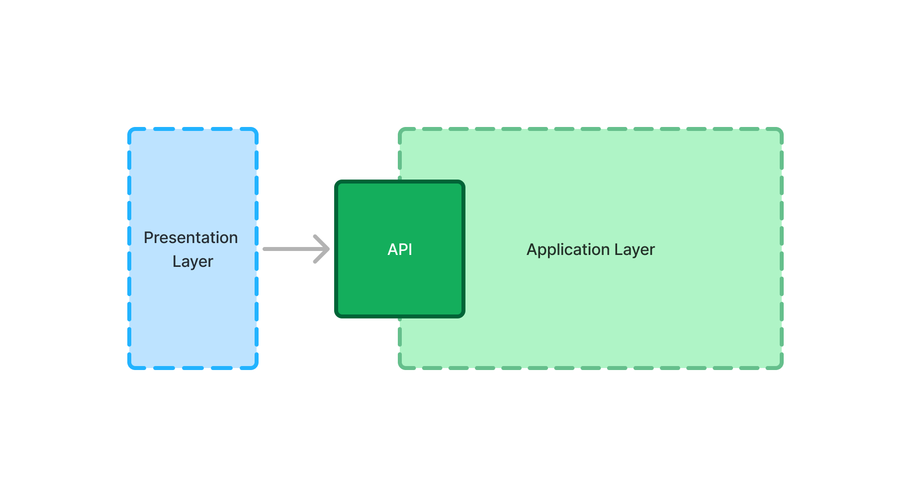

= Add an Application Service

In a Vaadin application, the _application layer_ contains the business, the data, and any integrations to external systems. The application layer exposes an API that the _presentation layer_ (i.e., the views) can call:

This API is implemented by _application services_. In practice, application services are *Spring beans* that you can call from Vaadin Flow and React views. 

== Design Guidelines

You can design application services according to your preferred architectural style, but following these best practices helps prevent common issues:
 
* The application services should be *stateless*.
* Application services should *initiate and complete database transactions* before returning results.
* The application services should be *secure*.
* Views should invoke application services, but application services *should not have dependencies on views*.

[NOTE]
Application services can use Vaadin's non-UI-related utilities and interfaces, but should not be tightly coupled to UI components.

An application service could look like this:

[source,java]
----
@Service // <1>
@PreAuthorize("isAuthenticated()") // <2>
public class OrderService {

    private final Validator validator;
    private final OrderRepository orderRepository;
    private final ApplicationEventPublisher eventPublisher;

    OrderService(Validator validator, 
            OrderRepository orderRepository, 
            ApplicationEventPublisher eventPublisher) {
        this.validator = validator;
        this.orderRepository = orderRepository;
        this.eventPublisher = eventPublisher;
    }

    @Transactional(propagation = Propagation.REQUIRES_NEW) // <3>
    public OrderId createOrder(OrderForm orderForm) {
        var validationErrors = validator.validate(orderForm);
        if (!validationErrors.isEmpty()) {
            throw new ConstraintViolationException(validationErrors);
        }
        var order = orderRepository.saveAndFlush(createOrderFromForm(orderForm));
        eventPublisher.publishEvent(new OrderCreatedEvent(order)); // Notify other 
                                                                   // components of
                                                                   // the new order
        return order.orderId();
    }

    private Order createOrderFromForm(OrderForm orderForm) {
        // ...
    }
}
----
<1> Makes the service into a Spring bean.
<2> Protects the service from unauthorized access. See <<../../security/protect-services#,Protect Services>> for details.
<3> Runs the method inside a database transaction.

If you want to read more about application service design the Vaadin Way, see the <<{articles}/building-apps/deep-dives/application-layer/application-services#,Application Services Deep Dive>>.

== Calling from Views

You can call an application service both from Vaadin Flow and React. When calling an application service from a React view, it must be *browser callable*, which introduces certain design constraints. These constraints do not apply when calling the service from a Flow view.

The following guides teach you how to call application services in Vaadin Flow and React:

* <<flow#,Calling Application Services in Vaadin Flow>>
* <<react#,Calling Application Services in React>>
