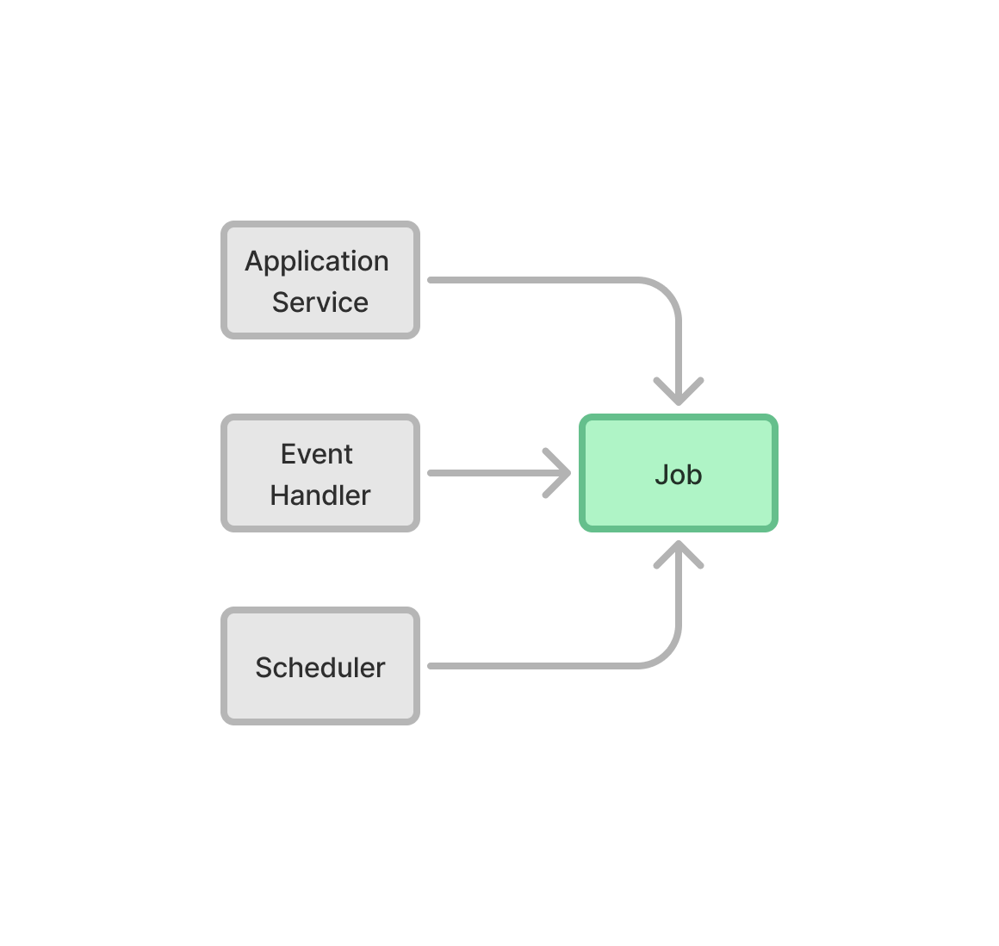

= Triggering Jobs

A trigger is an object responsible for starting a job, determining the thread in which to execute it, and handling any exceptions that occur during execution.

Jobs can be triggered in various ways, such as on application startup, at regular intervals (e.g., weekly, daily at midnight, or every five minutes), or in response to specific application events or user actions. The same job can have multiple triggers.

Below is a visual example of a job with three different triggers:

Spring has support for plugging in an `AsyncUncaughtExceptionHandler` that's called whenever an `@Async` method throws an exception. However, this moves the error handling outside of the method where the error occurred. To increase code readability, you should handle the error explicitly in each trigger.

Some triggers, like event listeners and schedulers, are not intended to be invoked by other objects. You should make them package-private to limit their visibility.

[NOTE]
On this page, all of the trigger examples are delegating to a separate <<jobs#,job object>>. However, if your job is simple, and you know it only needs one trigger, you can implement the job inside the trigger.

== User Triggered Jobs

For user triggered jobs, an <<../add-service#,application service>> acts as the trigger. You can create a dedicated service class for this, or add a method to a suitable, existing application service. Like all other application service methods, it should be protected using method-level security to ensure only authorized users can trigger the job.

// TODO Add link to security page once it has been written

The following example demonstrates how to trigger a background job from an application service using `@Async` and security annotations:

[source,java]
----
@Service
public class MyApplicationService {
    private static final Logger log = LoggerFactory.getLogger(MyApplicationService.class);
    private final MyBackgroundJob job;

    MyApplicationService(MyBackgroundJob job) {
        this.job = job;
    }

    @PreAuthorize("hasAuthority('permission:startjob')") // <1>
    @Async // <2>
    public void startJob(MyJobParameters params) {
        try {
            job.executeJob(params);
        } catch (Exception ex) {
            log.error("Error executing background job", ex);
        }
    }
}
----
<1> Spring ensures the current user has permission to start the job.
<2> Spring executes the method using its task executor thread pool.

The example above uses the `@Async` annotation, but you can also execute the job, <<../background-jobs#task-execution,programmatically>>.

If the job needs to provide real-time updates to the user interface (e.g., showing a progress bar or error messages), you have to use server push. For more details, see the <<interaction#,User Interface Interaction>> documentation page.

== Event Triggered Jobs

For event triggered jobs, you should create an event listener that receives events from Spring's event publisher. By default, the event publisher calls each listener in the same thread that published the event. You should therefore give the job to the `TaskExecutor`.

Below is an example of a listener that listens for `MyEvent` to be published. When the event occurs, it triggers the job in a background thread:

[source,java]
----
@Service
class PerformBackgroundJobOnMyEventTrigger {
    private static final Logger log = LoggerFactory.getLogger(PerformBackgroundJobOnMyEventTrigger.class);
    private final MyBackgroundJob job;

    PerformBackgroundJobOnMyEventTrigger(MyBackgroundJob job) {
        this.job = job;
    }

    @EventListener // <1>
    @Async // <2>
    public void onMyEvent(MyEvent event) {
        try {
            job.executeJob(event.someDataOfInterestToTheJob());
        } catch (Exception ex) {
            log.error("Error executing background job", ex);
        }
    }
}
----
<1> Spring calls the trigger when the `MyEvent` is published.
<2> Spring executes the method using its task executor thread pool.

This example uses the `@Async` annotation, but you can also execute the job, <<../background-jobs#task-execution,programmatically>>.

== Scheduled Jobs

For scheduled jobs, you should create a scheduler that uses Spring's scheduling mechanism to trigger the job.

Spring uses a separate thread pool for scheduled tasks. It's important not to use the scheduling thread pool for executing jobs, directly. Instead, schedule tasks using Spring’s `TaskScheduler` and then delegate the actual job execution to the `TaskExecutor`.

This is an example of a scheduler that schedules a job to execute every five minutes in a background thread:

[source,java]
----
@Service
class MyBackgroundJobScheduler {

    private static final Logger log = LoggerFactory.getLogger(MyBackgroundJobScheduler.class);
    private final MyBackgroundJob job;

    MyBackgroundJobScheduler(MyBackgroundJob job) {
        this.job = job;
    }

    @Scheduled(fixedRate = 5, timeUnit = TimeUnit.MINUTES) // <1>
    @Async // <2>
    public void executeJob() {
        try {
            job.executeJob();
        } catch (Exception ex) {
            log.error("Error executing scheduled job", ex);
        }
    }
}
----
<1> Spring calls the trigger every five minutes.
<2> Spring executes the method using its task executor thread pool.

The example here uses the `@Scheduled` and `@Async` annotations, but you can also execute the job using the task scheduler and task executor, <<../background-jobs#task-scheduling,programmatically>>.

Programmatic schedulers are more verbose, but they're easier to debug. Therefore, you should start with annotations when you implement schedulers. If you later need more control over scheduling, or run into problems that are difficult to debug, you should switch to a programmatic approach.

== Startup Jobs

For startup jobs, you should create a startup trigger that executes the job when the application starts.

If you need to block the application initialization until the job is completed, you can execute it in the main thread. For non-blocking execution, consider using a listener for the `ApplicationReadyEvent` to trigger the job once the application is fully initialized.

Here's an example of a trigger that blocks initialization until the job is finished:

[source,java]
----
@Service
class MyStartupTrigger {

    MyStartupTrigger(MyBackgroundJob job) {
        job.executeJob();
    }
}
----

[IMPORTANT]
Whenever you implement a startup trigger, be aware that the application is still being initialized. That means that not all services may be available for your job to use.

Below is an example of a trigger that executes a job in a background thread after the application has started:

[source,java]
----
import org.springframework.boot.context.event.ApplicationReadyEvent;

@Service
class MyStartupTrigger {

    private static final Logger log = LoggerFactory.getLogger(MyStartupTrigger.class);
    private final MyBackgroundJob job;

    MyStartupTrigger(MyBackgroundJob job) {
        this.job = job;
    }

    @EventListener // <1>
    @Async // <2>
    public void onApplicationReady(ApplicationReadyEvent event) {
        try {
            job.executeJob();
        } catch (Exception ex) {
            log.error("Error executing job on startup", ex);
        }
    }
}
----
<1> Spring calls the trigger when the `ApplicationReadyEvent` is published.
<2> Spring executes the method using its task executor thread pool.

This example uses the `@Async` annotation, but you can also execute the job, <<../background-jobs#task-execution,programmatically>>.
