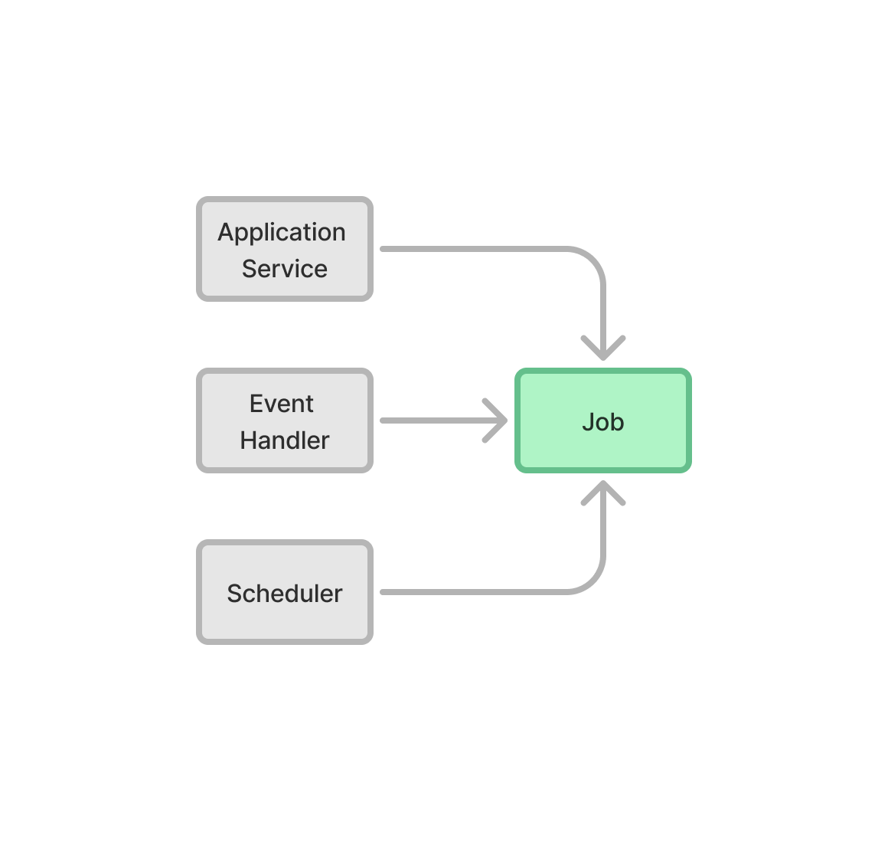

= Triggering Jobs

A trigger is an object responsible for starting a job, determining the thread in which to execute it, and handling any exceptions that occur during execution.

Jobs can be triggered in various ways, such as on application startup, at regular intervals (e.g., weekly, daily at midnight, or every five minutes), or in response to specific application events or user actions. The same job can have multiple triggers.

Below is a visual example of a job with three different triggers:

Spring has support for plugging in an `AsyncUncaughtExceptionHandler` that's called whenever an `@Async` method throws an exception. However, this moves the error handling outside of the method where the error occurred. To increase code readability, you should handle the error explicitly in each trigger.

Some triggers, like event listeners and schedulers, are not intended to be invoked by other objects. You should make them package-private to limit their visibility.

[NOTE]
On this page, all of the trigger examples are delegating to a separate <<jobs#,job object>>. However, if your job is simple, and you know it only needs one trigger, you can implement the job inside the trigger.

== User Triggered Jobs

For user triggered jobs, an <<../add-service#,application service>> acts as the trigger. You can create a dedicated service class for this, or add a method to a suitable, existing application service. Like all other application service methods, it should be protected using <<../../security/protect-services#,method-level security>> to ensure only authorized users can trigger the job.

The security check has to run in the thread of the user who starts the job. Because of this, the application service hands the job to the <<../background-jobs#task-execution,`TaskExecutor`>> itself, instead of using the `@Async` annotation:

[source,java]
----
@Service
public class MyApplicationService {
    private static final Logger log = LoggerFactory.getLogger(MyApplicationService.class);
    private final MyBackgroundJob job;
    private final TaskExecutor taskExecutor;

    MyApplicationService(MyBackgroundJob job, TaskExecutor taskExecutor) {
        this.job = job;
        this.taskExecutor = taskExecutor;
    }

    @PreAuthorize("hasAuthority('permission:startjob')") // <1>
    public void startJob(MyJobParameters params) {
        taskExecutor.execute(() -> { // <2>
            try {
                job.executeJob(params);
            } catch (Exception ex) {
                log.error("Error executing background job", ex);
            }
        });
    }
}
----
<1> Spring ensures the current user has permission to start the job, before the method runs.
<2> The job runs in a background thread from the task executor thread pool.

.Don't Combine `@PreAuthorize` and `@Async`
[CAUTION]
If you annotate the same method with both `@PreAuthorize` and `@Async`, Spring switches to the background thread before it checks the security annotation, as described in the https://docs.spring.io/spring-framework/docs/current/javadoc-api/org/springframework/scheduling/annotation/AsyncAnnotationBeanPostProcessor.html[`AsyncAnnotationBeanPostProcessor` API documentation]. With the default task executor, the <<jobs#security,security context>> isn't available in that thread, so Spring denies access and the job never runs. The user gets no feedback, as the error only shows up in the log. For more information about the security context and threads, see https://docs.spring.io/spring-security/reference/servlet/integrations/concurrency.html[Concurrency Support] in the Spring Security Reference Manual.

If the job needs to provide real-time updates to the user interface (e.g., showing a progress bar or error messages), you have to use server push. For more details, see the <<interaction#,User Interface Interaction>> documentation page.

== Event Triggered Jobs

For event triggered jobs, you should create an event listener that receives events from Spring's event publisher. By default, the event publisher calls each listener in the same thread that published the event. You should therefore give the job to the `TaskExecutor`.

Application services often publish events inside a <<../add-service#transactions,transaction>>. A job triggered by such an event should only run after the transaction has been committed. If the job starts earlier, it runs in a transaction of its own and might not see the changes yet. If the transaction is rolled back, the job would act on changes that never happened. To prevent this, use `@TransactionalEventListener` instead of `@EventListener`. With the default phase, `AFTER_COMMIT`, Spring delivers the event only after the transaction has been committed, and not at all if it's rolled back.

Below is an example of a listener that listens for `MyEvent` to be published. When the transaction that published the event has been committed, it triggers the job in a background thread:

[source,java]
----
@Service
class PerformBackgroundJobOnMyEventTrigger {
    private static final Logger log = LoggerFactory.getLogger(PerformBackgroundJobOnMyEventTrigger.class);
    private final MyBackgroundJob job;

    PerformBackgroundJobOnMyEventTrigger(MyBackgroundJob job) {
        this.job = job;
    }

    @TransactionalEventListener // <1>
    @Async // <2>
    public void onMyEvent(MyEvent event) {
        try {
            job.executeJob(event.someDataOfInterestToTheJob());
        } catch (Exception ex) {
            log.error("Error executing background job", ex);
        }
    }
}
----
<1> Spring calls the trigger after the transaction that published `MyEvent` has been committed.
<2> Spring executes the method using its task executor thread pool.

This example uses the `@Async` annotation, but you can also execute the job, <<../background-jobs#task-execution,programmatically>>.

If an event is published without an active transaction, Spring doesn't call transactional event listeners at all. Set `fallbackExecution = true` on the annotation if the trigger should then run right away. For events that are never published inside a transaction, such as the application events that Spring itself publishes, use `@EventListener`. The <<startup-jobs,startup trigger>> below is an example of this.

The job runs after the commit, so it's not part of the transaction that published the event. If the application stops before the job has finished, or the job fails, the changes are committed but the job's work is never done. See <<../../forms-data/consistency/eventual#,Eventual Consistency>> for ways to deal with this.

== Scheduled Jobs

For scheduled jobs, you should create a scheduler that uses Spring's scheduling mechanism to trigger the job.

Spring uses a separate thread pool for scheduled tasks. It's important not to use the scheduling thread pool for executing jobs, directly. Instead, schedule tasks using Spring’s `TaskScheduler` and then delegate the actual job execution to the `TaskExecutor`.

This is an example of a scheduler that schedules a job to execute every five minutes in a background thread:

[source,java]
----
@Service
class MyBackgroundJobScheduler {

    private static final Logger log = LoggerFactory.getLogger(MyBackgroundJobScheduler.class);
    private final MyBackgroundJob job;

    MyBackgroundJobScheduler(MyBackgroundJob job) {
        this.job = job;
    }

    @Scheduled(fixedRate = 5, timeUnit = TimeUnit.MINUTES) // <1>
    @Async // <2>
    public void executeJob() {
        try {
            job.executeJob();
        } catch (Exception ex) {
            log.error("Error executing scheduled job", ex);
        }
    }
}
----
<1> Spring calls the trigger every five minutes.
<2> Spring executes the method using its task executor thread pool.

The example here uses the `@Scheduled` and `@Async` annotations, but you can also execute the job using the task scheduler and task executor, <<../background-jobs#task-scheduling,programmatically>>.

Programmatic schedulers are more verbose, but they're easier to debug. Therefore, you should start with annotations when you implement schedulers. If you later need more control over scheduling, or run into problems that are difficult to debug, you should switch to a programmatic approach.

== Startup Jobs

For startup jobs, you should create a startup trigger that executes the job when the application starts.

If the application shouldn't be ready until the job is completed, implement Spring Boot's `ApplicationRunner` interface and execute the job in the main thread. For non-blocking execution, use a listener for the `ApplicationReadyEvent` to trigger the job once the application is fully initialized.

Don't execute the job in the constructor of the trigger. <<../add-service#calling-a-service-on-view-creation,Constructors should be free of side effects>>, and while Spring is still creating beans, the rest of the application hasn't been fully initialized.

Here's an example of a trigger that blocks startup until the job is finished:

[source,java]
----
import org.springframework.boot.ApplicationArguments;
import org.springframework.boot.ApplicationRunner;

@Service
class MyStartupTrigger implements ApplicationRunner {

    private final MyBackgroundJob job;

    MyStartupTrigger(MyBackgroundJob job) {
        this.job = job;
    }

    @Override
    public void run(ApplicationArguments args) { // <1>
        job.executeJob();
    }
}
----
<1> Spring Boot calls the trigger in the main thread after the application context has been initialized.

Spring Boot doesn't report the application as ready to accept traffic until all application runners have finished. However, the web server has already started at this point. If the job throws an exception, the application fails to start.

Below is an example of a trigger that executes a job in a background thread after the application has started:

[source,java]
----
import org.springframework.boot.context.event.ApplicationReadyEvent;

@Service
class MyStartupTrigger {

    private static final Logger log = LoggerFactory.getLogger(MyStartupTrigger.class);
    private final MyBackgroundJob job;

    MyStartupTrigger(MyBackgroundJob job) {
        this.job = job;
    }

    @EventListener // <1>
    @Async // <2>
    public void onApplicationReady(ApplicationReadyEvent event) {
        try {
            job.executeJob();
        } catch (Exception ex) {
            log.error("Error executing job on startup", ex);
        }
    }
}
----
<1> Spring calls the trigger when the `ApplicationReadyEvent` is published.
<2> Spring executes the method using its task executor thread pool.

This example uses the `@Async` annotation, but you can also execute the job, <<../background-jobs#task-execution,programmatically>>.
