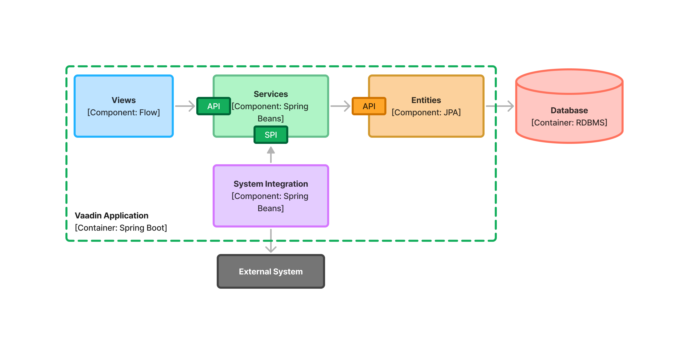

= APIs and SPIs

Whenever you design a building block for a Vaadin application - such as an application service or a UI component, you should think about how it interacts with the rest of the application. This typically happens through an *Application Programming Interface* (API), a *Service Provider Interface* (SPI), or a combination of both.

In this article, you'll learn what these mean, when to use them, and how to implement them in Java.

== Application Programming Interface

You typically design an API for either individual _classes_, or for entire _packages_. The API allows other parts of the application to _call_ your class or package. The other parts of the application depend on said class or package.

In this example, class B exposes an API that class A can call. Thus, class A depends on B and have to change if the API of class B changes:

image::images/api-dependency.png[A diagram of two classes with a dependency between them]

In Java, the API of a class is its _public_ methods. The API of a package are the _public_ classes and interfaces. All classes or methods that are not considered a part of the API should have a different visibility than public, such as package private.

[source,java]
----
@Service
public class MyApplicationService {

    // This method is public an a part of the API of MyApplicationService
    public void publicApi() {
        // ...
    }

    // This method is package private and intended for internal use.
    void internalMethod() {
        /// ...
    }
}
----

Not all classes and packages require a public API. For instance, a UI view is typically only called by the web browser. Therefore, it doesn't need an API at all.

== Service Provider Interface

A system component can also have a _Service Provider Interface_ (SPI) that allows other components to plug into it. This is useful in cases where a component needs to interact with an external system, or when a component needs to externalize some business rules to another component.

An SPI is an interface that one component _declares_, and another component _implements_. In Java, it consists of at least one Java interface and optionally other types that the interface needs. For example, if the interface needs a Java class or a Java record as an input argument or return value, this would be a part of the SPI as well. An SPI is also allowed to include types from the system component's API.

<<three-system-components, In the example>>, the services system component may need to integrate with an external system. Instead of putting all the code inside a single component, the service components declare an SPI. Then, a new system integration component is created that implements this SPI and handles the actual interaction with the external system:

[.fill.white]
[link=images/components-with-spi.png]

This not only separates the concerns but also protects the application from changes in the external system. If the external system's API changes, you only need to fix the system integration component. The rest of the system components can remain unchanged.

To distinguish between API and SPI classes and interfaces, you can put the SPI classes and interfaces inside a sub-package named `spi`. <<three-system-components, In the example>>, the SPI could look like this:

[source,java]
----
package com.example.application.services.spi; // <1>

import com.example.application.entities.CompletedOrder;

public interface ShippingSystem {

    void shipCompletedOrder(CompletedOrder completedOrder); // <2>
}
----
<1> The interface is in the `spi` sub-package to make it clear that it's intended to be implemented by another system component.
<2> The `CompletedOrder` class, which is inherited from the API of the entities system component, can also be used by the SPI.

Sometimes, an interface can act as both the API and the SPI of the component at the same time. A typical example of this is the repository interface of a domain model component:

[.fill.white]
image::images/combined-spi-api.png["A diagram of three system components: Services, Domain Model and Persistence", width=380]

The repository interface is part of the API of the domain model and called by the services system component. However, the repository interface is also a part of the SPI of the domain model and implemented by the persistence system component. The persistence system component, in turn, talks to the database. In this case, using a sub-package `spi` is only confusing. Instead, JavaDocs should be used to explain the roles of the interface. Sometimes you have to be pragmatic.

