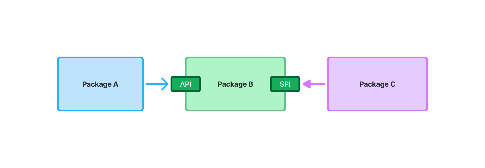

= APIs and SPIs
:toclevels: 2

Whenever you design a building block for a Vaadin application - such as an application service or a UI component, you should think about how it interacts with the rest of the application. This typically happens through an *Application Programming Interface* (API), a *Service Provider Interface* (SPI), or a combination of both.

In this article, you'll learn what these mean, when to use them, and how to implement them in Java.

== Application Programming Interface

You typically design an API for either individual _classes_, or for entire _packages_. The API allows other parts of the application to _call_ your class or package. The other parts of the application depend on said class or package.

In this example, class B exposes an API that class A can call. Thus, class A depends on B and have to change if the API of class B changes:

image::images/api-dependency.png[A diagram of package A and package B, where package A depends on package B]

In Java, the API of a class is its _public_ methods. The API of a package are the _public_ classes and interfaces. All classes or methods that are not considered a part of the API should have a different visibility than public, such as package private.

In this example, `MyApplicationService` class is a part of the public API of the `com.example.application.service` package. The `publicApi()` method is a part of the public API of the class:

[source,java]
----
package com.example.application.service;

// (Imports omitted)

@Service
public class MyApplicationService {

    // This method is public and a part of the API of MyApplicationService
    public void publicApi() {
        // ...
    }

    // This method is package private and intended for internal use.
    void internalMethod() {
        /// ...
    }
}
----

=== API Exposure of Dependencies

The API of a package can expose the API of another package. In this example, the `publicApi()` method takes a parameter of type `MyEntity`. Now the API of `com.example.application.service` depends on the API of `com.example.application.entity`:

[source,java]
----
package com.example.application.service;

import com.example.application.entity.MyEntity;

// (Other Imports omitted)

@Service
public class MyApplicationService {

    // MyEntity is now also a part of the API
    public void publicApi(MyEntity entity) {
        // ...
    }
}
----

Exposing dependencies through the API is not inherently bad, but it makes the API less stable. In the example above, if `MyEntity` changes, you have to change both `MyApplicationService` and all its clients. Because of this, *dependency exposure should always be an intentional design decision*.

Dependency exposure in the API is heavier than a normal dependency. One way of avoiding this is to introduce DTOs, as demonstrated in this example:

[source,java]
----
package com.example.application.service;

import com.example.application.entity.MyEntity;

// (Other Imports omitted)

@Service
public class MyApplicationService {

    private final MyRepository repository;

    // ...

    // This method uses MyEntity internally, but does not expose it as a part of its API.
    // MyDTO is a DTO class defined in the com.example.application.service package.
    public void publicApi(MyDTO dto) {
        MyEntity entity = repository.find(dto.id());
        entity.doSomething(dto.myProperty());
        repository.save(entity);
    }
}
----

`MyApplicationService` still depends on `MyEntity` but does not expose it in its API. If `MyEntity` changes, the implementation of `MyApplicationService` has to change, too. However, its API remains unchanged and so do its clients.

=== The API is Optional

Not all classes and packages require a public API. For instance, a UI view is typically only called by the web browser. Therefore, it doesn't need an API at all.

== Service Provider Interface

Whereas an API allows the outside world to call a class or package, an SPI allows a class or package to call the outside world. This is useful in cases where a class needs to interact with an external system, or when a package needs to externalize some business rules to another package.

In Java, an SPI is an _interface_ that is owned by the class or package that needs it. Other classes or packages can plug into it by _implementing_ the SPI.

In this example, package B exposes an SPI that package C implements. Package B can now call package C:

=== Declare an SPI or Call an API?

In the example above, package B could also have called the API of package C directly:

The end result would have been the same -- package B calls package C -- but now package B _depends on package C_. *If package C is stable -- meaning it is unlikely to change -- this is the recommended approach.* Adding an SPI in that case would only introduce unnecessary complexity.

As a rule of thumb, declare an SPI in the following cases:

1. *You don't yet know what the implementation is going to look like*. In this example, you can finish work on package B and use a mock implementation of the SPI until you start on the real implementation.

2. *You need to support multiple implementations*.
In this example, you can switch between package C and package D without changing package B. The switch could happen either at build time, at startup, or during runtime:

3. *You want to protect your application from changes in an external system*.
In this example, the application uses an SPI to communicate with an external system through an integration. If the external system's API changes, you only need to fix the integration. The rest of the application remains unchanged:

=== SPI as API

Sometimes, an interface can act as both the API and the SPI of a package at the same time. A typical example of this is the repository interface of a domain model.

In this example, the repository interface is part of the API of the domain model and called by the application services. However, the repository interface is also a part of the SPI of the domain model and implemented by the persistence package:

[.fill.white]
image::images/combined-spi-api.png["A diagram of three system components: Services, Domain Model and Persistence", width=380]

== Final Thoughts

In short, APIs define how the rest of your application calls into your code. SPIs define how your code calls out to the rest of the application or to external systems. Designing them intentionally ensures stability, flexibility, and maintainability.

When designing APIs, follow these best practices:

- Minimize exposure of internal classes and methods.
- Prefer DTOs over exposing domain entities unless you have a good reason not to.
- Be intentional when introducing API dependencies.

For SPIs:

- Use them when flexibility or decoupling is needed.
- Avoid unnecessary SPIs for stable dependencies.
