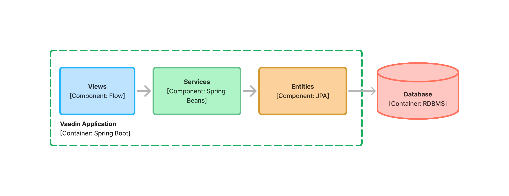

= System Components

The <<{articles}/building-apps/deep-dives/architecture/design#, Designing the Architecture>> page of the documentation discussed _system components_ and _UI components_. This page provides more about system components and how to turn them into Java code.

Vaadin applications are composed of system components, one of which is the user interface. The number of system components depends on the size and complexity of the application. A small application could have only one component. A large application might have ten or twenty components.

Here is an example of a Vaadin application with three components:

[[three-system-components]]
[.fill.white]
[link=images/three-components.png]

In this example, the _Views_ component talks to the _Services_ component. The _Services_ component in turn talks to the _Entities_ component, which uses JPA to communicate with a relational database.

== Components in Java

The Java programming language has no component construct. Instead, you would use Java packages to model components. Thus, <<three-system-components, the previous component diagram>> would correspond to the following Java package structure:

- `com.example.application` is a root package that contains the Spring Boot application class.
- `com.example.application.views` is a package corresponding to the _views_ system component.
- `com.example.application.services` is the package corresponding to the _services_ system component.
- `com.example.application.entities` is the package corresponding to the _entities_ system component.

For small system components, a package per component is enough. However, in more complex cases, you'll often need to create sub-packages to keep the code organized. You may also need to organize the system component packages themselves into parent packages.
// For more information about this, please see the <<{articles}/building-apps/project-structure#,Project Structure>> section of the documentation.

== Application Programming Interfaces

A system component can have an _Application Programming Interface_ (API) that allows other components to _call_ it. However, system components are not required to make themselves available to other components. For instance, a user interface system component is typically only called by the web browser and never by other system components. Therefore, it doesn't need an API at all.

In Java, the API consists of all _public_ classes, interfaces and methods inside the system component package. In other words, the simplest possible component with an API is a package that contains a single public Java class, that in turn contains a single public method.

All classes or methods that are not considered a part of the API should have a different visibility than public, such as package private.

A system component can inherit the API of another component on which it depends. For instance, <<three-system-components, in the example>>, the services component can inherit the API of the entities component, like this:

[source,java]
----
package com.example.application.services;

import com.example.application.entities.OrderRepository;
import com.example.application.entities.DraftOrder;
import com.example.application.entities.CompletedOrder;

import org.springframework.stereotype.Service;
import org.springframework.transaction.annotation.Transactional;

@Service
public class OrderService { // <1>

    private final OrderRepository repository;

    OrderService(OrderRepository repository) { // <2>
        this.repository = repository;
    }

    @Transactional
    public CompletedOrder completeOrder(DraftOrder draftOrder) { // <3>
        var completedOrder = draftOrder.complete();
        return repository.save(completedOrder);
    }
}
----
<1> `OrderService` is a part of the API, so it's _public_.
<2> The services system component handles instantiating the service itself. The constructor is _package private_, as it is not part of the API.
<3> `completeOrder` is a part of the API, so it's _public_. `DraftOrder` and `CompletedOrder` are inherited from the API of the entities system component.

As you can see, you're not required to use Java interfaces for the API unless you need or want to use them.

== Service Provider Interfaces

A system component can also have a _Service Provider Interface_ (SPI) that allows other components to plug into it. This is useful in cases where a component needs to interact with an external system, or when a component needs to externalize some business rules to another component.

An SPI is an interface that one component _declares_, and another component _implements_. In Java, it consists of at least one Java interface and optionally other types that the interface needs. For example, if the interface needs a Java class or a Java record as an input argument or return value, this would be a part of the SPI as well. An SPI is also allowed to include types from the system component's API.

<<three-system-components, In the example>>, the services system component may need to integrate with an external system. Instead of putting all the code inside a single component, the service components declare an SPI. Then, a new system integration component is created that implements this SPI and handles the actual interaction with the external system:

[.fill.white]
[link=images/components-with-spi.png]
image::images/components-with-spi.png[A diagram of four system components, an external system and a database]

This not only separates the concerns but also protects the application from changes in the external system. If the external system's API changes, you only need to fix the system integration component. The rest of the system components can remain unchanged.

To distinguish between API and SPI classes and interfaces, you can put the SPI classes and interfaces inside a sub-package named `spi`. <<three-system-components, In the example>>, the SPI could look like this:

[source,java]
----
package com.example.application.services.spi; // <1>

import com.example.application.entities.CompletedOrder;

public interface ShippingSystem {

    void shipCompletedOrder(CompletedOrder completedOrder); // <2>
}
----
<1> The interface is in the `spi` sub-package to make it clear that it's intended to be implemented by another system component.
<2> The `CompletedOrder` class, which is inherited from the API of the entities system component, can also be used by the SPI.

Sometimes, an interface can act as both the API and the SPI of the component at the same time. A typical example of this is the repository interface of a domain model component:

[.fill.white]
image::images/combined-spi-api.png["A diagram of three system components: Services, Domain Model and Persistence", width=380]

The repository interface is part of the API of the domain model and called by the services system component. However, the repository interface is also a part of the SPI of the domain model and implemented by the persistence system component. The persistence system component, in turn, talks to the database. In this case, using a sub-package `spi` is only confusing. Instead, JavaDocs should be used to explain the roles of the interface. Sometimes you have to be pragmatic.

== Instantiating Components

As Java has no component construct, a component instance consists of ordinary Java objects during runtime. These objects are instantiated by Spring, which also takes care of setting up the dependencies between them through dependency injection. Use _constructor injection_ into _final_ fields instead of autowiring into mutable fields, like this:

[source,java]
----
@Service
public class InvoiceGenerationService {

    private final InvoiceRepository invoiceRepository;
    private final AccountingSystem accountingSystem;
    private final ApplicationEventPublisher eventPublisher;

    InvoiceGenerationService(InvoiceRepository invoiceRepository,
                             AccountingSystem accountingSystem,
                             ApplicationEventPublisher eventPublisher) {
        this.invoiceRepository = invoiceRepository;
        this.accountingSystem = accountingSystem;
        this.eventPublisher = eventPublisher;
    }
}
----

Constructor injection has several benefits. First, it becomes clear what are the dependencies of the class. Second, it's impossible to instantiate the class without the necessary dependencies. Third, it's impossible to modify unintentionally the dependencies after instantiation. If the number of constructor arguments grows too large, the class has too many responsibilities and you should split it into smaller parts.

Usually, using Spring's component scanning and stereotype annotations, such as `@Component` or `@Service`, is enough to instantiate all the objects in your system component. However, if you need more fine-grained control over the object creation, you can use Spring's Java-based container configuration. Inside your component, create a `@Configuration` annotated class and use `@Bean` methods to create the objects.

Unless you need to use the `@Import` annotation to import the configuration class into some other configuration class, you can make it package private. This makes it clear that the configuration is not considered part of the system component's API.

If you're not familiar with Spring's Java-based container configuration, or you want to learn more about it, read the https://docs.spring.io/spring-framework/reference/core/beans/java/basic-concepts.html:[Spring Framework Documentation].
