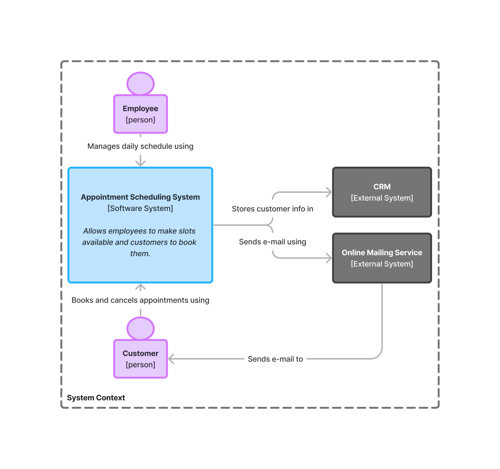
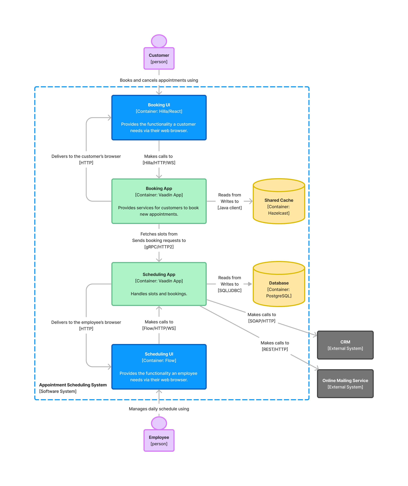
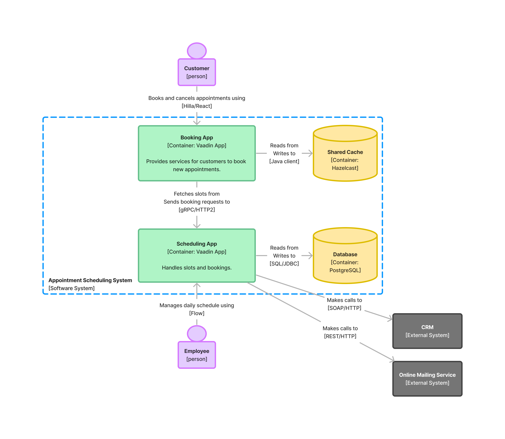
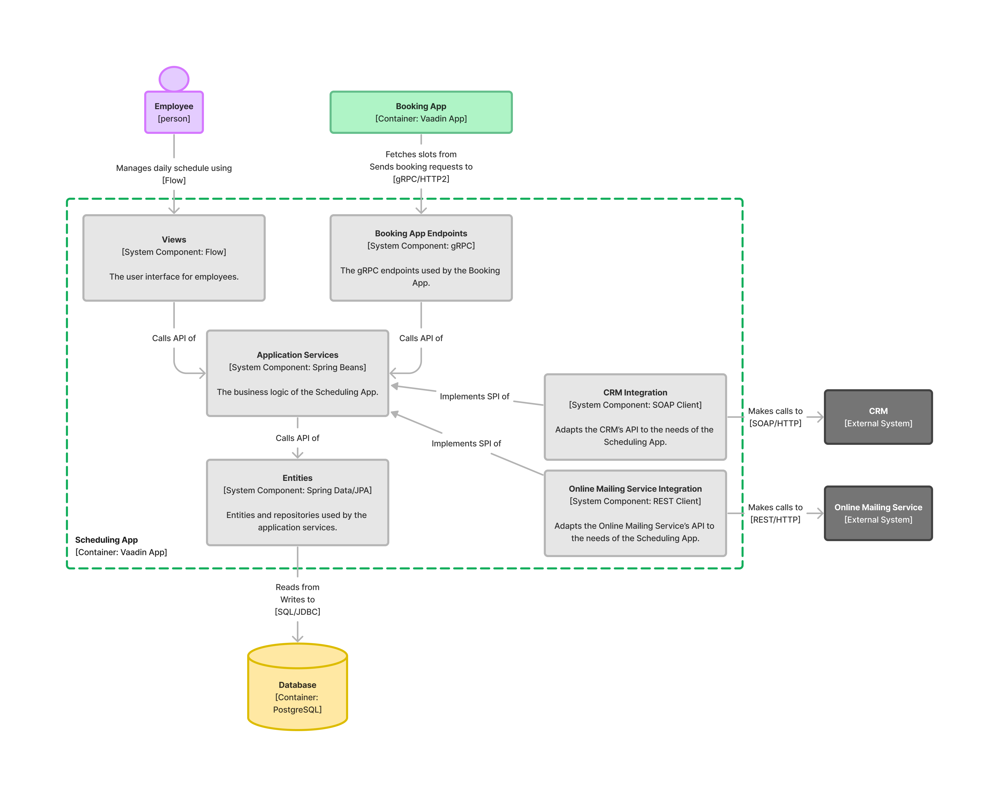

// TODO Can you make the images zoomable by clicking on them?
// No, but you can add links to them so the user can click and open them on a new page.

= Designing the Architecture

Software architecture is a wide concept. No one thing is the software architecture. It has many aspects and can be looked at from various points of view. This page presents only one of them: the structure of the software.
// For other aspects, look at the <<{articles}/building-apps/architecture/deep-dive#,Deep Dive>> section of the documentation.

To explain a software architecture design to other developers, you need a good way of visualizing it. You've probably seen an architecture diagram. These aren't always helpful. Often, they are an incoherent and inconsistent mess of boxes and arrows that confuse rather than clarify. At the other end of the spectrum, you'll find dedicated modeling tools that use industry-standard notations such as Unified Modeling Language (UML) or Systems Modeling Language (SysML). These are without doubt useful but require you to learn a new notation and buy a dedicated modeling tool.

Fortunately, there is a middle way called the _C4 model_. C4 is a model for visualizing software architecture in a notation and tooling-independent manner. The model is presented in detail at https://c4model.com[c4model.com], but the main ideas are summarized on this page.

The C4 model takes its inspiration from digital maps, where you can zoom in and zoom out. Higher zoom levels offer a better overview but have fewer details, whereas lower levels have more details while providing less overview. C4 allows you to create "maps" of your code and provides four zoom levels for you to use: Context, Containers, Components, and Code. You're not required to use all levels. It's fine to omit a level if you don't find it useful. There's no point in drawing diagrams for their own sake.

== Context

A _system context diagram_ is the highest level and a good starting point for new architecture. It depicts how the system you intend to build fits into the environment around it. It includes information about the users of the system and any external system with which it integrates. It doesn't contain any technical information at all: that's reserved for the lower levels.

Here is an example system context diagram of a fictional appointment scheduling system:

[[c4-context]]
[.fill.white]
[link=images/c4-context.png]

You can see that the system has two different types of users: employees and customers. You can also see that the system integrates with two external systems: a Customer Resource Management (CRM) system for storing customer information, and an online mailing service for sending emails to customers.

The notation is simple: it consists of boxes, circles, lines, and text. It's important to remember to annotate the lines as well, as they describe the dynamics of the system. Observing the dynamics of a system can often tell you more than only looking at its static structure. For instance, if you left out the text from all the boxes in <<c4-context, the previous diagram>>, you could still understand what they mean from the annotated arrows.

You can add as much or as little text as you want, as long as it tells the story you want to tell. In the previous diagram you could, for instance, make the users larger and include more detailed descriptions of why each user might want to use the system.

== Containers

If you were to zoom in on the software system in the context diagram, you'd get to the second level: a _container diagram_. In the C4 context, a container is either a deployable _application_ or a _data store_. It has nothing to do with Docker containers -- even though you may later package your applications as such. A container diagram shows the deployable parts of the system and how they interact with each other and any external systems.

Continuing with the fictional appointment scheduling system example, zooming in on the system box gives the following container diagram:

[.fill.white]
[link=images/c4-container.png]

As you can see, the diagram reveals a lot more details than the context diagram. You can see that the system consists of six containers: two web browsers (the employee's and the customer's), two Vaadin applications, a Hazelcast shared cache and a PostgreSQL database. You can see that the employee-facing user interface is using Flow and the customer-facing user interface is using Hilla and React. You can also see how the containers communicate with each other and with the external systems.

The notation follows the same pattern as the system context diagram: boxes, circles, lines, and text. You can add as many details as needed. For instance, if modeling the web browsers as separate containers isn't relevant, you could simplify the diagram like this:

[.fill.white]
[link=images/c4-container-simplified.png]

A Vaadin developer would be able to deduce from this diagram that the users are using their web browsers to interact with the applications.

== Components

If you were to zoom in on a container in the container diagram, you would get the third level: a _component diagram_. The term _component_ is used quite liberally in the software industry, often for different things depending on the context. In the C4 context, the term component is defined as an encapsulation of related functionality that has a well-defined interface and that can be instantiated.

However, as Vaadin also uses components to construct user interfaces, it makes sense to further the scope and type of a component with a prefix. Therefore, the components that you find in a component diagram are _system components_ and the components you find in a Vaadin user interface are _UI components_.

A component diagram shows how a container like a Vaadin application is constructed from system components. It includes information about the components' responsibilities, how they are implemented, and how they interact.

Continuing with the fictional appointment scheduling system example, zooming in on the scheduling application container gives the following component diagram:

[.fill.white]
[link=images/c4-component.png]

As you can see, the notation is again the same as in the past two levels.

If you had access to the source code of the scheduling application, this diagram would already be quite helpful in navigating it. You can see that there are six system components:

- The _Views_ system component contains the Flow user interface.
- The _Booking App Endpoints_ system component contains the https://grpc.io[gRPC] endpoints that the Booking App uses.
- The _Application Services_ system component contains the business logic of the entire application. It has an API that is called by both _Views_ and _Booking App Endpoints_.
- The _Entities_ system component contains the entities and repositories and uses Spring Data and JPA. It has an API that's called by _Application Services_.
- The _CRM Integration_ and _Online Mailing Service Integration_ system components act as adapters between the scheduling application and the external CRM system and online mailing service, respectively. They both implement Service Provider Interfaces (SPI) that _Application Services_ has defined.

Getting the system components right is essential to succeeding in building great Vaadin applications. You can learn more about APIs and SPIs of system components and how to turn system components into Java code on the <<components#, System Components>> page.

== Code

If you were to zoom in on a system component in the component diagram, you would get to the fourth and final level: a _code diagram_. This shows how a system component has been implemented in code and is typically drawn using UML or some other standard notation for code design. It's the most detailed of all the diagrams and, therefore, likely the one you'll use the least.

The code is the ultimate source of truth and it changes often, especially at the beginning of a project. This means that any code diagrams you draw are likely to become outdated at some point. It's therefore recommended to make code diagrams only for the most complex components. You can keep them up to date or discard them when they are no longer useful. The main point is to only draw the diagrams that help you tell the story and get the job done.

// TODO Add links to articles once they have been written
