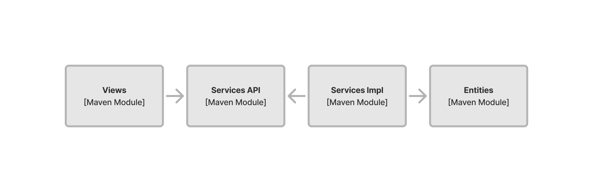
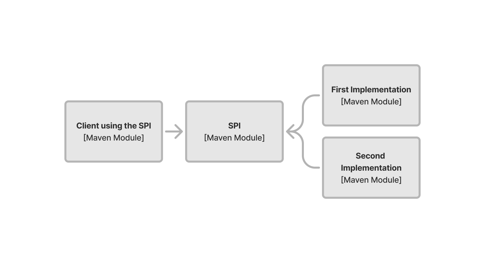

include::{articles}/_vaadin-version.adoc[]

= Multi-Module Projects

A multi-module project consists of multiple directories, each with its own POM file and source directory. The modules can depend on each other; Maven builds them in the correct order. 

[IMPORTANT]
Even though the project consists of many modules, it is still a single application and is packaged into a single JAR file or WAR file.

Multi-module projects are more complex than <<single-module#,single-module projects>>, but offer a stricter separation of concerns in return. This makes them useful for large codebases, and projects with large teams. By splitting the code into smaller modules and controlling the dependencies among them, you reduce the risk of code misuse. Instead of relying on developer discipline alone, the compiler complains if you try to use a class in the wrong place.

Unlike single-module projects, there is no starter for creating a multi-module Maven project for a Vaadin application. Instead, you have to assemble the project without a starter, beginning with the parent POM file.

[NOTE]
If you've never used multi-module Maven projects, you should at least read the https://maven.apache.org/guides/mini/guide-multiple-modules.html[Guide to Working with Multiple Modules] before continuing.

// TODO Actually, that guide is not that good. A newbie would still not know how a multi-module project works after reading it. Should find a better resource and refer to that.

== Parent POM-Structure

The parent POM file resides in the root directory of the project. In a Vaadin project, it serves two roles. First, it acts as the parent to all other modules, allowing its children to inherit dependencies and other configuration from it. Second, it acts as the _reactor_ of the entire project, responsible for building the individual modules in the correct order. The parent module doesn't contain any source code, nor should it be packaged into a JAR file.

To turn a basic Maven POM file into a parent, start by changing its packaging to `pom`, like this:

[source,xml]
----
<groupId>com.example.application</groupId>
<artifactId>parent-pom</artifactId>
<version>1.0-SNAPSHOT</version>
<!-- tag::snippet[] -->
<packaging>pom</packaging>
<!-- end::snippet[] -->
----

The next steps are similar to the ones needed in single-module projects. Import the `spring-boot-starter-parent` project like this:

[source,xml]
----
<parent>
    <groupId>org.springframework.boot</groupId>
    <artifactId>spring-boot-starter-parent</artifactId>
    <version>3.3.3</version> <!--1-->
    <relativePath/>
</parent>
----
<1> You can check for the latest version on the  https://mvnrepository.com/artifact/org.springframework.boot/spring-boot-starter-parent[MVN Repository].

Declare all other dependency versions as project properties, like so:

[source,xml,subs="+attributes"]
----
<properties>
    <java.version>21</java.version> <!--1-->
    <vaadin.version>{vaadin-version}</vaadin.version> <!--2-->
</properties>
----
<1> This property is used by `spring-boot-starter-parent` to configure the Java compiler plugin.
<2> You can check for the latest version on the  https://mvnrepository.com/artifact/com.vaadin/vaadin-bom[MVN Repository].

Then import the Vaadin BOM, like this:

[source,xml]
----
<dependencyManagement>
    <dependencies>
        <dependency>
            <groupId>com.vaadin</groupId>
            <artifactId>vaadin-bom</artifactId>
            <version>${vaadin.version}</version>
            <type>pom</type>
            <scope>import</scope>
        </dependency>
    </dependencies>
</dependencyManagement>
----

To be able to use basic Spring features such as dependency injection, all modules in the project have to import the `spring-context` dependency. To avoid having to explicitly declare it in every module, add it to the parent POM, like this:

[source,xml]
----
<dependencies>
    <dependency>
        <groupId>org.springframework</groupId>
        <artifactId>spring-context</artifactId>
    </dependency>   
<dependencies>
----

Unlike the single-module project, this POM file doesn't contain any plugins. Instead, it contains a section that lists all of the modules that should be included in the project build. Since at this point you won't have created any modules, add an empty section:

[source,xml]
----
<modules>
</modules>
----

Below is how a fully configured POM file for an empty multi-module Vaadin application looks:

.Parent pom.xml
[source,xml,subs="+attributes"]
----
<?xml version="1.0" encoding="UTF-8"?>
<project xmlns="http://maven.apache.org/POM/4.0.0"
         xmlns:xsi="http://www.w3.org/2001/XMLSchema-instance"
         xsi:schemaLocation="http://maven.apache.org/POM/4.0.0 http://maven.apache.org/xsd/maven-4.0.0.xsd">
    <modelVersion>4.0.0</modelVersion>

    <groupId>com.example.application</groupId>
    <artifactId>parent-pom</artifactId>
    <version>1.0-SNAPSHOT</version>
    <packaging>pom</packaging>

    <parent>
        <groupId>org.springframework.boot</groupId>
        <artifactId>spring-boot-starter-parent</artifactId>
        <version>3.3.3</version>
        <relativePath/>
    </parent>

    <properties>
        <java.version>21</java.version>
        <vaadin.version>{vaadin-version}</vaadin.version>
    </properties>

    <dependencyManagement>
        <dependencies>
            <dependency>
                <groupId>com.vaadin</groupId>
                <artifactId>vaadin-bom</artifactId>
                <version>${vaadin.version}</version>
                <type>pom</type>
                <scope>import</scope>
            </dependency>
        </dependencies>
    </dependencyManagement>

    <dependencies>
        <dependency>
            <groupId>org.springframework</groupId>
            <artifactId>spring-context</artifactId>
        </dependency>   
    <dependencies>

    <modules>
    </modules>
</project>
----

== Architecture & Modules

The code structure of a project should resemble the <<{articles}/building-apps/deep-dives/architecture/components#,architecture>> of the application. For multi-module projects, the _project structure_ should also resemble the architecture of the application. Therefore, you'll need to have a sense of how the architecture is going to look before assembling a multi-module Vaadin project.

Consider a fictional Vaadin application with a _Views_ component, a _Services_ component, and an _Entities_ component.

[[three-system-components]]
[.fill]
[link=../architecture/images/three-components.png]
image::../architecture/images/three-components.png[Diagram of Three System Components and a Database]

These components correspond to the following Java packages:

- `com.example.application.views`
- `com.example.application.services`
- `com.example.application.entities`

Additionally, you often have the following utility packages:

- `com.example.application.utils`
- `com.example.application.security`

To split these packages into separate Maven modules, you'll need to look at their dependencies. They're depicted by arrows in the diagram. Each module forms its own compilation unit and has its own classpath.

Following this principle, you might have a project structure that looks like this:

[source]
----
(root)
├── entities/
│   ├── src/main/java/com/example/application/entities/
│   │   └── ...
│   └── pom.xml
├── services/
│   ├── src/main/java/com/example/application/services/
│   │   └── ...
│   └── pom.xml
├── utils/
│   ├── src/main/java/com/example/application/utils/
│   │   └── ...
│   └── pom.xml
├── views/
│   ├── src/main/java/com/example/application/views/
│   │   └── ...
│   └── pom.xml
└── pom.xml
----

You may notice that the `security` module is missing. This is intentional. It'll be explained later.

== Module POM-Structure

Every Maven module has its own POM file. They're all quite similar. They all start with a reference to the parent POM:

[source,xml]
----
<parent>
    <groupId>com.example.application</groupId>
    <artifactId>parent-pom</artifactId>
    <version>1.0-SNAPSHOT</version>
</parent>
----

Since all of the modules are part of the same application, they should have the same `groupId` and `version`. These are inherited from the parent POM, unless declared explicitly in the POM file. Because of this, you should omit the `<groupId>` and `<version>` elements from the module POM files.

Each module still needs an `artifactId`. Use the same name for both the directory of a module and its `artifactId`.

After this, you'll need to declare the dependencies of the modules. These are the first differences.

The `entities` module only depends on `utils`, and any external dependencies it needs to access the database. The complete POM file looks like this:

.Entities pom.xml
[source,xml]
----
<?xml version="1.0" encoding="UTF-8"?>
<project xmlns="http://maven.apache.org/POM/4.0.0"
         xmlns:xsi="http://www.w3.org/2001/XMLSchema-instance"
         xsi:schemaLocation="http://maven.apache.org/POM/4.0.0 http://maven.apache.org/xsd/maven-4.0.0.xsd">
    <modelVersion>4.0.0</modelVersion>
    <parent>
        <groupId>com.example.application</groupId>
        <artifactId>parent-pom</artifactId>
        <version>1.0-SNAPSHOT</version>
    </parent>

    <artifactId>entities</artifactId>

    <dependencies>
        <dependency>
            <groupId>${project.groupId}</groupId>  <!--1-->
            <artifactId>utils</artifactId>
            <version>${project.version}</version>  <!--2-->
        </dependency>
        ...  <!--3-->
    </dependencies>
</project>
----
<1> Instead of writing `com.example.application`, you can use the Maven built-in property `project.groupId`.
<2> Instead of writing `1.0-SNAPSHOT`, you can use the Maven built-in property `project.version`.
<3> This is where you would add dependencies to Spring Data, Hibernate, JPA, jOOQ, the JDBC driver and so on.

The `services` module depends on `entities` and `utils`. Because `entities` already depends on `utils`, `services` gets it as a _transitive dependency_ by only depending on `entities`. However, for clarity, it is recommended to include the `utils` dependency anyway. The complete POM file looks like this:

.Services pom.xml
[source,xml]
----
<?xml version="1.0" encoding="UTF-8"?>
<project xmlns="http://maven.apache.org/POM/4.0.0"
         xmlns:xsi="http://www.w3.org/2001/XMLSchema-instance"
         xsi:schemaLocation="http://maven.apache.org/POM/4.0.0 http://maven.apache.org/xsd/maven-4.0.0.xsd">
    <modelVersion>4.0.0</modelVersion>
    <parent>
        <groupId>com.example.application</groupId>
        <artifactId>parent-pom</artifactId>
        <version>1.0-SNAPSHOT</version>
    </parent>

    <artifactId>services</artifactId>

    <dependencies>
        <dependency>
            <groupId>${project.groupId}</groupId>
            <artifactId>entities</artifactId>
            <version>${project.version}</version>
        </dependency>
        <dependency>
            <groupId>${project.groupId}</groupId>
            <artifactId>utils</artifactId>
            <version>${project.version}</version>
        </dependency>    
    </dependencies>
</project>
----

The `utils` module doesn't have any dependencies at the beginning. Its POM file looks like this:

.`Utils pom.xml`
[source,xml]
----
<?xml version="1.0" encoding="UTF-8"?>
<project xmlns="http://maven.apache.org/POM/4.0.0"
         xmlns:xsi="http://www.w3.org/2001/XMLSchema-instance"
         xsi:schemaLocation="http://maven.apache.org/POM/4.0.0 http://maven.apache.org/xsd/maven-4.0.0.xsd">
    <modelVersion>4.0.0</modelVersion>
    <parent>
        <groupId>com.example.application</groupId>
        <artifactId>parent-pom</artifactId>
        <version>1.0-SNAPSHOT</version>
    </parent>

    <artifactId>utils</artifactId>
</project>
----

The `views` module depends on Vaadin, the `services` module and the `utils` module. In addition, the `views` module includes the Vaadin Maven plugin. The complete POM file looks like this:

.Views pom.xml
[source,xml]
----
<?xml version="1.0" encoding="UTF-8"?>
<project xmlns="http://maven.apache.org/POM/4.0.0"
         xmlns:xsi="http://www.w3.org/2001/XMLSchema-instance"
         xsi:schemaLocation="http://maven.apache.org/POM/4.0.0 http://maven.apache.org/xsd/maven-4.0.0.xsd">
    <modelVersion>4.0.0</modelVersion>
    <parent>
        <groupId>com.example.application</groupId>
        <artifactId>parent-pom</artifactId>
        <version>1.0-SNAPSHOT</version>
    </parent>

    <artifactId>views</artifactId>

    <dependencies>
        <dependency>
            <groupId>com.vaadin</groupId>
            <artifactId>vaadin-spring-boot-starter</artifactId>
        </dependency>
        <dependency>
            <groupId>${project.groupId}</groupId>
            <artifactId>services</artifactId>
            <version>${project.version}</version>
        </dependency>
        <dependency>
            <groupId>${project.groupId}</groupId>
            <artifactId>utils</artifactId>
            <version>${project.version}</version>
        </dependency>
    </dependencies>

    <build>
        <plugins>
            <plugin>
                <groupId>com.vaadin</groupId>
                <artifactId>vaadin-maven-plugin</artifactId>
                <version>${vaadin.version}</version>
                <executions>
                    <execution>
                        <goals>
                            <goal>prepare-frontend</goal>
                        </goals>
                    </execution>
                </executions>
            </plugin>
        </plugins>
    </build>

    <profiles>
        <profile>
            <id>production</id>
            <dependencies>
                <dependency>
                    <groupId>com.vaadin</groupId>
                    <artifactId>vaadin-core</artifactId>
                    <exclusions>
                        <exclusion>
                            <groupId>com.vaadin</groupId>
                            <artifactId>vaadin-dev</artifactId>
                        </exclusion>
                    </exclusions>
                </dependency>
            </dependencies>
            <build>
                <plugins>
                    <plugin>
                        <groupId>com.vaadin</groupId>
                        <artifactId>vaadin-maven-plugin</artifactId>
                        <version>${vaadin.version}</version>
                        <executions>
                            <execution>
                                <goals>
                                    <goal>build-frontend</goal>
                                </goals>
                                <phase>compile</phase>
                            </execution>
                        </executions>
                    </plugin>
                </plugins>
            </build>
        </profile>
    </profiles>    
</project>
----

// TODO Where do you put frontend files and images? Which project, which directory?

Whenever you add a new module to a project, remember also to declare it in the parent POM file, like this:

.Parent pom.xml
[source,xml]
----
...
<modules>
    <module>entities</module>
    <module>views</module>
    <module>services</module>
    <module>utils</module>
</modules>
...
----

At this point, the project contains modules for all system components. It compiles, but you can't actually run the application. This is because you haven't added an `Application` class, nor have you set up the Spring Boot Maven plugin. To do this, you'll need to create another Maven module: the _application module_.

== Application Module POM-Structure

The application module acts as the _aggregator_ of a project. It brings all of the modules together and builds them into a self-contained executable JAR-file that you can deploy to production. Because of this, the application module is also sometimes referred to as the _deployment unit_ of the project.

The application module is an ordinary Maven module that contains at least the `Application` class, and the application's configuration files. It imports all other modules, either explicitly or transitively, and adds the Spring Boot Maven plugin. The complete POM-file looks like this:

.Application pom.xml
[source,xml]
----
<?xml version="1.0" encoding="UTF-8"?>
<project xmlns="http://maven.apache.org/POM/4.0.0"
         xmlns:xsi="http://www.w3.org/2001/XMLSchema-instance"
         xsi:schemaLocation="http://maven.apache.org/POM/4.0.0 http://maven.apache.org/xsd/maven-4.0.0.xsd">
    <modelVersion>4.0.0</modelVersion>
    <parent>
        <groupId>com.example.application</groupId>
        <artifactId>parent-pom</artifactId>
        <version>1.0-SNAPSHOT</version>
    </parent>

    <artifactId>app</artifactId>

    <dependencies>
        <dependency>
            <groupId>${project.groupId}</groupId>
            <artifactId>views</artifactId>
            <version>${project.version}</version>
        </dependency>
        <dependency>
            <groupId>org.springframework.boot</groupId>
            <artifactId>spring-boot-devtools</artifactId>
            <optional>true</optional>
        </dependency>
    </dependencies>

    <build>
        <plugins>
            <plugin>
                <groupId>org.springframework.boot</groupId>
                <artifactId>spring-boot-maven-plugin</artifactId>
            </plugin>
        </plugins>
    </build>
</project>
----

Including the application module, the entire project structure now looks like this:

[source]
----
(root)
├── app/
│   ├── src/main/java/com/example/application/
│   │   └── ...
│   └── pom.xml
├── entities/
│   ├── src/main/java/com/example/application/entities/
│   │   └── ...
│   └── pom.xml
├── services/
│   ├── src/main/java/com/example/application/services/
│   │   └── ...
│   └── pom.xml
├── utils/
│   ├── src/main/java/com/example/application/utils/
│   │   └── ...
│   └── pom.xml
├── views/
│   ├── src/main/java/com/example/application/views/
│   │   └── ...
│   └── pom.xml
└── pom.xml
----

Remember the `com.example.application.security` utility package still didn't have a Maven module of its own. If this package only contains code that isn't intended to be used by other modules, such as the Spring Security configuration, you can put it into the application module. You would then have a module structure like this:

[source]
----
app/
├── src/main/
│   ├── java/
│   │   └── com/example/application/
│   │       ├── security/
│   │       │   └── SecurityConfiguration.java
│   │       └── Application.java 
│   └── resources/
│       └── application.properties
└── pom.xml
----

However, if your `security` package also includes code that is intended to be used by other modules, you should create a separate _Security_ module and put everything there.

== Priming Build

The first-ever build of a Maven project is called the _priming build_. During this build, all of the dependencies are downloaded and the plugins are executed for the first time. When you work with a Vaadin multi-module project, it's important to run the priming build either before, or directly after importing the project into your IDE. To perform a priming build, run this command in the root of the project:

[source,terminal]
----
$ mvn package
----

During the priming build, the Vaadin Maven plugin generates several frontend files that are needed when the application runs. Because the plugin is configured in the `views` module, the files are also generated into that module. When you start the application, Vaadin finds these files and loads them, and any other frontend files you may have created, from the `views` module.

Without the priming build, Vaadin would generate the missing files when the application starts for the first time. However, these files would be in the `app` module and not in the `views` module. Vaadin would also look for any other frontend files, like the theme, in the `app` module. As a result, the application wouldn't work properly.

== Enhancing

Mapping system components and utility packages to Maven modules is only one way of structuring a multi-module Vaadin project. Depending on what concerns you want to separate, you can go further by splitting the application into more Maven modules. The following sections provide some examples of common scenarios.

=== Hiding Entities from Presentation Layer

Sometimes you might not want the presentation layer to interact directly with the entities. Instead, you may want to use Data Transfer Objects (DTO) to communicate with your application layer. To do this, split the _Services_ component into two Maven modules: `services-api` and `services-impl`.

[[services-api]]
[.fill]
[link=images/services-api.png]

Put the service interfaces and DTO:s in the `services-api` module, and add it as a dependency to the `views` module. The `services-api` module shouldn't depend on the `entities` module. Otherwise, the `entities` module becomes a transitive dependency of `views` -- something to avoid in this case.

Next, put the classes that implement the service interfaces in the `service-impl` module. Annotate these classes with `@Service`, or declare them as Spring beans in some other way. This module should depend on both the `service-api` and the `entities` module.

Finally, add both `service-api` and `services-impl` as dependencies to the application module. When the application starts, Spring instantiates the service classes and injects their instances into the views.

=== Supporting Pluggable Implementations

Sometimes you want to be able to plug in different implementations of a Service Provider Interface (SPI). For example, you may want to store and retrieve the entities from a local database, or from a remote REST service. To do this, create one Maven module for the SPI and one Maven module for each implementation:

[[spi]]
[.fill]
[link=images/spi.png]

Each module that implements the SPI should have a dependency on the SPI module. All of the modules that use the SPI should also have a dependency on it. The main difference is in the Java code: the client modules call the SPI, whereas the implementation modules implement the SPI. Annotate the implementation classes with `@Service`, or declare them as Spring beans in some other way.

Even though you have multiple implementations of the same SPI, you can use only one of them at a time while the application is running. An alternative is to add a Maven profile for each implementation to your application module. Each profile would then include a dependency on the corresponding implementation module, like this:

[source,xml]
----
<profiles>
    <profile>
        <id>app-with-first-implementation</id>
        <dependencies>
            <dependency>
                <groupId>${project.groupId}</groupId>
                <artifactId>first-implementation</artifactId>
                <version>${project.version}
            </dependency>
        </dependencies>
    </profile>
    <profile>
        <id>app-with-second-implementation</id>
        <dependencies>
            <dependency>
                <groupId>${project.groupId}</groupId>
                <artifactId>second-implementation</artifactId>
                <version>${project.version}
            </dependency>
        </dependencies>
    </profile>    
</profiles>
----

You can now build different versions of your application. To build a package that contains the first implementation, you would run this command:

[source,terminal]
----
$ mvn package -P app-with-first-implementation
----

Likewise, to build a package that contains the second implementation, you would run this command:

[source,terminal]
----
$ mvn package -P app-with-second-implementation
----

When the application starts, Spring instantiates the classes of the included implementation module, and injects their instances wherever they're needed.
