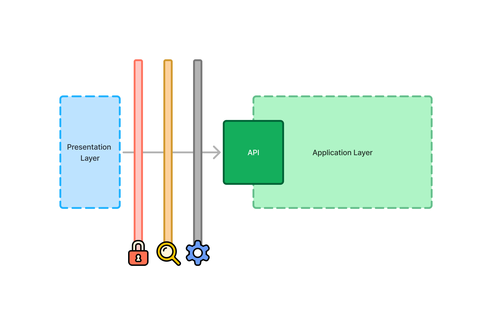

= Application Services

The <<../architecture/layers#,application layer>> API consists of _application services_, implemented in code as Spring Beans.

Services should have _high cohesion_. This means that all of the methods in your service should relate to the same thing. For example, all methods in this `PaymentService` are directly related to the business activity of handling payments:

[source,java]
----
public interface PaymentService {
    PaymentId processPayment(Order order);
    PaymentStatus checkPaymentStatus(PaymentId paymentId);
    void refundPayment(PaymentId paymentId);
}
----

Application services need not be related to business activities to be highly cohesive. They could also be related to a specific view in the user interface, or even a specific user interface component. For example, if you're using <<{articles}/components/charts#,Vaadin Charts>>, it's easier if the data returned by your service is converted directly into <<{articles}/components/charts/data#,chart data>>. 

When building a payment summary view, you might be tempted to add such a method to the `PaymentService`. However, adding this method to the `PaymentService` would actually lower the cohesion of the service. Although it retrieves information about payments, its primary driver is the needs of the summary view, not the business activity of handling payments.

Another way of thinking about the cohesion of services is that any single service should only have a single reason to change. With the payment service containing methods both for handling payments, and for showing the summary, it now has two reasons to change. In a situation like this, you should create a new `PaymentSummaryService`, and implement the method there. You now have two services with only one reason to change. In other words, they're highly cohesive.

// TODO I want to write something about service methods being atomic and stand-alone, and that a service method should never call another, but I don't know how to formulate it. Maybe under its own section.

== Interfaces or Classes

In the early days of Spring, services consisted of both an interface, and an implementation class. The reason for this is that Spring uses proxies to handle various cross-cutting concerns. At that time, you could only create proxies of Java interfaces, not classes. Furthermore, when writing tests, you could only mock interfaces, not classes.

Nowadays, those limitations are gone. As long as your service classes are not `final`, and don't contain any `final` methods, Spring can make proxies of them. You can also mock them during tests.

Creating interfaces for application services is now a matter of personal taste. If you like to create interfaces, you can continue to do so. In that case, you should make the implementation class package protected, like this:

[source,java]
----
@Service
class PaymentServiceImpl implements PaymentService {
    ...
}
----

However, you can also write the application service without an interface, like this:

[source,java]
----
@Service
public class PaymentService {
    ...
}
----

The advantage of this approach is that you have one less Java file to maintain. Both approaches, though, are suitable for Vaadin.

== Input & Output

Application services often need to communicate with <<repositories#,repositories>> to fetch and store data. They also need to pass this data to the UI layer. For this, there are two options: pass the entities directly; or pass Data Transfer Objects (DTO:s). Both have advantages and disadvantages.

=== Entities

When the application service passes the entities directly to the UI layer, they become part of the application layer API. Many service methods delegate to the corresponding repository methods. Here's an example of this:

[source,java]
----
@Service
public class CustomerCrudService {

    private final CustomerRepository repository;

    CustomerCrudService(CustomerRepository repository) {
        this.repository = repository;
    }

    public Page<Customer> findAll(Specification<Customer> specification, Pageable pageable) {
        return repository.findAll(specification, pageable);
    }

    public Customer save(Customer customer) {
        return repository.saveAndFlush(customer);
    }
}
----

[CAUTION]
When most of your service methods delegate to a repository, it may be tempting to skip the service and have the UI layer communicate directly with the repository. However, this isn't a good idea because of the cross-cutting concerns that the application service has to handle. This is explained later on this page.

Using entities in your application service is a good idea when your user interface and entities match each other, closely. For example, you could have a form with fields that match the fields of the entity -- or a grid with columns that match them.

Your entities should be _anemic_, which means that they only contain data and little to no business logic.

In both cases, the user interface and the entities are likely to change at the same time, for the same reason. For example, if you need to add a field, you'll add it to both the user interface and the entity.

=== Data Transfer Objects

Sometimes, application services shouldn't return the entities themselves. For instance, the domain model may contain business logic that must be called within some context that isn't available in the UI layer. It might require access to other services, or run inside a transaction.

In other cases, the user interface may need only a subset of the data stored inside a single entity, or a combination of data from multiple entities. Fetching and returning the full entities would be a waste of resources.

You may also have a situation where the domain model and user interface are changing independently of each other. For example, the domain model may have to be adjusted every year due to government regulations while the user interface remains about the same.

In this case, the application services should accept DTO:s as input, and return DTO:s as output. The entities should no longer be part of the application layer API.

This adds another responsibility to the application service: mapping between entities and DTO:s.

When using <<repositories#query-classes,query classes>>, you can do the mapping in them by returning their DTO:s, directly. The query DTO:s become part of the application layer API.

For storing data, services typically have to copy data from the DTO to the entity. For example, like this:

[source,java]
----
@Service
public class CustomerCrudService {

    private final CustomerRepository repository;

    CustomerCrudService(CustomerRepository repository) {
        this.repository = repository;
    }

    // In this example, CustomerForm is a Java record.

    public CustomerForm save(CustomerForm customerForm) {
        var entity = Optional.ofNullable(customerForm.getId())
            .flatMap(repository::findById)
            .orElseGet(Customer::new);
        entity.setName(customerForm.name());
        entity.setEmail(customerForm.email());
        ...
        return toCustomerForm(repository.saveAndFlush(entity));
    }

    private CustomerForm toCustomerForm(Customer entity) {
        return new CustomerForm(entity.getId(), entity.getName(), entity.getEmail(), ...);
    }
}
----

When using DTO:s, you have more code to maintain. Some changes, like adding a new field to the application, requires more work. However, your user interface and domain model are isolated from each other, and can evolve independently.

=== Domain Payload Objects

When using <<domain-primitives#,domain primitives>>, you should use them in your DTO:s, as well. In this case, the DTO:s are called _Domain Payload Objects_ (DPO). They're used in the exact same way as DTO:s.

=== Validation

All input should be validated by the application services before they do anything else with it. This is important for security, integrity, and consistency. Even if you use input validation in your user interface, you should still validate the data in the application services.

You can validate the input in different ways. For more information, see the <</building-apps/deep-dives/concepts/consistency/validation#,Validation>> documentation page.

== Cross-Cutting Concerns

Application services act as the main entry point into the application from the user interface. Because of this, they have some responsibilities in addition to handling the business activities. The most important ones are security, transaction management, and observability.

You can implement cross-cutting concerns in two ways. The first way would be to use Aspect Oriented Programming (AOP), which is what Spring uses for its cross-cutting concerns. For instance, this is how you would run the `save` method inside a transaction using AOP:

[source,java]
----
@Service
public class CustomerCrudService {
    ...
    @Transactional
    public CustomerForm save(CustomerForm customerForm) {
        ...
    }
}
----

During application startup, Spring detects the `@Transactional` annotation and turns the service into a proxy. When a client calls the `save` method, the calls gets routed through a _method interceptor_. The interceptor starts the transaction, calls the actual method, and then commits the transaction when the method returns.

The second way to implement cross-cutting concerns is inside every service method. For instance, this is how you would run the `save` method inside a transaction, explicitly:

[source,java]
----
@Service
public class CustomerCrudService {
    private final TransactionTemplate transactionTemplate;
    ...

    public CustomerForm save(CustomerForm customerForm) {
        return transactionTemplate.execute(tx -> {
            ...
        });
    }
}
----

If you use AOP, you should write integration tests that also test the cross-cutting concerns. If there is a problem with your application context, and your aspect isn't being applied, you may not notice it until it's too late.

See the https://docs.spring.io/spring-framework/reference/core/aop.html[Spring Documentation] for more information about AOP.

// TODO Each cross-cutting concern deserves a documentation page of its own. This section should be updated as new pages are written.

=== Security

All application services in your Vaadin application should be protected by Spring Security. You should do this regardless of how your user interface views are protected. Even methods that don't require authentication, should be declared explicitly to permit anonymous users. See the <</building-apps/security/protect-services#,Protect Services>> guide for more information.

=== Transactions

All application service methods that interact with the database should always run inside their own transactions. You should use the `REQUIRED` or `REQUIRES_NEW` transaction propagation.

See the <<consistency/transactions#,Transactions>> documentation page for more information about transaction management.

=== Observability

To observe what your application services are doing from the outside, you can use https://micrometer.io/[Micrometer Observation].

// TODO Maybe the expand text here to include what you might observe -- why they want to do that.

See the https://docs.spring.io/spring-boot/reference/actuator/observability.html[Spring Boot Documentation] for more information about observability.

// TODO Add a link to a separate page about observability
