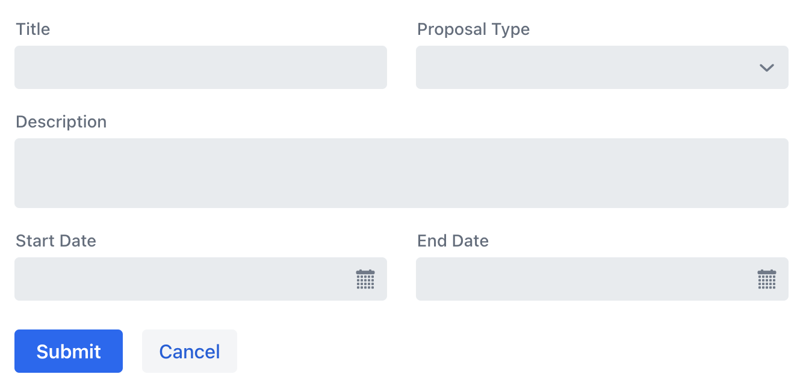

= Fields and Binding
:toclevels: 2

Forms are used to display and edit data in UI components called *fields*. This data comes from a *Form Data Object* (FDO), which is structured to align with the fields in the form. Each form field typically maps to a corresponding property in the FDO.

FDOs are often fetched from and submitted to an <<loading-and-saving#,application service>> for processing, such as validation and persistence. Architecturally, *an FDO belongs to the application layer*, not the UI layer.

.Entities as Form Data Objects
[IMPORTANT]
In simple cases -- such as CRUD views and administration screens -- the form model and the domain model may be the same. In those cases, *you can use your entities as FDOs*. However, doing so *couples your domain logic to the UI*. This can lead to maintainability issues, especially if UI requirements evolve independently of business logic. When that happens, it's better to introduce a dedicated FDO and handle data conversion in the application service.

Data is exchanged between the form and the FDO through *data binding*. Typically, each field is bound to a specific property of the FDO. The binding mechanism keeps the form and the FDO in sync.

.Part of a Series
[TIP]
This is part 1 of the *Add a Form* series.

== Laying Out the Fields

In Vaadin, you build forms visually by *adding input components to layout components*. The most commonly used layout components for forms include <</components/form-layout#,Form Layout>> and <</components/vertical-layout#,Vertical Layout>>. Form Layout supports multiple columns, whereas Vertical Layout lays out the components in a single column. These are often combined with <</components/horizontal-layout#,Horizontal Layout>>, which lays out its components in a single row.

[NOTE]
Layout components differ from router layouts, although you can construct a router layout using them.

The following example demonstrates how to build a two-column project proposal form using various input components:

.ProposalForm.java
[source,java]
----
public class ProposalForm extends Composite<FormLayout> { // <1>

    public ProposalForm() {
        // Create the components
        var titleField = new TextField("Title");

        var proposalTypeField = new ComboBox<ProposalType>("Proposal Type");
        proposalTypeField.setItems(ProposalType.values());

        var descriptionField = new TextArea("Description");

        var startDateField = new DatePicker("Start Date");

        var endDateField = new DatePicker("End Date");

        // Configure the form
        var formLayout = getContent(); // <2>
        formLayout.add(titleField);
        formLayout.add(proposalTypeField);
        formLayout.add(descriptionField, 2); // <3>
        formLayout.add(startDateField);
        formLayout.add(endDateField);
    }
}
----
<1> `Composite` hides the API of Form Layout from users of `ProposalForm`, reducing the risk of misuse.
<2> `getContent()` returns the Form Layout.
<3> Because Form Layout uses two columns by default, this expands the description field to span the full width.

The finished form would look like this:

[.device]

Form Layout is responsive; when space is limited, it automatically adjusts to a single-column layout, placing each input on its own row. It also includes features not covered in this example. For
more information see the <</components/form-layout#,Form Layout>> documentation.

== Common Field Components

Vaadin provides a set of *build-in field components* that you can use in your forms:

* *Text Input Components*
  - <</components/text-field#,Text Field>> -- For standard single-line text input
  - <</components/text-area#,Text Area>> -- For multi-line text input
  - <</components/email-field#,Email Field>> -- Specialized field for email addresses
  - <</components/password-field#,Password Field>> - Secure field for password entry
  - <</components/rich-text-editor#,Rich Text Editor>> - Advanced text editing with formatting options
* *Selection Components*
  - <</components/checkbox#,Checkbox>> -- For binary (true/false) selections
  - <</components/radio-button#,Radio Button Group>> -- For selecting a single option from a visible list
  - <</components/combo-box#,Combo Box>> -- Drop-down for selecting a single option
  - <</components/multi-select-combo-box#,Multi-Select Combo Box>> -- Drop-down for selecting multiple options
  - <</components/select#,Select>> -- Simple drop-down menu
  - <</components/list-box#,List Box>> -- Scrollable list of options
* *Date and Time Components*
  - <</components/date-picker#,Date Picker>> -- For selecting a date
  - <</components/time-picker#,Time Picker>> -- For selecting a time
  - <</components/date-time-picker#,Date Time Picker>> -- For selecting both date and time
* *Numeric Components*
  - <</components/number-field#,Number Field>> -- For numeric input

== Introducing Binder

Vaadin offers a [classname]`Binder` class that binds fields to FDO properties, ensuring that changes made in the form update the FDO. For each field-property pair, `Binder` creates a new `Binding` object. However, since Binder is one-directional, *updates to the FDO outside of the `Binding` won't automatically reflect in the form fields* unless manually refreshed.

When reading an FDO, `Binder` populates fields with corresponding property values. When writing, it updates the FDO with the modified field values.

You can *attach a converter* to a `Binding` to transform between field values and FDO properties with different types. For example, a `String` field can be converted into an `EmailAddress` object in the FDO. You can also *attach validators* to ensure the input meets specific constraints, such as requiring a non-empty email.

== Types of FDOs

An FDO can range from a simple data container that holds only values, to a more advanced class that includes business logic such as validation rules. The best approach depends on your application's complexity and how much control you need over the data.

=== JavaBean FDOs

When implementing FDOs as JavaBeans, *each form field maps to a corresponding getter and setter method.* If a field is read-only, you can leave out the setter method.

.JavaBean Conventions Are Optional
[NOTE]
You can name your getters and setters any way you like, as long as their method descriptors match what's expected for property access methods. A getter should take no parameters and return a value, while a setter should accept a single parameter and return `void`.

You can add business logic to the setters. For instance, you could perform validation, or maintain a change log inside the bean.

When an FDO is read, `Binder` populates each field with data from the corresponding getter. When the FDO is written, `Binder` calls the setters to update the bean with data in the form. You can then send the bean to an application service for processing.

Beans give you more flexibility for complex forms but require more boilerplate code than records, due to the need for explicit getters and setters. Since they are mutable, there's also a higher risk of bugs, especially when handling form cancellations or undo actions.

.Beware of Stale Data
[IMPORTANT]
If your FDOs come from a shared cache or data provider, be careful to avoid stale data. This can occur if a user starts editing an item and changes are written back to the FDO, but the user then cancels instead of saving. To prevent this, you can use buffered mode, refresh the FDO after cancellation, or bind a copy of the FDO instead of the original.

=== Record FDOs

When implementing FDOs as Java records, *each form field corresponds to a record component.*

When an FDO is read, `Binder` populates each field with data from the corresponding record component. When the FDO is written, `Binder` creates a new record instance from the data in the form. You can then send the record to an application service for processing.

Java records are concise and reduce boilerplate. Their immutability makes form state easier to manage, reducing the risk of subtle bugs. It also makes it clear when the form has been read or written.

== Binding to a Bean

Continuing with the *Project Proposal* form example, you can create a JavaBean to represent the FDO:

.Proposal.java
[source,java]
----
public class Proposal {
    private String title;
    private ProposalType type;
    private String description;
    private LocalDate startDate;
    private LocalDate endDate;

    public String getTitle() {
        return title;
    }
    public void setTitle(String title) {
        this.title = title;
    }

    public ProposalType getType() {
        return type;
    }
    public void setType(ProposalType type) {
        this.type = type;
    }

    public String getDescription() {
        return description;
    }
    public void setDescription(String description) {
        this.description = description;
    }

    public LocalDate getStartDate() {
        return startDate;
    }
    public void setStartDate(LocalDate startDate) {
        this.startDate = startDate;
    }

    public LocalDate getEndDate() {
        return endDate;
    }
    public void setEndDate(LocalDate endDate) {
        this.endDate = endDate;
    }
}
----

To bind this bean to the form, create a [classname]`Binder` instance and register each form field:

.ProposalForm.java
[source,java]
----
public class ProposalForm extends Composite<FormLayout> {

// tag::snippet[]
    private final Binder<Proposal> binder;
// end::snippet[]

    public ProposalForm() {
        // (Creating and adding fields omitted for brevity)

// tag::snippet[]
        binder = new Binder<>();
        binder.forField(titleField) // <1>
            // Converters and validators would go here
            .bind(Proposal::getTitle, Proposal::setTitle); // <2>
        binder.forField(proposalTypeField)
            .bind(Proposal::getType, Proposal::setType);
        binder.forField(descriptionField)
            .bind(Proposal::getDescription, Proposal::setDescription);
        binder.forField(startDateField)
            .bind(Proposal::getStartDate, Proposal::setStartDate);
        binder.forField(endDateField)
            .bind(Proposal::getEndDate, Proposal::setEndDate);
// end::snippet[]
    }
}
----
<1> Creates a `Binding` for `titleField`.
<2> Uses getter and setter methods for binding.

=== Buffered vs. Write-Through

When using a JavaBean as an FDO, `Binder` can operate in *buffered* or *write-through* mode.

* *Buffered mode*: Changes remain in the form until explicitly saved. This prevents side effects but may affect validation behavior.
* *Write-through mode*: Updates the FDO immediately as the user edits the form. Business logic in setter methods is triggered immediately. However, invalid states can occur where the form contains errors, but the FDO remains valid.

Form validation is covered in the <<validation#,Form Validation>> guide.

=== Reading from a Bean

To populate a form in *buffered mode*, use `Binder.readBean()`:

.ProposalForm.java
[source,java]
----
public class ProposalForm extends Composite<FormLayout> {

    private final Binder<Proposal> binder;
    private @Nullable Proposal formDataObject;

    // (Constructor omitted for brevity)

// tag::snippet[]
    public void setFormDataObject(@Nullable Proposal formDataObject) {
        this.formDataObject = formDataObject; // <1>
        if (formDataObject != null) {
            binder.readBean(formDataObject);
        } else {
            binder.refreshFields(); // <2>
        }
    }
// end::snippet[]
}
----
<1> Store the FDO for future reference. You'll need it when you implement the write functionality.
<2> Clears the form if there is no FDO.

For *write-through mode*, use `Binder.setBean()`:

.ProposalForm.java
[source,java]
----
public class ProposalForm extends Composite<FormLayout> {

    private final Binder<Proposal> binder;

    // (Constructor omitted for brevity)

// tag::snippet[]
    public void setFormDataObject(@Nullable Proposal formDataObject) {
        binder.setBean(formDataObject); // <1>
    }
// end::snippet[]
}
----
<1> If `formDataObject` is `null`, this also clears the form.

=== Writing to a Bean

In *buffered mode*, use `Binder.writeBeanIfValid()`:

.ProposalForm.java
[source,java]
----
public class ProposalForm extends Composite<FormLayout> {

    private final Binder<Proposal> binder;
    private Proposal formDataObject;

    // (Constructor omitted for brevity)

    public void setFormDataObject(@Nullable Proposal formDataObject) {
        // (Implementation omitted for brevity)
    }

// tag::snippet[]
    public Optional<Proposal> getFormDataObject() {
        if (formDataObject == null) {
            formDataObject = new Proposal(); // <1>
        }
        if (binder.writeBeanIfValid(formDataObject)) {
            return Optional.of(formDataObject); // <2>
        } else {
            return Optional.empty(); // <3>
        }
    }    
// end::snippet[]
}
----
<1> Creates a new, empty `Proposal` if `setFormDataObject()` was never called.
<2> Returns the updated `Proposal` if validation succeeds.
<3> Returns an empty `Optional` if validation fails.

.Other methods for writing to a bean
[%collapsible]
====
The `Binder` class provides four methods for writing form data to an FDO:

`writeBean` :: Validates the entire form and writes all values to the FDO if validation passes. Throws an exception if validation fails.
`writeBeanAsDraft` :: Writes all valid values to the FDO while ignoring invalid values. Throws no exception.
`writeBeanIfValid` :: Validates the form and writes all values if validation passes. Returns false (rather than throwing an exception) if validation fails.
`writeChangedBindingsToBean` :: Validates the entire form but only writes modified fields to the FDO if validation passes. Throws an exception if validation fails.

Some methods have overloaded versions that allow you to further customize the write operation. See the JavaDocs for details.
====

In *write-through mode*, no explicit write operation is needed. However, always check form validity before processing:

.ProposalForm.java
[source,java]
----
public class ProposalForm extends Composite<FormLayout> {

    private final Binder<Proposal> binder;

    // (Constructor omitted for brevity)

    public void setFormDataObject(@Nullable Proposal formDataObject) {
        // (Implementation omitted for brevity)
    }

// tag::snippet[]
    public Optional<Proposal> getFormDataObject() {
        if (binder.getBean() == null) {
            throw new IllegalStateException("No form data object"); // <1>
        }
        if (binder.validate().isOk()) {
            return Optional.of(binder.getBean()); // <2>
        } else {
            return Optional.empty(); // <3>
        }
    }
// end::snippet[]
}
----
<1> Throws an exception if `setFormDataObject()` was never called. If you called `setBean()` here with an empty FDO, you'd reset the form.
<2> Returns the updated `Proposal` if validation succeeds.
<3> Returns an empty `Optional` if validation fails.

== Binding to a Record

The equivalent *Project Proposal* FDO using a *record* looks like this:

.ProposalRecord.java
[source,java]
----
public record ProposalRecord(
    String title, 
    ProposalType type, 
    String description, 
    LocalDate startDate, 
    LocalDate endDate
) {
}
----

Unlike JavaBeans, records do not have setters. Instead, `Binder` uses *string-based mapping* to bind form fields to record components. You also need to specify the record class when creating the binder:

.ProposalForm.java
[source,java]
----
public class ProposalForm extends Composite<FormLayout> {

// tag::snippet[]
    private final Binder<ProposalRecord> binder;
// end::snippet[]

    public ProposalForm() {
        // (Creating and adding fields omitted for brevity)

 // tag::snippet[]
        binder = new Binder<>(ProposalRecord.class); // <1>
        binder.forField(titleField)
            // Converters and validators would go here
            .bind("title"); // <2>
        binder.forField(proposalTypeField).bind("type");
        binder.forField(descriptionField).bind("description");
        binder.forField(startDateField).bind("startDate");
        binder.forField(endDateField).bind("endDate");
// end::snippet[]
    }
}
----
<1> Passes the `ProposalRecord` record class to the `Binder` constructor.
<2> Uses record component names as string literals.

=== Avoiding Invalid Record Component Names

If you rename a record component but forget to update the corresponding `Binding`, it causes an error at runtime rather than build time. The `bind()` method would notice that no such record component exists, and throw an exception.

To mitigate this, you can create a unit test that instantiates the form, like this:

.ProposalFormTest.java
[source,java]
----
class ProposalFormTest {
    @Test
    void instantiating_form_throws_no_exceptions() {
        new ProposalForm();
    }
}
----

Since the `bind()` method is called in the constructor, this test would fail if it tried to bind a field to a non-existent record component.

To reduce this risk, you can also use constants for record component names instead of string literals. The constants could look like this:

.ProposalRecord.java
[source,java]
----
public record ProposalRecord(
    String title, 
    ProposalType type, 
    String description, 
    LocalDate startDate, 
    LocalDate endDate
) {
    public static final String PROP_TITLE = "title";
    public static final String PROP_TYPE = "type";
    // And so on...
}
----

And you would use them with `Binder` like this:

[source,java]
----
binder.forField(titleField).bind(ProposalRecord.PROP_TITLE);
binder.forField(proposalTypeField).bind(ProposalRecord.PROP_TYPE);
// And so on...
----

=== Reading from a Record

To populate the form from a record, use `Binder.readRecord()`:

.ProposalForm.java
[source,java]
----
public class ProposalForm extends Composite<FormLayout> {

    private final Binder<ProposalRecord> binder;

    // (Constructor omitted for brevity)

// tag::snippet[]
    public void setFormDataObject(@Nullable ProposalRecord formDataObject) {
        if (formDataObject != null) {
            binder.readRecord(formDataObject);
        } else {
            binder.refreshFields();
        }
    }
// end::snippet[]
}
----

=== Writing to a Record

Since records are immutable, `Binder.writeRecord()` creates a new instance:

.ProposalForm.java
[source,java]
----
public class ProposalForm extends Composite<FormLayout> {

    private final Binder<ProposalRecord> binder;

    // (Constructor omitted for brevity)

    public void setFormDataObject(@Nullable ProposalRecord formDataObject) {
        // (Implementation omitted for brevity)
    }

// tag::snippet[]
    public Optional<ProposalRecord> getFormDataObject() {
        try {
            return Optional.of(binder.writeRecord()); // <1>
        } catch (ValidationException ex) {
            // Binder already shows the error messages.
            return Optional.empty(); // <2>
        }
    }
// end::snippet[]
}
----
<1> Returns a new `ProposalRecord` if validation succeeds.
<2> Returns an empty `Optional` if validation fails.

[IMPORTANT]
Since `Binder` creates a new record instance, *you must bind every record component to a field*. Otherwise, `Binder` does not know what values to pass to the unbound fields.

