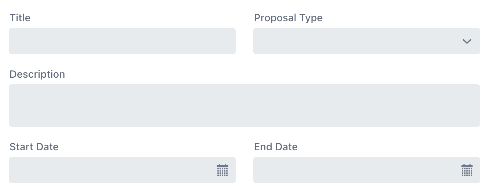

= Add a Form in Hilla
:toclevels: 2

TODO Write Introduction
// TODO Review with AI

== Laying Out the Fields

In Hilla, you build the form visually by *adding input components to a layout component*. The most common layout components for forms are <</components/form-layout#,Form Layout>>, <</components/vertical-layout#,Vertical Layout>>, and an ordinary `
` (with some CSS).  The Form Layout component supports multiple columns, whereas Vertical Layout lays out the components in a single column.

.Layout or 
?
[TIP]
If you are used to working with Flow, you can continue to work with the familiar layout components in Hilla. If you have a background in React or some other client-side framework, you may feel more comfortable working with `
`.

The following example shows how to build a two-column project proposal form with various input components:

.ProposalForm.tsx
[source,tsx]
----
import { ComboBox, DatePicker, FormLayout, TextArea, TextField } from "@vaadin/react-components";
import ProposalType from "Frontend/generated/com/example/application/domain/ProposalType";

export default function ProposalForm() {
    return (
        <FormLayout>
            <TextField label="Title"/>
            <ComboBox label="Proposal Type" items={Object.values(ProposalType)}/> {/* <1> */}
            <TextArea label="Description" data-colspan="2"/> {/* <2> */}
            <DatePicker label="Start Date"/>
            <DatePicker label="End Date"/>
        </FormLayout>
    );
}
----
<1> `ProposalType` is an `enum` in this example.
<2> Since `FormLayout` has two columns by default, this makes the description field take up the full width of the layout.

The finished form would look like this:

[.fill]

Form Layout is responsive, which means that if there is not enough room, the layout adjusts to a single column, with each input component on its own row. It also has other features not presented here. For
more information see the <<{articles}/components/form-layout#,Form Layout>> documentation.

