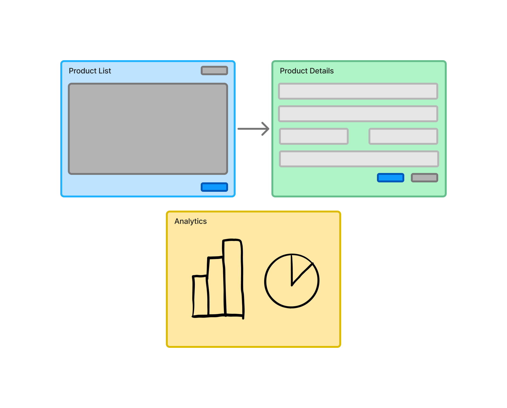
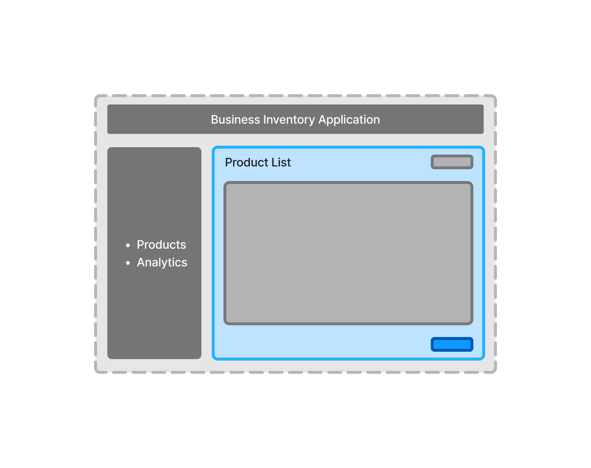
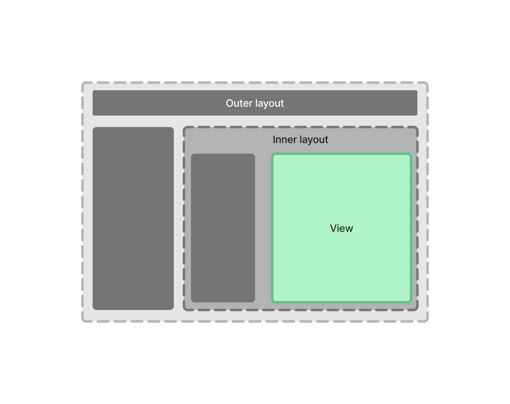

= Building Blocks

// TODO Write some introduction here

== Views

Users interact with a Vaadin application through views. A _view_ is a user interface page that contains specific information, and allows the user to perform specific actions.

For example, a business inventory application may have a product list view, a product detail view, and an analytics view. 

The list view shows a table of all products in the system. When the user clicks on a product in the list view, the browser navigates to the product detail view. The analytics view displays graphs or charts related to inventory trends and sales.

== Parent Layouts

Vaadin applications often have user interface elements that are visible on all views, such as a header, or a navigation bar. Instead of adding them to each individual view, you can add them to a _parent layout_. A view is then rendered inside the parent layout.

Here is an example of the product list view from earlier, rendered inside a parent layout:

The layout contains a menu that allows the user to navigate between the product list, and the analytics views. As the user navigates between the views, the layout itself remains the same.

Parent layouts can be nested. Here is a schematic drawing of a view, rendered inside an inner layout. The inner layout, in turn, is rendered inside an outer layout:

Nesting layouts like this is useful when implementing the master-detail pattern, for example.

// TODO Add link to master-detail once that page has been written.

== Routes

When a user navigates from one view to another, the URL changes in the browser. Vaadin uses routes to deduce which URL corresponds to which view, and vice versa.

A _route_ is a mapping between a URL path, and a view. For example, the path `/products` may correspond to the product list view. Likewise, the path `/products/1234` may correspond to the product details view, where `1234` is the ID of the product to show.

Routes are also used to specify which parent layout a view should be rendered in. This makes it possible to render different views in different layouts, or even to leave out the layout. For example, a login view should typically not be rendered inside a parent layout.

== UI Components

Views and layouts are constructed from _UI components_. Vaadin provides several components for different purposes: data entry, visualization, interaction, and layouts.

Data entry components are, for example, text fields, checkboxes, and combo boxes.

Visualization components are, for example, notifications, avatars, and badges.

Interaction components are, for example, buttons, menus, and dialogs.

Layout components are used to lay out other components on the screen in different ways. They are not to be confused with _parent layouts_, even though they are often used to build parent layouts.

You can find a complete list on the <<{articles}/components#,Components>> documentation page.

== Custom Components

The Vaadin UI components are the smallest building blocks of your user interface. In practice, you often have to combine them into your own composite components. This components are called _custom components_, to distinguish them from components provided by Vaadin, or third parties.

Both views and parent layouts are custom components.
