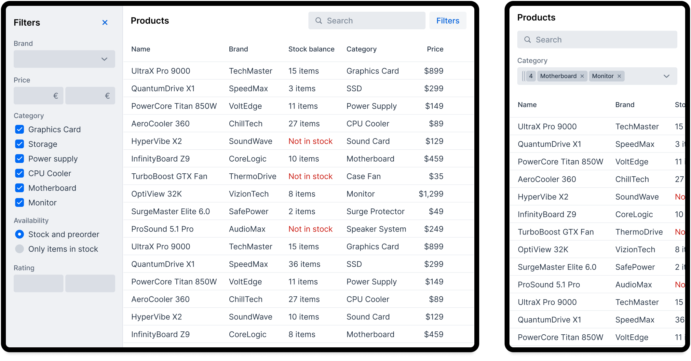
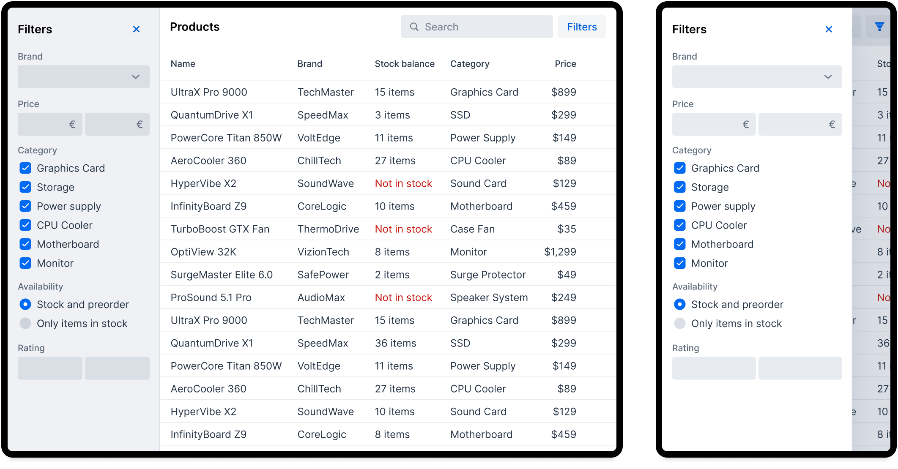
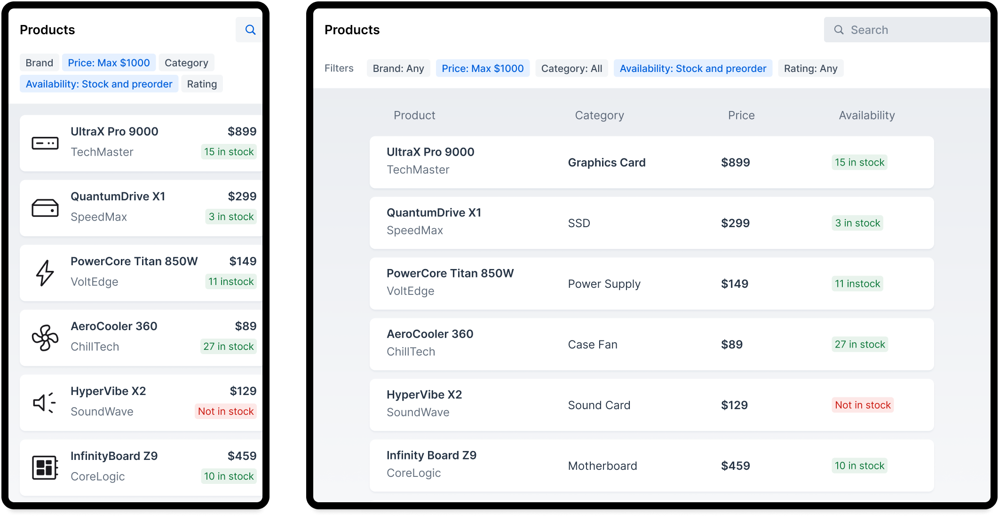
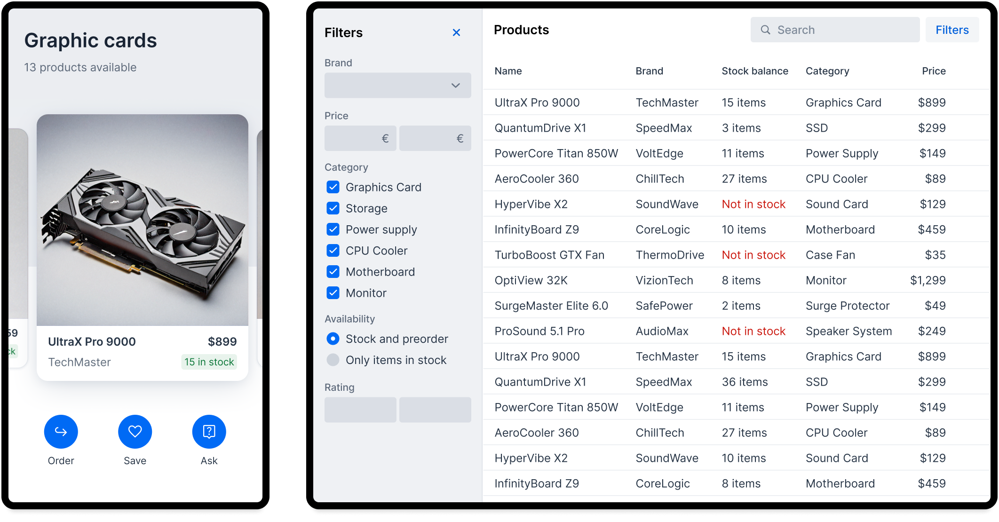
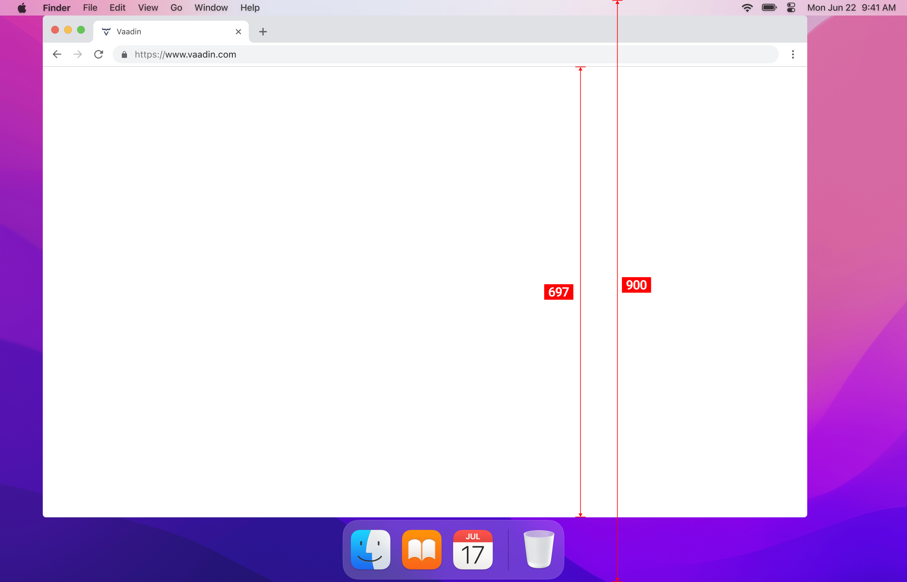
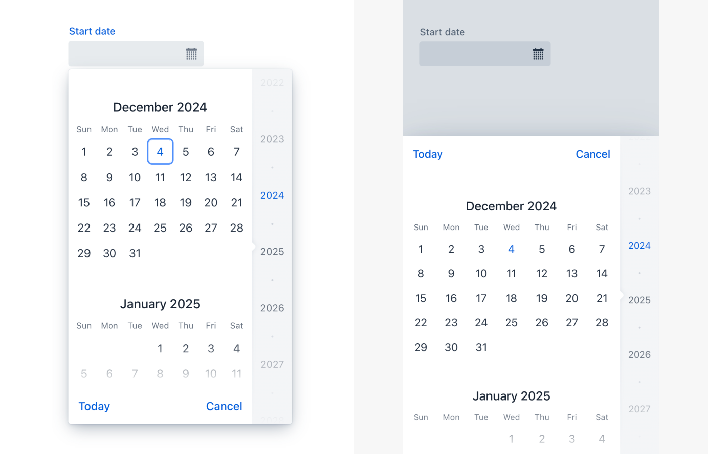
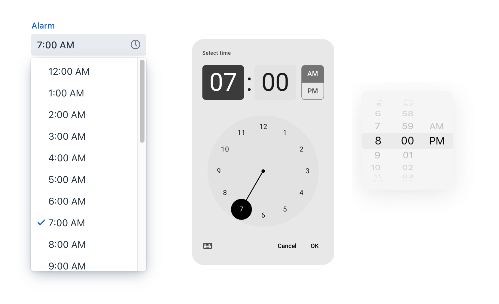

= Responsiveness
:toclevels: 2

In the scope of UX design, responsiveness refers to the UI responding to changes in the viewport size. Making a responsive application often means adapting the UI to mobile phone screen sizes and taking touch interactions into consideration. The same responsive techniques can also be adapted to make the best out of large screen sizes. The goal is not to squeeze or stretch the UI elements to fill the available space, but rather to adapt the user interfaces to best use the available screen estate.


== Designing for Mobile Responsiveness

There are different approaches when optimizing an UI for a small touchscreen. The right approach depends on your application's specific needs. As a rule of thumb it's better to do a limited set of mobile functionalities well, than rush through and force everything to fit on a small screen.


=== Reduce Features on Small Screens

The most lightweight option is to reduce features on smaller screens. This may work for applications that are primarily used on desktop and mobile UI is used only occasionally to access read-only data or simple workflows. Maybe the users won't really need the system administration features or heavy data entry on mobile and hiding them from the application is completely fine.

[link=images/responsiveness1.png]



=== Build a Responsive System

Next approach can be to adapt all the UI's to be mobile friendly. It is easiest to achieve when the UI is based on a design system that takes responsiveness into account. UI patterns should adapt to viewport size independently to reduce need for one-off view specific overrides. CSS media query and container query are the techniques for implementing responsive UI building blocks.

[link=images/responsiveness2.png]



=== Start with Mobile Size

“Mobile first” means an approach where the UI definition starts with the mobile size and is adapted to larger viewport sizes. It's easier to design for experiences to be more natural on mobile when there isn't the burden of an existing desktop design. On a smaller screen a workflow is likely to consist of a series of smaller steps which may be combined on desktop. Mobile first approach fits applications which prioritize the mobile UI to be as important as the desktop UI.

The example below shows a UI design that was first made for mobile and adapted to desktop. Note that the data is the same as in earlier examples, but the desktop UI presentation and functionality is based on the mobile version.

[link=images/responsiveness3.png]



=== Separate Mobile UI

Desktop and mobile UIs should be developed separately when the best possible user experience for both are required. With this approach there is no need for compromises. Often developing separate UI:s is not desirable due to doubling the amount of UI code leading to additional challenges.

Our recommendation is to make a separate mobile UI only for a very limited set of views or functionalities. For example QR code scanning or full screen map may benefit decoupling from the desktop UI implementation. The example below shows a mobile UI that relies on swipe gestures while the desktop version has totally different interaction patterns.

[link=images/responsiveness4.png]



=== What Screen Sizes Should I Design for?

Avoid designing explicitly for any specific screen resolution like 1920x1080 or “iPhone 22 Pro”. Even if your users are known to have a very specific hardware setup they would still benefit from being able to resize their browser window to half screen or use browser zoom. The design tool artboard needs to have some size, but consider that to be fluid. Push yourself to test how your design adapts to larger and smaller sizes. Especially note that the browser window tends to be much narrower than the screen resolution. Image below demonstrates that on a 1270x900 screen roughly 75% of height is actually available for the browser content.




== Responsive Features in Vaadin Components

Some of the components have responsive features built into them. For example the image below shows that the position of the Date Picker's overlay is changed to optimize for touchscreen devices.



[cols="1,2"]
|===
|Component|Responsive features

|App Layout|Navigation drawer can be displayed as an overlay or bottom navbar. Drawer automatically collapses to hamburger menu on small viewports.
|Dashboard|Reflow content automatically to optimize use of available space.
|Charts|All chart types can be configured to fill any available space. Charts will scale in real time when container size changes.
|Dialog, Confirm Dialog|Button toolbar changes to vertical layout when space is limited.
|Context Menu|Overlay is displayed as fixed to bottom of screen on mobile sizes.
|CRUD|Editor is always shown as an overlay on small viewports.
|Date Picker|Overlay is displayed as fixed to bottom of screen on mobile sizes.
|Email Field|Email specific touchscreen keyboard is used if provided by OS.
|Form Layout|By default, contents displayed in two columns are shown in a single column on mobile sizes.
|Menu Bar|Overflow menu appears when items don't fit in the width of the element.
|Number Field|Number specific touchscreen keyboard is used if provided by OS
|Password Field|Mobile browsers can display the typed character for a moment before obscuring it.
|Select|Overlay is displayed as fixed to bottom of screen on mobile sizes.
|Tabs|Horizontal scroll buttons appear when tabs don't fit in the width of the element. Container is horizontally scrollable.
|===


=== Native Inputs and Vaadin Fields

At first glance the operating systems native overlays for selecting days or options from a list may seem like a good option. Our approach has been to use our own inputs as they allow better control when the input has min-max limits, disabled options or other logic for entering a value. For example time pickers in all operating systems are not guaranteed to be able to display limits for entering time which would lead to usability issues and different experience depending on the user's device.

Image below shows Vaadin Time Picker next to OS native time pickers.




== Developing Responsive User Interfaces

In Vaadin the technical implementation of responsive layouts is based on standard web technologies; Flexbox, Grid, Media query and container query. We also offer some helpers for the non-CSS savvy people for utilizing those CSS techniques.


=== Flexbox and Grid

https://developer.mozilla.org/en-US/docs/Learn/CSS/CSS_layout/Flexbox[Flexbox] is a layout which sets its child DOM elements to either expand to available space or shrink to minimize the used space. Items are displayed either vertically (column) or horizontally (row). In addition flexbox can be configured to wrap to a new line, which helps implement content that automatically reflows on smaller viewport sizes.

https://developer.mozilla.org/en-US/docs/Learn/CSS/CSS_layout/Grids[Grid] is a two-dimensional layout system. It's similar to having multiple Flexboxes next to each other, but adds more control over the layout. The concept behind Grid is slightly more complex than Flexbox but mastering both allows implementing very sophisticated responsive layout structures on the web.

In Vaadin the layout components already use FlexBox and Grid and make them easier to approach. If the Vaadin layout components don't fit your specific needs, you can write your own CSS or use the Lumo Utilities.


=== CSS Media Query and Container Query

Here’s an example of a mobile toolbar that is hidden on non-mobile viewports. Media query will override the styles when viewport width is within a defined scope.

```css
html {
    .mobile-toolbar {
        display: none;
    }
    @media (max-width: 640px) {
        .mobile-toolbar {
            display: flex;
        }
    }
}
```


Media query is a good tool for defining responsive breakpoints based on the viewports width. Sometimes styling based on viewport width isn't enough and container query allows styling based on size of the element's container. For example when an application has resizable content areas, it's desirable to style the content based content area rather than width of screen.

In this example when the side panel container has a width of 400px or more a footer is shown.

```css
html {
    .sidepanel {
        display: none;
        container-type: inline-size;
        container-name: sidepanel;   /* Optional */
    }
    @container sidepanel (min-width: 400px) {
        .footer {
            display: flex;
        }
    }
}
```


=== Lumo Utilities

Utility classes are small, single-purpose CSS classes that can be applied directly to a component or HTML element to style them in a specific way. Unlike traditional CSS approaches, which often involve writing custom styles for each element, utility classes provide a more modular and reusable way to style your content.

Here's the same example of mobile toolbar that is hidden on non-mobile viewports. It's important to note that the responsive utility classes follow a *mobile-first approach*. For example, "Small" styles are applied when the screen width is 640 pixels or wider.

[.example]
--
[source,html]
----
<source-info group="Lit"></source-info>
<div class="flex sm:hidden">
----

[source,java]
----
<source-info group="Flow"></source-info>
mobileToolbar.addClassNames(Display.FLEX, Display.Breakpoint.Small.HIDDEN);
----
.TSX
[source,html]
----
<source-info group="React"></source-info>
<div className="flex sm:hidden">
----
--

Blog post "https://vaadin.com/blog/building-responsive-layouts-with-vaadin-utility-classes[Building responsive layouts with Vaadin utility classes]" goes into details of Lumo Utility classes through examples.
