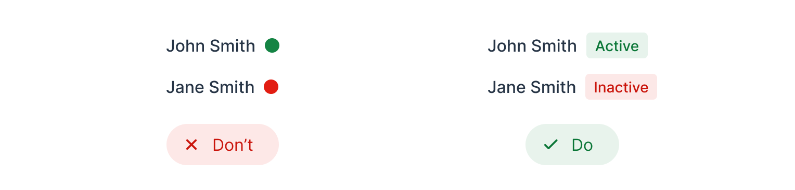

= Color

When starting from scratch, without a brand guideline, choose a primary and an accent color that suits your design's mood or tone. Lumo defaults to blue, a common yet neutral and safe choice. If you opt for green or red, be mindful as they're often tied to success and error messages. Purple and vibrant gradients have gained popularity in AI branding and design.

image::images/color-ui-example.png[Generate Button shows Vibrant Gradient Trend for AI]

== Generating a Color Palette

Should you need help generating a color palette, there are many tools available online, such as:

- https://coolors.co/[Coolers]
- https://color.adobe.com/[Adobe Color]
- https://colors.eva.design/[Eva Design]

Lumo's <<{articles}/styling/lumo/lumo-style-properties/color#,color palette>> consists of grayscale shades, with blue as the primary color, red for errors, green for success, yellow for warnings, and text colors.

image::images/color-palette.png[Lumo's Color Palette]

Follow the "less is more" approach when using color in your application. Limiting your color palette to a few strategic choices -- such as one primary color, a couple of accent shades, and neutral tones -- helps to create a clean, cohesive interface. This reduces visual clutter and ensures that important elements stand out. Keep it simple for a more intuitive and focused user experience.

== Color Contrast

Ensure there is sufficient contrast between the text and its background. For legibility purposes, you should target a contrast ratio of at least 4.5:1, in accordance with https://www.w3.org/WAI/WCAG21/Understanding/contrast-minimum:[WCAG 1.4.3]. Most browsers feature a built-in color contrast checker that can be accessed through their inspection tools.

Lumo is compliant by default. However, if you customize the text colors, be sure to check the contrast.

Avoid relying on color alone to convey information, as outlined in https://www.w3.org/WAI/WCAG21/Understanding/use-of-color[WCAG 1.4.1]. Use text labels, patterns, or shapes in addition to colors to ensure accessibility.

image::images/color-shapes1.png[Comparison: Left without Background; Right Highlights Selected]

// TODO, RUSSELL:  These two images should be described -- in addition to the captions.

