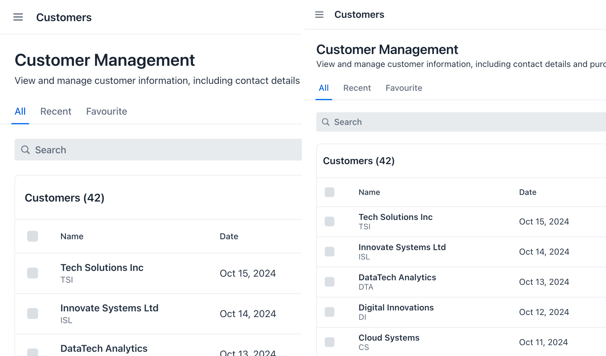

= Size & Space

The dimensions of UI elements, the spacing between them, and the size of text significantly impact the usability of the user interface. Elements should be large enough to ensure comfortable interaction across all target devices. For example, touchscreen interfaces benefit from larger elements, compared to desktop interfaces.

Effective use of padding, margins, and white space creates visually balanced interfaces. Beyond enhancing aesthetics, suitable spacing helps organize content into clear visual hierarchies, making understanding information and navigating easier.


== Sizing

Lumo has a default base font size of 16 pixels. The font size of the `<html>` element is important because all sizes and spacing in Vaadin components are relative to this root size. This is why Lumo uses `rem` units (i.e., relative to the root font size) for both sizing and spacing.

Examples of `rem` to `px` calculations:

    1rem = 16px
    1.5rem = 16px * 1.5 = 24px
    2.25rem = 16px * 2.25 = 36px

The recommended approach is to adjust Lumo's <<{articles}/styling/lumo/lumo-style-properties/size-space#,size>>, <<{articles}/styling/lumo/lumo-style-properties/size-space#,space>>, and <<{articles}/styling/lumo/lumo-style-properties/typography#lumo-font-size,font size>> custom properties, instead of changing the root font size.

Sometimes, the overall size of the UI may need to be adjusted. Common use cases include:

- Decreasing sizes in data-heavy interfaces to display more content on the screen;
- Reducing font sizes while increasing spacing to allow more white space around components; and
- Increasing the size of elements on touchscreens to enlarge touch targets and mitigate the _fat-finger_ problem.

The following image shows an example of reduced spacing and sizing. A smaller font-size together with slightly reduced space between elements allows displaying more items in the Grid on the same viewport size, while keeping the visual hierarchy intact.



These adjustments can be made independently for touch devices or different screen resolutions, ensuring an optimal user experience across various displays. It's recommended to modify the sizing, spacing and font size via CSS custom properties. Below is an example of increasing the sizing on touch devices without changing the font-size.

```css
@media (pointer: coarse) {
  html {
    --lumo-size-xl: 4rem;
    --lumo-size-l: 3rem;
    --lumo-size-m: 2.5rem;
    --lumo-size-s: 2rem;
    --lumo-size-xs: 1.75rem;
  }
}
```
A less common option is to apply size modifications to specific sections of the UI. For instance, a filtering bar might benefit from a more compact design, while the main content area maintains its regular size.

When decreasing font sizes, it's essential to ensure that the smallest text elements, such as those in badges, remain legible. A minimum recommended size for readability is 12 pixels. Refer to the <<{articles}/building-apps/presentation-layer/design/visuals/typography#type-scale,type scale>> for more information on adjusting the scaling ratio between different font sizes.

[NOTE]
If you notice users relying on browser zoom, it may indicate that the overall sizing is off.


== Spacing

Good use of space allows the user interface to _breathe_. By giving elements enough room, the design appears cleaner, and the content is easier to read. Too little white space results in cramped layouts that feel busy and overwhelming, negatively impacting user experience.

Proper spacing helps visually organize the interface. Well planned gaps between elements group related content together without the need for divider lines. Inconsistent or poorly applied spacing compromises the visual hierarchy, making it difficult for users to understand the relationship between different UI elements.

When creating a new design, start with more space rather than less. It's easier to reduce space later to achieve a balanced look than to add it as an afterthought.

To maintain a cohesive and consistent design, spacing should follow a system. Vaadin's Lumo theme provides predefined custom properties for spacing, from `XS` to `XXXL`, increasing on a non-linear scale while still aligning with a 4px grid. Using a systematic approach ensures that every part of the UI adheres to the same visual rhythm.

In the following image, spacing is used to separate the page into three sections. The sub-group with two buttons on the bottom right appears to belong to the "Market summary" section due to its alignment within the invisible section:


