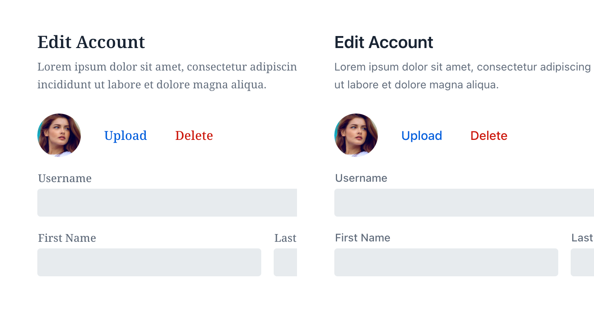
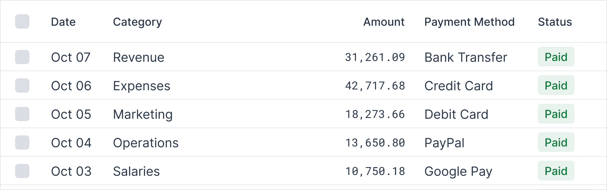
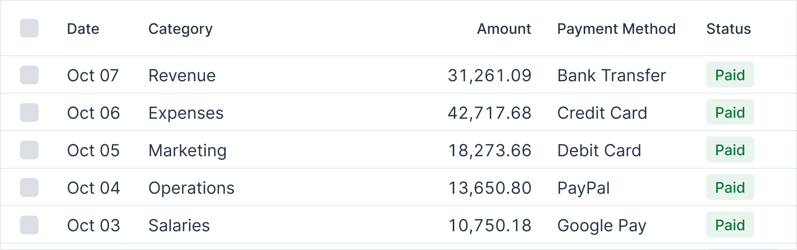
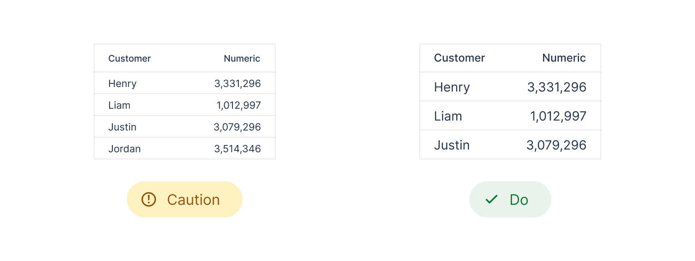

= Typography

Typography is a key element of business app design that directly affects user experience and readability. By thoughtfully selecting the right font families and sizes, designers can create interfaces that are both visually appealing and easy to use. This section explores the key components of typography, offering insights on making choices that enhance the overall effectiveness of your application’s design.

== Font Family

Choose a font family that fits the look you're going for. Generally speaking, serif fonts are more traditional, while sans-serif fonts are more modern. Some research suggests that the latter slightly outperforms serif fonts in legibility tests for those with poor eyesight.

Font family in Lumo depends on the operating system. The defaults are Segoe UI on Windows, Roboto on Android and Chrome OS, and San Francisco on macOS, iOS, and iPadOS, with Helvetica and Arial as fallback fonts on other systems, all of which are sans serif fonts.

Serif (left) vs sans serif (right):

Monospace fonts are excellent for displaying numeric values when comparisons are necessary.

Alternatively, you can use link:https://developer.mozilla.org/en-US/docs/Web/CSS/font-variant-numeric[CSS to display numbers in a monospace style], depending on font support.

== Font Size

WCAG doesn't specify a minimum font size requirement, but be cautious of going smaller than 12 pixels. That said, this also depends on the inherent size of the typeface; some typefaces may appear smaller or larger at the same size, which affects legibility.

== Type Scale

A type scale is a system for choosing font sizes based on a base size and scaling ratio. This approach creates a clear visual hierarchy for headings and body text, improving content navigation for users. Alongside font size, variations in font weight and color also contribute to this hierarchy.

image::images/typography-type-scale.png[Comparison of two forms: the left side displays a uniform font size, while the right side uses varying font sizes to create a clear visual hierarchy, enhancing readability and ease of navigation.]

There are several online tools available to help you preview and select a type scale that suits your needs, including:

- https://baseline.is/tools/type-scale-generator/
- https://typescale.com/
