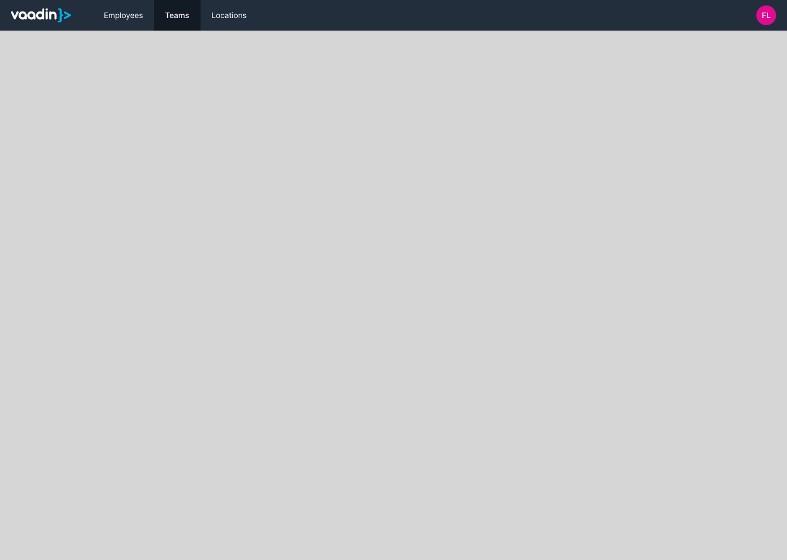
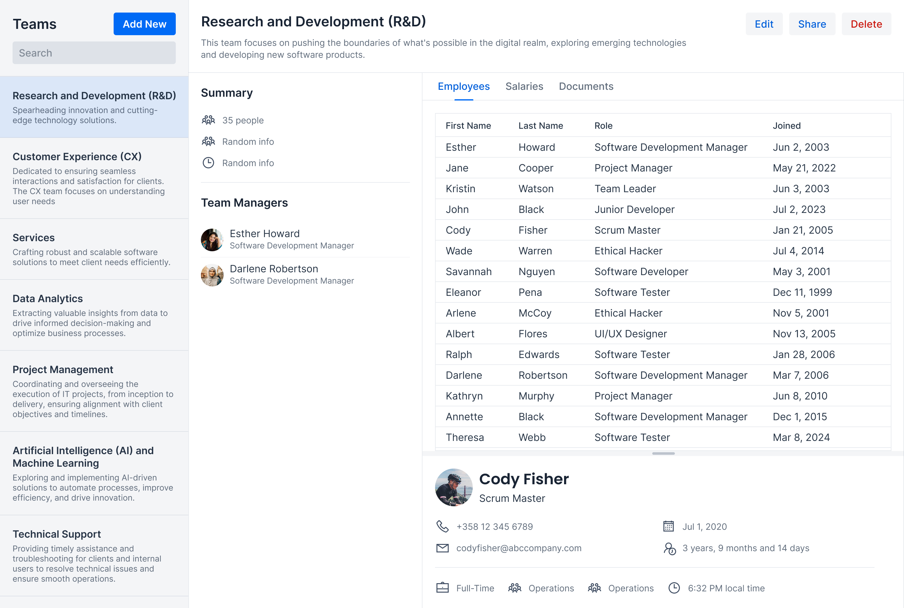
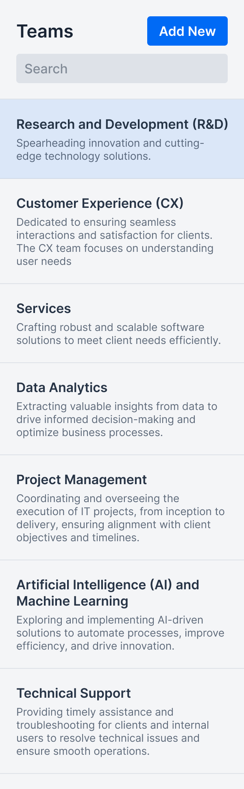
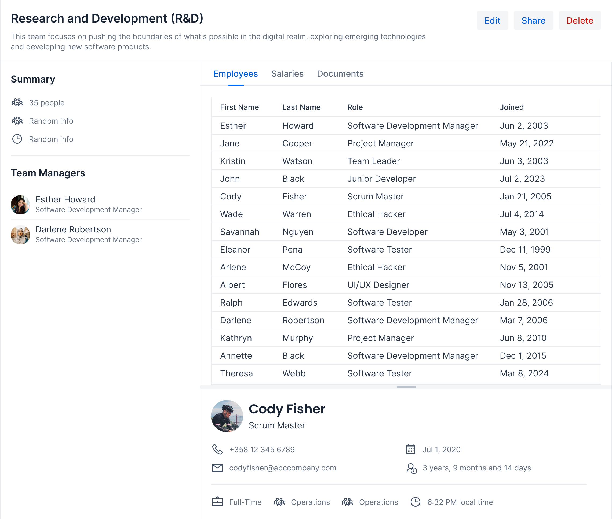
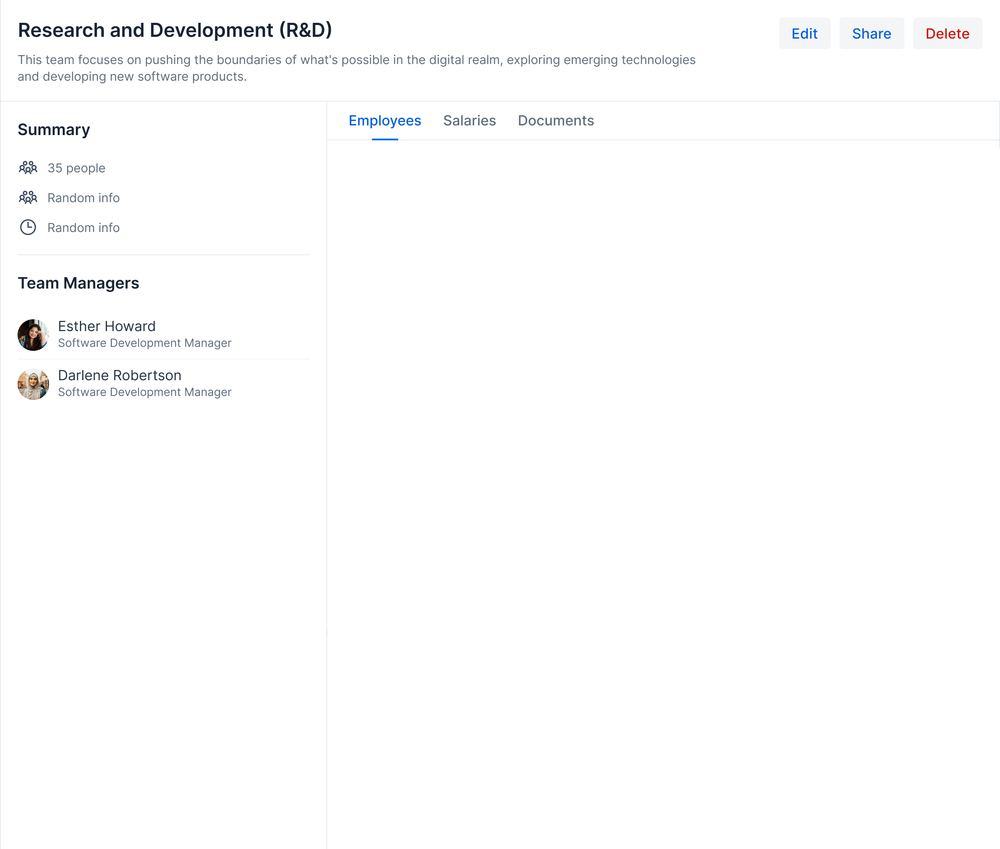
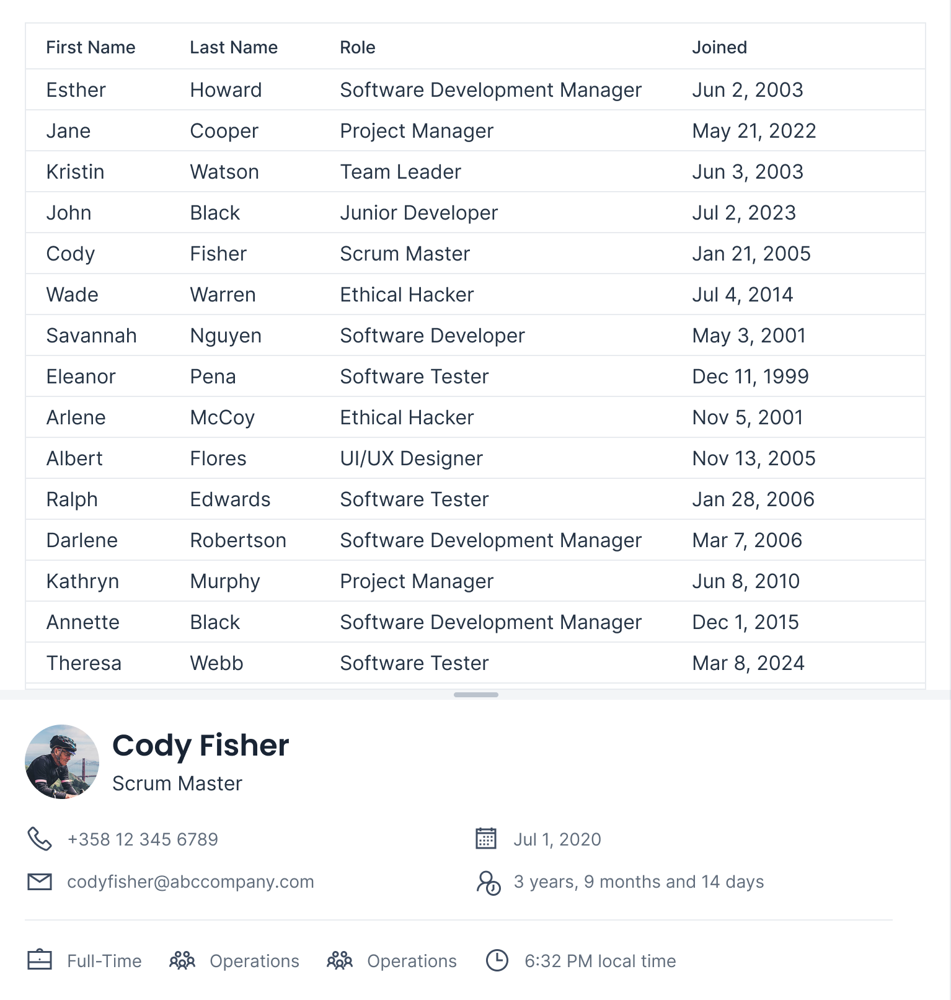
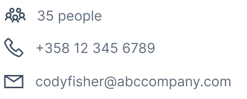

// Notes from Gerald:
//
// General
// - thereis a lot of "You should find this out before you start implementing." Its a bit of an overhead. maybe this should be put into a little colored box at the side with a microscope or something to indicate the things the developer has to find out to not interrupt the reading flow.
//
// Main layout
//  - the word layout is a bit confusing. you are talking about the router layout which shouldn't be revealed yet, but i was confused in the beginning with horizontal/vertical/flex/etc. layout. as you came to "a view is rendere inside a layout" it became clear to me which is which. so maybe we need a more abstract term here?
//
// The View
// - what do you want to say with that: "The sidebar and header are so simple that they can be nested inside the panel."?

# View Composition

You build Vaadin user interfaces by composing UI components together. Some UI components are provided out-of-the-box by Vaadin, others you have to write yourself. Some components are generic and reusable in different settings, others are designed for one specific use case and should not be reused at all. Knowing how to identify and implement these components is key to succeeding in building complex Vaadin user interfaces.

You are now going to learn the basics of view composition in Vaadin. The starting point is the following mock-up of a fictional business application:

image:images/application.png[alt=A mock-up of a fictional business application,width=800]

Step by step, you are going to learn how to split it up into smaller parts until you are ready to implement it.

## Main Layout

The first step is to identify which parts of the user interface belong to the _layout_ and which belong to the _view_. A layout contains elements that are always visible in the user interface, such as the title of the application, navigation links and information about the current user. A view is one page of the user interface and is typically rendered inside a layout. As the user navigates between views, the layout remains the same. It is also possible to nest layouts inside each other.

The main layout of the mock-up is the following:

It consists of a header and a content area. The content are contains whatever the current view is. The header consists of three different components: the application's logo, navigation links to the _Employees_, _Teams_ and _Locations_ views, and the current user's avatar.

*The main layout is a UI component you have to implement.* The header is so simple that it can be nested inside the layout.

## The View

Having discovered the main layout, you can remove those parts from the mock-up. This leaves you with the actual Teams view, which looks like this:

It is a good idea to look for common user interface design patterns. In this view, the most obvious one is the _Master-Detail_ pattern. On the left, there is a list of teams that the user can select from. When the user selects a team, its details show up on the right.

From the mock-up it is unclear what should happen if there are no teams in the list or no team is selected. You should find this out before you start implementing.

### Team Selection Panel

The master-part of the master-detail is the team selection panel:

At the top, there is a header containing the name of the Teams view, a button for creating new teams and a text field for filtering the list of teams.

The list of teams itself consists of panels, one for each team. Each team panel contains the name and description of the team. *The team panel is a UI component you _may_ have to implement*, depending on how you choose to implement the list itself.

You select a team by clicking on the panel. From the mock-up it is unclear whether keyboard navigation should be supported or not. It is also unclear whether the team selection panel is resizable or not, although the lack of a splitter indicates it has a fixed width. These are things you should find out before you start implementing, as it affects which components you can use. 

*The team selection panel is a UI component you have to implement*. The header is so simple that it can be nested inside the panel.

### Team Details Panel

The detail-part of the master-detail is the team details panel:

At the top, there is again a header. It contains the name and description of the team, and buttons for editing, sharing and deleting the team.

To the left, there is a sidebar with two sections: one with general information about the team and another with a list of managers of the team. From the mock-up it is unclear whether the managers are clickable or not. It is also unclear whether the sidebar is resizable or not, although the lack of a splitter indicates it has a fixed width. Again, these are things you should find out before you start implementing, as it affects which components you can use.

To the right, there are tabs that control the contents of the rest of the panel. This indicates that the entire team details panel is in fact a nested layout with three sub-views: _Employees_, _Salaries_, and _Documents_. In fact, the team details panel looks like this:

*The team details panel is a UI component you have to implement.* The sidebar and header are so simple that they can be nested inside the panel.

#### Employees Sub-View

The first, and only sub-view visible in the mock-up, is the Employees sub-view:

As with ordinary views, it is a good idea to look for common design patterns. In this case, you have another Master-Detail. At the top, there is a grid of team members. When you select a team member, its details show up in a bottom panel. The splitter between the grid and the bottom panel indicates the bottom panel is resizable.

From the mock-up it is unclear what should happen if there are no employees in the grid or no employee is selected. You should find this out before you start implementing.

The employee details panel is read-only, which makes it simple to implement. It contains general information about the employee.

*The employees sub-view is a UI component you have to implement. The employee details panel is a UI component you _may_ have to implement*, depending on how you choose to implement the sub-view itself.

## Generic Components

You have now split the mock-up into a layout, a view, a nested layout and a sub-view. In addition, you have identified some panels that you need to implement. The final step before you can start to actually write code is to identify any generic components that are re-used in multiple places. In this mock-up, there are at least two.

The first generic component is the person panel:

image:images/person-panel.png[width=300]

It is used both in the list of managers and in the employees sub-view. It contains the person's picture or avatar, name, and title. From the mock-up, you can see that the panel is smaller in the list and larger in the sub-view.

The second generic component is the item with icon:

It is used both in the team summary and in the employees sub-view. From the mock-up it is unclear whether the phone number and email should be clickable. You should find this out before you start implementing.

As you start to implement the view, you may discover more generic components. This is especially the case with Flow, as laying out components in an imperative way is rather verbose.
