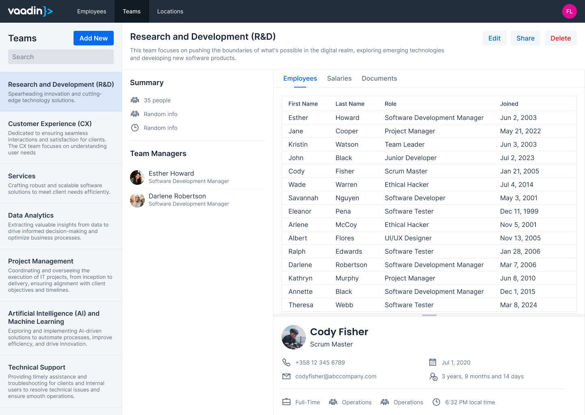
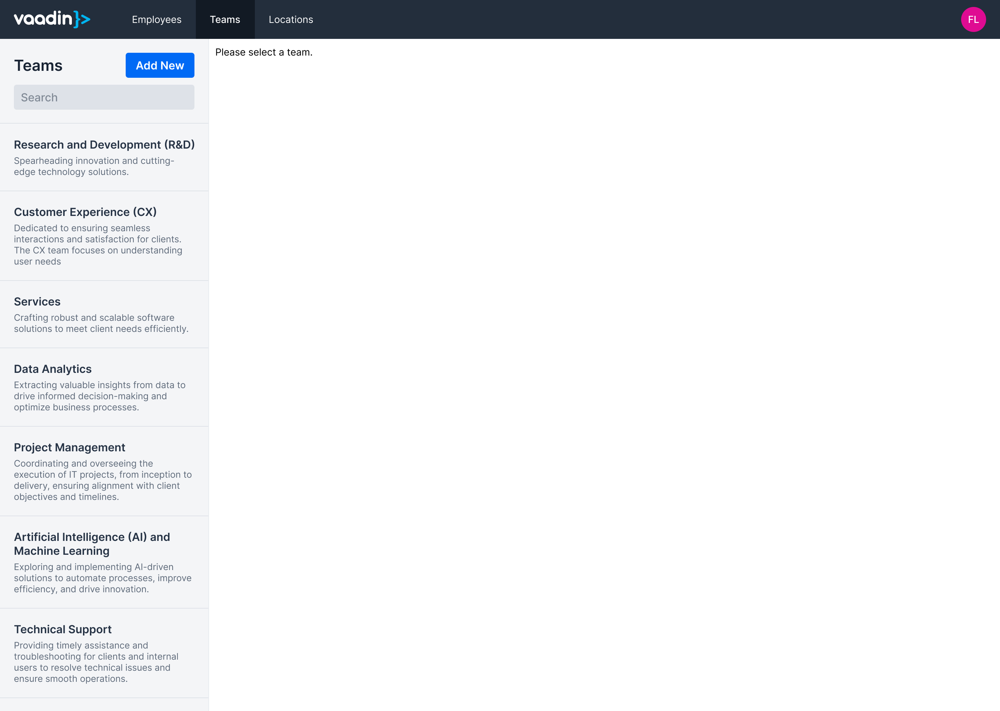
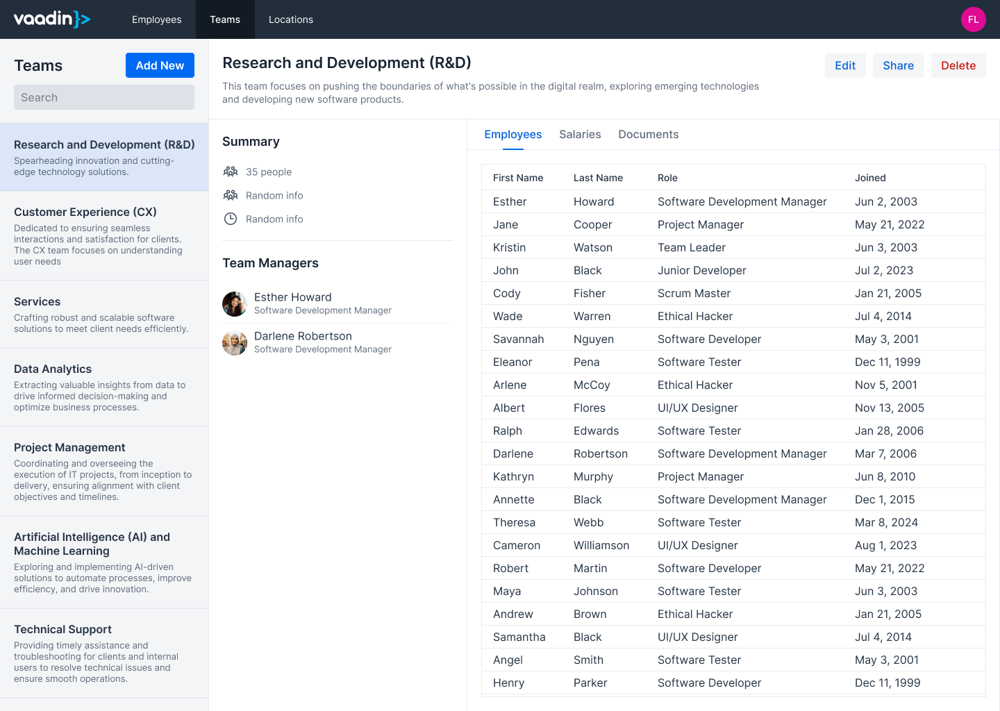

// Notes from Gerald:
//
// String ID:s in URL:s
// - is there maybe a more practical example, how to use NanoId? would you save it along the primary key in the DB? if not: how do you convert it forth and back, in a map? what happens with that map if the application restarts?

# URL Design

On the <<composition#,previous>> page, you learned how to split this mock-up into UI components:

You are now going to learn how to design the URL of the mock-up based on how a user is intended to navigate the view. The main focus is on deciding what _view state_ to store in the URL as path or query parameters. Now why is this important?

Say you are working with the application, and want one of your colleagues to have a look at something. Now could ask them to open the application and tell them how to look up the information you want to show. However, if the relevant state was stored in the URL, you could send it to your colleague. The colleague would then only need to click the link to end up with the same view as you (after authenticating, of course).

## Path Parameters

Path parameters are, as their name suggests, a part of the URL path: `/view/[parameter1]/[parameter2]`. Use path parameters for navigating to a specific view, or sub-view within a view.

In the fictional application, the root path of the _Teams_ view is `/teams`. If you navigate to this path, you end up with this:

The first path parameter is the ID of the team: `/teams/[teamId]`. For example, the team _Research and Development (R&D)_ could have the path `/teams/8zguABh6u`.

It is quite common to use incrementing long integers as database primary keys. If you use such a key in the URL, for example `/teams/1`, it is easy for an attacker to deduce that there may also be a `/teams/2`, a `/teams/3` and so on. Even if you have secured the application so that only authorized users get access regardless of whether they know the URL or not, the URL is exposing internal information. This information can be used to attack the application in another way. Instead, use a random ID such as `/teams/8zguABh6u`. Under the hood, you can still use long incrementing integers for primary and foreign keys, as they are faster than strings.

The Teams view has three sub-views, visible as tabs: _Employees_, _Salaries_, and _Documents_. The selected tab is the second path parameter: `/teams/[teamId]/[tab]`. For example, the sub-views could have the following paths:

* Employees: `/teams/8zguABh6u/employees`
* Salaries: `/teams/8zguABh6u/salaries`
* Documents: `/teams/8zguABh6u/documents`

Because the Employees tab should be selected by default, the path `/teams/8zguABh6u` should be considered an alias of `/teams/8zguABh6u/employees`. If you navigate to either of these paths, you end up with this:

The Employees sub-view allows you to select an employee to view their details. This selection is the third path parameter and it is only valid when the Employees tab is selected: `/teams/[teamId]/employees/[employeeId]`. For example, _Cody Fisher_ could have the path `/teams/8zguABh6u/employees/zxPIVBqJ2`. If you navigate to this path, you end up with the state of the original mock-up:

## Query Parameters

Query parameters are added to the end of a URL after a `?` symbol. You can specify multiple query parameters by separating them with `&` symbols: `/view?param1=foo&param2=bar`. Use query parameters if you want to be able to share or bookmark a view while it is in a specific state. Such a state could, for example, be a particular sort order or filter.

You don't have to use query parameters unless there is a clear benefit to do so. Looking at the mock-up, the view is already quite usable without query parameters. That said, it still has some candidates which you are going to look at next, for the sake of demonstration.

The Teams view has a text field for filtering the list of teams. This is the first candidate for a query parameter: `/teams/8zguABh6u?search=foobar`

The Employees sub-view has a grid that can be sorted by clicking at the column headers. This is the second candidate for a query parameter: `/teams/8zguABh6u/employees/?orderEmployeesBy=firstName,lastName`

You can have query parameters and path parameters for both the view and the sub-view at the same time. For example, look at this URL: 

[source]
----
/teams/8zguABh6u/employees/zxPIVBqJ2?search=research&orderEmployeesBy=firstName,lastName
----

You can extract the following information:

* The current view is the Teams view.
* The team whose public ID is `8zguABh6u` is selected.
* The Employees sub-view is visible.
* The employee whose public ID is `zxPIVBqJ2` is selected.
* The team list is filtered using the search term `research`.
* The employee grid is sorted first by first name, then by last name.

## String ID:s in URL:s

The examples above used random strings as public ID:s. When you generate a random ID, you should pay attention to its usability. Since the ID is public, people may want to copy and paste it, either on its own or as a part of the URL. That means the ID must be URL-friendly, short enough and easy to copy.

An easy way of generating random string ID:s in Java is to use Universally Unique IDentifiers (UUID). Java has a [classname]`UUID` class in the [packagename]`java.util` package. You can use it to generate random UUID:s by calling [methodname]`UUID.randomUUID()`. However, there is a problem with using UUID:s as public ID:s in URL:s.

Try to select this UUID by double-clicking on it:

[source]
----
78f98876-b150-4e08-8d7e-41bb5e0f7e72
----

Chances are you ended up selecting only a part of the ID instead of the whole string. This is because of the hyphens. You can fix this by either removing the hyphens or replacing them with underscores. Try to select these ID:s by double-clicking on them:

[source]
----
78f98876_b150_4e08_8d7e_41bb5e0f7e72
78f98876b1504e088d7e41bb5e0f7e72
----

You should now be able to select the whole string. However, the string is still quite long and when used as URL parameters, the URL becomes quite long too: 

[source]
----
https://myapp.example.com/teams/78f98876b1504e088d7e41bb5e0f7e72/employees/5191cfa1823e40858b0f0e10ce50c28e
----

This is not a user friendly URL. You can copy-paste it, but it is difficult to read for the human eye. Telling it to somebody over the phone is next to impossible.

A better alternative for public random string ID:s is _NanoId_. NanoId:s allow you to pick both the length and the alphabet. By default, the length is 21 characters and the alphabet numbers 0--9, letters A-Z and a-z, and the symbols - (hyphen) and _ (underscore).

If you use 9 character NanoId:s generated from an alphabet consisting of only numbers, uppercase and lowercase letters, you end up with a URL like this:

[source]
----
https://myapp.example.com/teams/aftD6ZXp6/employees/m4wqAas1Q
----

This is both shorter and more user friendly.

NanoId has been implemented in different programming languages, among others https://github.com/aventrix/jnanoid[Java] and https://github.com/ai/nanoid[JavaScript].

## Back Button Behavior

Once you are ready with the URL design, there is one more thing to consider: the browser's back button.

When you navigate to a URL in a web browser, a new entry is pushed to the browser's history stack. When you click the back button, the browser goes back one step in the history stack. You can continue to click the button until the stack is empty.

When a user uses a web application, it is the application itself that handles the navigation in respond to the user's actions. For example, in the mock-up application, the user would not modify the URL itself to select a team or a tab. Rather, the user would click on the team and the tab and the application would be responsible for updating the URL.

When a web application updates the URL, it can do it in wo ways: either by pushing new entries to the history stack, or by replacing the current entry in the history stack. This affects the behavior of the browser's back button.

Consider the following use case: the user opens the application, looks for a team, selects a team, sorts the employee grid and selects an employee. If every URL change was pushed to the history stack, the history stack would look like the following, sorted from oldest to newest:

* `/teams`
* `/teams?search=research`
* `/teams/aftD6ZXp6?search=research`
* `/teams/aftD6ZXp6?search=research&orderEmployeesBy=lastName`
* `/teams/aftD6ZXp6/employees/zxPIVBqJ2?search=research&orderEmployeesBy=lastName`

If the user clicked the back button now, they would end up with a sorted employee grid without a selection. Another click on the button would take the user to the same employee grid, but with its default sort order. A third click on the button would deselect the team and show the search results. A final click on the button would show the list of all teams, without any filters applied.

Since the search fields has no extra button, the query is executed as soon as the user stops typing. If the user is typing slowly, you may end up with entries like the following in the history stack:

* `/teams?search=re`
* `/teams?search=resea`
* `/teams?search=research`

If the user now clicked the back button, they would be confused. 

A good rule of thumb is to push new entries to the history stack whenever the path of the URL changes, and replace the current entry whenever query parameters change. With this behavior, the use case described earlier would result in the following history stack, sorted from oldest to newest:

* `/teams?search=research`
* `/teams/aftD6ZXp6?search=research&orderEmployeesBy=lastName`
* `/teams/aftD6ZXp6/employees/zxPIVBqJ2?search=research&orderEmployeesBy=lastName`

If the user clicked the back button now, they would end up with a sorted employee grid without a selection. Another click on the button would deselect the team and show the search results.

Finally, as with all rules of thumb, there may be exceptions. The important thing is to take back button behavior into consideration when designing the view URL and make sure it makes sense.
