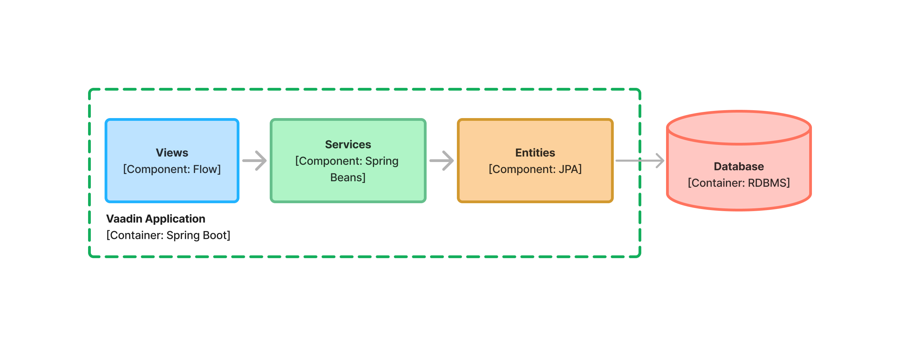

include::{articles}/_vaadin-version.adoc[]

= Multi-Module Projects

A multi-module project consists of multiple directories, each with its own POM file and source directory. During the build, Maven packages each module into a JAR file, or a WAR file. The modules can depend on each other; Maven builds them in the correct order. 

Unlike <<single-module#,single-module projects>>, there is no starter for creating a multi-module Maven project for a Vaadin application. Instead, you have to set up your project without a starter, beginning with the parent POM file.

[NOTE]
If you've never used multi-module Maven projects, you should at least read the https://maven.apache.org/guides/mini/guide-multiple-modules.html[Guide to Working with Multiple Modules] before continuing.

// TODO Actually, that guide is not that good. A newbie would still not know how a multi-module project works after reading it. Should find a better resource and refer to that.

== Parent POM-Structure

The parent POM file resides in the root directory of your project. In a Vaadin project, it serves two roles. First, it acts as the parent to all of the other modules, allowing them to inherit dependencies and other configuration from it. Second, it acts as the _reactor_ of the entire project, responsible for building the individual modules in the correct order. The parent module doesn't contain any source code, nor should it be packaged into a JAR file.

To turn a basic Maven POM file into a parent POM, start by changing its packaging to `pom`, like this:

[source,xml]
----
<groupId>com.example.application</groupId>
<artifactId>parent-pom</artifactId>
<version>1.0-SNAPSHOT</version>
<!-- tag::snippet[] -->
<packaging>pom</packaging>
<!-- end::snippet[] -->
----

The next steps are similar to the ones needed in <<single-module#,single-module projects>>. Import the `spring-boot-starter-parent` project like this:

[source,xml]
----
<parent>
    <groupId>org.springframework.boot</groupId>
    <artifactId>spring-boot-starter-parent</artifactId>
    <version>3.3.3</version> <!--1-->
    <relativePath/>
</parent>
----
<1> You can check for the latest version on the  https://mvnrepository.com/artifact/org.springframework.boot/spring-boot-starter-parent[MVN Repository].

Declare all other dependency versions as project properties, like so:

[source,xml,subs="+attributes"]
----
<properties>
    <java.version>21</java.version> <!--1-->
    <vaadin.version>{vaadin-version}</vaadin.version> <!--2-->
</properties>
----
<1> This property is used by `spring-boot-starter-parent` to configure the Java compiler plugin.
<2> You can check for the latest version on the  https://mvnrepository.com/artifact/com.vaadin/vaadin-bom[MVN Repository].

Then import the Vaadin BOM, like this:

[source,xml]
----
<dependencyManagement>
    <dependencies>
        <dependency>
            <groupId>com.vaadin</groupId>
            <artifactId>vaadin-bom</artifactId>
            <version>${vaadin.version}</version>
            <type>pom</type>
            <scope>import</scope>
        </dependency>
    </dependencies>
</dependencyManagement>
----

Unlike the single-module project, this POM file doesn't contain any plugins. Instead, it contains a section that lists all of the modules that should be included in the project build. Since at this point you won't have created any modules, add an empty section:

[source,xml]
----
<modules>
</modules>
----

Below is how a fully configured POM file for an empty multi-module Vaadin application looks:

.Parent pom.xml
[source,xml,subs="+attributes"]
----
<?xml version="1.0" encoding="UTF-8"?>
<project xmlns="http://maven.apache.org/POM/4.0.0"
         xmlns:xsi="http://www.w3.org/2001/XMLSchema-instance"
         xsi:schemaLocation="http://maven.apache.org/POM/4.0.0 http://maven.apache.org/xsd/maven-4.0.0.xsd">
    <modelVersion>4.0.0</modelVersion>

    <groupId>com.example.application</groupId>
    <artifactId>parent-pom</artifactId>
    <version>1.0-SNAPSHOT</version>
    <packaging>pom</packaging>

    <parent>
        <groupId>org.springframework.boot</groupId>
        <artifactId>spring-boot-starter-parent</artifactId>
        <version>3.3.3</version>
        <relativePath/>
    </parent>

    <properties>
        <java.version>21</java.version>
        <vaadin.version>{vaadin-version}</vaadin.version>
    </properties>

    <dependencyManagement>
        <dependencies>
            <dependency>
                <groupId>com.vaadin</groupId>
                <artifactId>vaadin-bom</artifactId>
                <version>${vaadin.version}</version>
                <type>pom</type>
                <scope>import</scope>
            </dependency>
        </dependencies>
    </dependencyManagement>

    <modules>
    </modules>
</project>
----

== Architecture & Modules

The code structure of the project should resemble the <<{articles}/building-apps/architecture/components#,architecture>> of the application. For multi-module projects, the _project structure_ should also resemble the architecture of the application. Therefore, you'll need to have an idea of what the architecture is going to look like before you start setting up a multi-module Vaadin project.

The code structure of a Vaadin application should have a _Views_ component, a _Services_ component, and an _Entities_ component.

[[three-system-components]]
[.fill]
[link=../architecture/images/three-components.png]

This architecture corresponded to the following Java packages:

- `com.example.application`
- `com.example.application.views`
- `com.example.application.services`
- `com.example.application.entities`

In addition, the following utility packages were added:

- `com.example.application.utils`
- `com.example.application.security`

To split these packages into separate Maven modules, you'll need to look at their dependencies, depicted by the arrows in the diagram. The main reason for using a multi-module project is to separate concerns. Each module forms its own compilation unit and has its own classpath. By packaging each system component into its own Maven module, you can control its dependencies in a way that is impossible in a single-module project. 

Following this principle, you might have a project structure that looks like this:

[source]
----
(root)
├── entities/
│   ├── src/main/java/
│   │   └── ...
│   └── pom.xml
├── services/
│   ├── src/main/java/
│   │   └── ...
│   └── pom.xml
├── utils/
│   ├── src/main/java/
│   │   └── ...
│   └── pom.xml
├── views/
│   ├── src/main/java/
│   │   └── ...
│   └── pom.xml
└── pom.xml
----

You may notice that the `security` module is missing. This is intentional. It'll be explained later.

== Module POM-Structure

Every Maven module has its own POM file and they are all quite similar. They all start with a reference to the parent POM:

[source,xml]
----
<parent>
    <groupId>com.example.application</groupId>
    <artifactId>parent-pom</artifactId>
    <version>1.0-SNAPSHOT</version>
</parent>
----

Since all of the modules are part of the same application, they should have the same `groupId` and `version`. These are inherited from the parent POM, unless declared explicitly in the POM file. Because of this, you should leave out the `<groupId>` and `<version>` elements from your module POM files.

Each module still needs an `artifactId`. Use the same name for both the directory of a module and its `artifactId`.

After this, you'll need to declare the dependencies of the modules. This is where the first differences start to appear. The `entities` module depends on `utils`, and any external dependencies it needs to access the database. This means that any code in the `entities` module is unable to call code in the `views` or the `services` modules. If you tried to do that, you would get a compiler error. The complete POM file looks like this:

.Entities pom.xml
[source,xml]
----
<?xml version="1.0" encoding="UTF-8"?>
<project xmlns="http://maven.apache.org/POM/4.0.0"
         xmlns:xsi="http://www.w3.org/2001/XMLSchema-instance"
         xsi:schemaLocation="http://maven.apache.org/POM/4.0.0 http://maven.apache.org/xsd/maven-4.0.0.xsd">
    <modelVersion>4.0.0</modelVersion>
    <parent>
        <groupId>com.example.application</groupId>
        <artifactId>parent-pom</artifactId>
        <version>1.0-SNAPSHOT</version>
    </parent>

    <artifactId>entities</artifactId>

    <dependencies>
        <dependency>
            <groupId>${project.groupId}</groupId> <!--1-->
            <artifactId>utils</artifactId>
            <version>${project.version}</version> <!--2-->
        </dependency>
        ... <!--3-->
    </dependencies>
</project>
----
<1> Instead of writing `com.example.application`, you can use the Maven built-in property `project.groupId`.
<2> Instead of writing `1.0-SNAPSHOT`, you can use the Maven built-in property `project.version`.
<3> This is where you would add dependencies to Spring Data, Hibernate, JPA, JOOQ, the JDBC driver and so on.

The `services` module depends on `entities` and `utils`. Because `entities` already depends on `utils`, `services` gets it as a _transitive dependency_ by only depending on `entities`. The complete POM file looks like this:

// TODO Add spring-context dependency as well and explain why

.Services pom.xml
[source,xml]
----
<?xml version="1.0" encoding="UTF-8"?>
<project xmlns="http://maven.apache.org/POM/4.0.0"
         xmlns:xsi="http://www.w3.org/2001/XMLSchema-instance"
         xsi:schemaLocation="http://maven.apache.org/POM/4.0.0 http://maven.apache.org/xsd/maven-4.0.0.xsd">
    <modelVersion>4.0.0</modelVersion>
    <parent>
        <groupId>com.example.application</groupId>
        <artifactId>parent-pom</artifactId>
        <version>1.0-SNAPSHOT</version>
    </parent>

    <artifactId>services</artifactId>

    <dependencies>
        <dependency>
            <groupId>${project.groupId}</groupId>
            <artifactId>entities</artifactId>
            <version>${project.version}</version>
        </dependency>
    </dependencies>
</project>
----

The `utils` module doesn't have any dependencies at the beginning. Its POM file looks like this:

.`Utils pom.xml`
[source,xml]
----
<?xml version="1.0" encoding="UTF-8"?>
<project xmlns="http://maven.apache.org/POM/4.0.0"
         xmlns:xsi="http://www.w3.org/2001/XMLSchema-instance"
         xsi:schemaLocation="http://maven.apache.org/POM/4.0.0 http://maven.apache.org/xsd/maven-4.0.0.xsd">
    <modelVersion>4.0.0</modelVersion>
    <parent>
        <groupId>com.example.application</groupId>
        <artifactId>parent-pom</artifactId>
        <version>1.0-SNAPSHOT</version>
    </parent>

    <artifactId>utils</artifactId>
</project>
----

The `views` module depends on Vaadin, the `services` module and the `utils` module. This means that both the `entities` and the `utils` modules are included as transitive dependencies. The complete POM file looks like this:

// TODO Add vaadin plugin as well and explain why

.Views pom.xml
[source,xml]
----
<?xml version="1.0" encoding="UTF-8"?>
<project xmlns="http://maven.apache.org/POM/4.0.0"
         xmlns:xsi="http://www.w3.org/2001/XMLSchema-instance"
         xsi:schemaLocation="http://maven.apache.org/POM/4.0.0 http://maven.apache.org/xsd/maven-4.0.0.xsd">
    <modelVersion>4.0.0</modelVersion>
    <parent>
        <groupId>com.example.application</groupId>
        <artifactId>parent-pom</artifactId>
        <version>1.0-SNAPSHOT</version>
    </parent>

    <artifactId>views</artifactId>

    <dependencies>
        <dependency>
            <groupId>com.vaadin</groupId>
            <artifactId>vaadin-spring-boot-starter</artifactId>
        </dependency>
        <dependency>
            <groupId>${project.groupId}</groupId>
            <artifactId>services</artifactId>
            <version>${project.version}</version>
        </dependency>
    </dependencies>
</project>
----

// TODO Where do you put frontend files and images? Which project, which directory?

Whenever you add a new module to your project, remember also to declare it in the parent POM file, like this:

.Parent pom.xml
[source,xml]
----
...
<modules>
    <module>entities</module>
    <module>views</module>
    <module>services</module>
    <module>utils</module>
</modules>
...
----

// TODO Continue here with the need for a deployment unit module, as an intro to the next section

== Deployment Unit POM-Structure

..

== Going Deeper

..

== When to Use

..