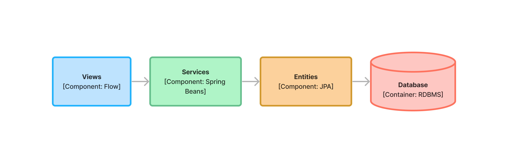

include::{articles}/_vaadin-version.adoc[]

# Single-Module Projects

A single-module project consists of a single directory, with a single POM-file and a single source directory. During the build, Maven packages the module into either a self-contained, executable JAR-file, or a WAR-file.

You can use various starters to create new single-module Vaadin projects (see <<{articles}/getting-started/project#,Getting Started>> for more information). You can also create the project manually, starting with a basic Maven POM-file and adding the necessary sections.

## POM Structure

As for all Spring Boot projects, a lot of the configuration is imported through the `spring-boot-starter-parent`:

[source,xml]
----
<parent>
    <groupId>org.springframework.boot</groupId>
    <artifactId>spring-boot-starter-parent</artifactId>
    <version>3.3.3</version> <!--1-->
    <relativePath/>
</parent>
----
<1> You can check the latest version https://mvnrepository.com/artifact/org.springframework.boot/spring-boot-starter-parent[here].

The parent imports all the Spring Boot dependencies and configures the most common Maven plugins - such as the compiler - using sensible defaults. 

The parent configuration is the only part of the project configuration where you need to refer to the dependency version explicitly. Declare all other dependency versions as project properties, like this:

[source,xml,subs="+attributes"]
----
<properties>
    <java.version>21</java.version> <!--1-->
    <vaadin.version>{vaadin-version}</vaadin.version> <!--2-->
</properties>
----
<1> This property is used by `spring-boot-starter-parent` to configure the Java compiler plugin.
<2> You can check the latest version https://mvnrepository.com/artifact/com.vaadin/vaadin-bom[here].

Having the dependency versions declared as properties makes them easier to upgrade. It also makes it easier to get an overview of which dependencies your application has, other than the Spring Boot dependencies.

As Spring Boot, Vaadin comes with its own set of dependencies. These are imported through a Bill of Materials (BOM) like this:

[source,xml]
----
<dependencyManagement>
    <dependencies>
        <dependency>
            <groupId>com.vaadin</groupId>
            <artifactId>vaadin-bom</artifactId>
            <version>${vaadin.version}</version>
            <type>pom</type>
            <scope>import</scope>
        </dependency>
    </dependencies>
</dependencyManagement>
----

Importing the BOM makes the dependencies known to your project. This means that when you use them, you don't have to declare their versions explicitly. To use the dependencies, you have to add them to your project like this:

[source,xml]
----
<dependencies>
    <dependency>
        <groupId>com.vaadin</groupId>
        <artifactId>vaadin-spring-boot-starter</artifactId>
    </dependency>

    <dependency>
        <groupId>org.springframework.boot</groupId>
        <artifactId>spring-boot-devtools</artifactId>
        <optional>true</optional>
    </dependency>
</dependencies>
----

The only dependency you need to build a simple Vaadin application is `vaadin-spring-boot-starter`. The `spring-boot-devtools` dependency enables <<{articles}/flow/configuration/live-reload/spring-boot#,Spring Boot Developer Tools>> to make development a little easier. In a real application, you would also add dependencies for at least persistence and database access, and for running tests.

// TODO Add links to application layer documentation, once it has been written.

Next, to build your project, you need to add two more Maven plugins:

[source,xml]
----
<build>
    <plugins>
        <plugin>
            <groupId>org.springframework.boot</groupId>
            <artifactId>spring-boot-maven-plugin</artifactId>
        </plugin>

        <plugin>
            <groupId>com.vaadin</groupId>
            <artifactId>vaadin-maven-plugin</artifactId>
            <version>${vaadin.version}</version>
            <executions>
                <execution>
                    <goals>
                        <goal>prepare-frontend</goal>
                    </goals>
                </execution>
            </executions>
        </plugin>
    </plugins>
</build>
----

The `spring-boot-maven-plugin` does at lot of things, but for now, you can think of it as the plugin that packages your project into a single, executable JAR file. For more information about this plugin, see the https://docs.spring.io/spring-boot/maven-plugin:[Spring Boot documentation].

The `vaadin-maven-plugin` also does a lot of things. The `prepare-frontend` goal checks that you have sufficiently recent versions of the `node` and `npm` tools, and installs them if they are missing. It also reviews all the resources used by your application, generates some missing source files and moves them into their correct places. Depending on how much work the plugin has to do, the first execution of this goal may take some time. However, later executions are often fast and therefore it makes sense to include this goal in every build. For more information about this plugin, see <<{articles}/flow/production/production-build#,Production Build>> and <<{articles}/flow/configuration/maven#,Maven Configuration Properties>>.

After you have executed `prepare-frontend`, you are ready to run your application in <<{articles/flow/configuration/development-mode#,development mode>>. To make a production build, you also have to run the `build-frontend` goal. This goal takes a lot longer to complete, which is why it is often configured inside its own `production` Maven profile, like this:

[source,xml]
----
<profiles>
    <profile>
        <id>production</id>
        <dependencies>
            <dependency>
                <groupId>com.vaadin</groupId>
                <artifactId>vaadin-core</artifactId>
                <exclusions>
                    <exclusion>
                        <groupId>com.vaadin</groupId>
                        <artifactId>vaadin-dev</artifactId>
                    </exclusion>
                </exclusions>
            </dependency>
        </dependencies>
        <build>
            <plugins>
                <plugin>
                    <groupId>com.vaadin</groupId>
                    <artifactId>vaadin-maven-plugin</artifactId>
                    <version>${vaadin.version}</version>
                    <executions>
                        <execution>
                            <goals>
                                <goal>build-frontend</goal>
                            </goals>
                            <phase>compile</phase>
                        </execution>
                    </executions>
                </plugin>
            </plugins>
        </build>
    </profile>
</profiles>
----

This means that the `build-frontend` goal only runs when the `production` profile is active. This profile also excludes the `vaadin-dev` dependency, as it is only needed in development.

A fully configured POM-file for a single-module Vaadin application looks like this:

.pom.xml
[source,xml,subs="+attributes"]
----
<?xml version="1.0" encoding="UTF-8"?>
<project xmlns="http://maven.apache.org/POM/4.0.0"
         xmlns:xsi="http://www.w3.org/2001/XMLSchema-instance"
         xsi:schemaLocation="http://maven.apache.org/POM/4.0.0 http://maven.apache.org/xsd/maven-4.0.0.xsd">
    <modelVersion>4.0.0</modelVersion>
    <groupId>com.example.application</groupId>
    <artifactId>application</artifactId>
    <name>application</name>
    <version>1.0-SNAPSHOT</version>
    <packaging>jar</packaging>

    <parent>
        <groupId>org.springframework.boot</groupId>
        <artifactId>spring-boot-starter-parent</artifactId>
        <version>3.3.3</version>
        <relativePath/>
    </parent>

    <properties>
        <java.version>21</java.version>
        <vaadin.version>{vaadin-version}</vaadin.version>
    </properties>

    <dependencyManagement>
        <dependencies>
            <dependency>
                <groupId>com.vaadin</groupId>
                <artifactId>vaadin-bom</artifactId>
                <version>${vaadin.version}</version>
                <type>pom</type>
                <scope>import</scope>
            </dependency>
        </dependencies>
    </dependencyManagement>

    <dependencies>
        <dependency>
            <groupId>com.vaadin</groupId>
            <artifactId>vaadin-spring-boot-starter</artifactId>
        </dependency>

        <dependency>
            <groupId>org.springframework.boot</groupId>
            <artifactId>spring-boot-devtools</artifactId>
            <optional>true</optional>
        </dependency>
    </dependencies>

    <build>
        <plugins>
            <plugin>
                <groupId>org.springframework.boot</groupId>
                <artifactId>spring-boot-maven-plugin</artifactId>
            </plugin>

            <plugin>
                <groupId>com.vaadin</groupId>
                <artifactId>vaadin-maven-plugin</artifactId>
                <version>${vaadin.version}</version>
                <executions>
                    <execution>
                        <goals>
                            <goal>prepare-frontend</goal>
                        </goals>
                    </execution>
                </executions>
            </plugin>
        </plugins>
    </build>

    <profiles>
        <profile>
            <id>production</id>
            <dependencies>
                <dependency>
                    <groupId>com.vaadin</groupId>
                    <artifactId>vaadin-core</artifactId>
                    <exclusions>
                        <exclusion>
                            <groupId>com.vaadin</groupId>
                            <artifactId>vaadin-dev</artifactId>
                        </exclusion>
                    </exclusions>
                </dependency>
            </dependencies>
            <build>
                <plugins>
                    <plugin>
                        <groupId>com.vaadin</groupId>
                        <artifactId>vaadin-maven-plugin</artifactId>
                        <version>${vaadin.version}</version>
                        <executions>
                            <execution>
                                <goals>
                                    <goal>build-frontend</goal>
                                </goals>
                                <phase>compile</phase>
                            </execution>
                        </executions>
                    </plugin>
                </plugins>
            </build>
        </profile>
    </profiles>
</project>
----

## Code Structure

The code structure of your Vaadin application should resemble its <<{articles}/building-apps/architecture/components#,architecture>>. Here is an example of a Vaadin application with three components:

[[three-system-components]]
[.fill]
[link=../architecture/images/three-components.png]

The _Views_ component is the user interface of the application. It communicates with the _Services_ component. Since the views are built with <<{articles}/flow#,Flow>>, Spring is able to directly inject instances of the services into the views. No remote invocation, like a REST API, is needed.

The _Services_ component contains the business logic of the application. It also enforces security and manages transactions using Spring. It may be returning entities directly to the _Views_-component, or use dedicated Data Transfer Objects (DTO).

The _Entities_ component contains the data of the application, in the form of JPA entities. It also contains repositories or data access objects that allow the _Services_ component to fetch data from, and store data to, a relational database.

.Note
[IMPORTANT]
This example is a _data-driven_ application. A _domain-driven_ application would use a different set of components.

// TODO Add links to articles about data driven and domain driven applications once they have been written

As mentioned in <<../architecture/components#,System Components>>, this architecture corresponds to the following Java packages:

* `com.example.application`
* `com.example.application.views`
* `com.example.application.services`
* `com.example.application.entities`

However, in many Vaadin applications, there is code that does not fit into any particular system component. This code is often cross cutting, meaning it is used by many different system components. This could can be placed in _utility packages_. You should keep these packages as scarce as possible. If you find yourself adding more and more classes to utility packages, there may be a problem with the separation of concerns in your application. If that happens, you may have to introduce a new system component, split an existing component into smaller components, or merge multiple components into one.

In most Vaadin applications, you should start with two utility packages: `security` and `utils`.

The `security` package contains all the code that relates to security. It contains the <<{articles}/flow/security/enabling-security#,Security Configuration class>> and any custom security utilities you may need.

The `utils` package is for miscellaneous classes. For example, if your project needed a custom `StringUtils` class, you would put it in this package.

With these packages, and an <<{articles}/styling/application-theme#,application theme>>, you end up with a code structure that looks like this:

[source]
----
src/main/
├─ frontend/
│  ├─ themes/
│  │  ├─ my-theme/
│  │  │  ├─ styles.css
│  │  │  ├─ theme.json
├─ java/
│  ├─ com/example/application/
│  │  ├─ entities/
│  │  │  ├─ ...
│  │  ├─ security/
│  │  │  ├─ SecurityConfiguration.java
│  │  ├─ services/
│  │  │  ├─ ...
│  │  ├─ utils/
│  │  │  ├─ ...
│  │  ├─ views/
│  │  │  ├─ ...
│  │  ├─ Application.java
├─ resources/
│  ├─ META-INF/
│  │  ├─ resources/
│  │  │  ├─ images/
│  │  │  │  ├─ ...
│  ├─ application.properties
----

Note the somewhat strange location of image files. You can find more information about this <<{articles}/flow/application/resources#,here>>.

## When to Use

Single-module projects are simple and easy to understand. They are best suited for smaller applications, and applications that are maintained by small development teams. They are also suitable for new projects, since it is quite easy to migrate from a single-module project to a multi-module project, if or when the need arises.

Single-module projects have one drawback that you should be aware of. When you designed your architecture, you also defined constraints on how the components depend on each other. For example, the user interface might not be allowed to talk to a data repository directly. 

// Another drawback is that bigger modules take longer to build, but I don't know how big of a deal this actually is. In practice, you end up building the entire thing in a multi-module project as well and there, it may be even slower.

In a single-module project, all the code is in the same place. Only your discipline prevents you from accidentally - or intentionally - breaking these constraints. The risk of this happening grows as the codebase, or the number of people touching it, grows. This, in turn, increases the risk of your code degrading into an unmaintainable http://www.laputan.org/mud/mud.html#BigBallOfMud[Big Ball of Mud]. If this is a concern to you, you should consider adding https://www.archunit.org/[ArchUnit] tests to your project, or converting to a <<multi-module#,multi-module>> project.
