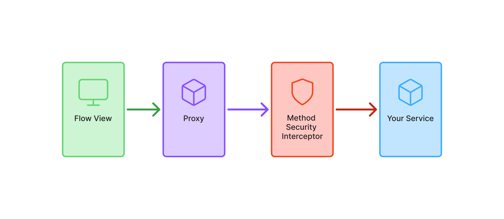

= Protect Services

A secure application relies on multiple layers of protection, including both views and application services. Even when your views are protected, you should also protect the application services. This is important if you have views that allow users with different roles to do different things. If you, for instance, forget to disable a button for users lacking a particular role, and don't protect your services, you have created a privilege escalation.

== Introducing Method Security

In Vaadin, services are standard Spring beans that are injected into views and used directly. Since services are accessed directly from views, they must be secured at the method level using *Spring method security*.

Spring Security protects services by creating a proxy that intercepts method calls. This ensures access control is enforced before execution, as shown in the following diagram:

In this guide, you'll only learn the minimum to get started with Spring method security in a Vaadin application. For more in-depth information, see the https://docs.spring.io/spring-security/reference/servlet/authorization/method-security.html[Spring Security Reference Manual].

== Enabling Method Security

To enable method security, add [annotationname]`@EnableMethodSecurity` to your security configuration class:

.`SecurityConfig.java`
[source,java]
----
@EnableWebSecurity
// tag::snippet[]
@EnableMethodSecurity
// end::snippet[]
@Configuration
class SecurityConfig {

    @Bean
    SecurityFilterChain securityFilterChain(HttpSecurity http) throws Exception {
        http.with(VaadinSecurityConfigurer.vaadin(), configurer -> {
            configurer.loginView(LoginView.class);
        });
        return http.build();
    }
    ...
}
----

.Test the method security
[CAUTION]
Without [annotationname]`@EnableMethodSecurity`, *all services remain unprotected* -- even if you annotate methods with security rules! Always verify that method security is enabled with automatic tests.  _A guide showing you how to do this in a Vaadin application is planned, but not yet written. In the meantime, refer to the https://docs.spring.io/spring-security/reference/servlet/test/method.html[Spring Reference Manual]._

== Securing the Services

Spring Security uses different annotations to secure your services. The most flexible ones, which are enabled by default, are [annotationname]`@PreAuthorize`, [annotationname]`@PostAuthorize`, [annotationname]`@PreFilter`, and [annotationname]`@PostFilter`. In this guide, you'll only learn how to use [annotationname]`@PreAuthorize`.

You can annotate both *service classes* and individual *service methods*. An annotation placed on the class applies to *all public methods* of the class. An annotation placed on a method *overrides any annotation on the class*.

[annotationname]`@PreAuthorize` takes as its single argument a Spring Expression Language (SpEL) expression that must evaluate to `true` to grant access. Although you can do some quite advanced things with SpEL, the most common methods you'll want to use are:

* `permitAll` allows *anyone* to call the method.
* `isAuthenticated` allows any *authenticated* user to call the method.
* `hasRole` / `hasAnyRole` allows users *having the roles* specified to call the method.
* `denyAll` prevents *anyone* from calling the method.

You use the SpEL methods like this:

[source,java]
----
@Service
// tag::snippet[]
@PreAuthorize("isAuthenticated()") // <1>
// end::snippet[]
public class ProtectedService {

    public MyData callableByAllUsers() { // <2>
    }

// tag::snippet[]
    @PreAuthorize("hasRole('" + Roles.ADMIN + "')") // <3>
// end::snippet[]
    public void callableByAdminsOnly(MyData data) {
    }
}
----
<1> Allows all authenticated users to call the service by default.
<2> Inherits its access permissions from the class-level annotation.
<3> Overrides the class-level annotation to allow access to administrators only. Note the single quotes `'` around the role name.
