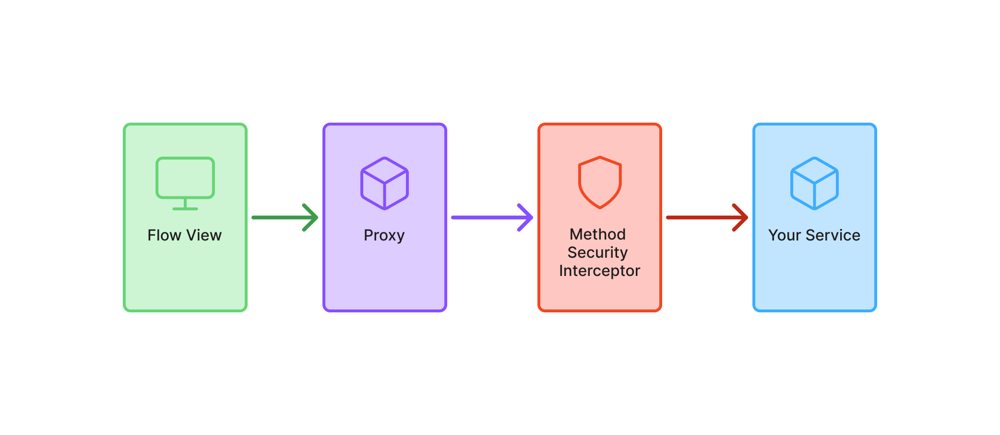

= Protect Flow Services
:toclevels: 2

Flow views are already <<../protect-views/flow#,well protected>>, but you should consider protecting the services as well. This is important if you have views that allow users with different roles to do different things. If you, for instance, forget to disable a button for users lacking a particular role, and don't protect your services, you have created a privilege escalation.

In this guide, you'll learn how to control access to services by using Spring method security. A hands-on mini-tutorial at the end will help you apply these concepts in a real Vaadin application.

== Introducing Method Security

In Vaadin Flow, services are standard Spring beans that are injected into views and used directly. Since services are accessed directly from views, they must be secured at the method level using *Spring method security*.

Spring Security protects services by creating a proxy that intercepts method calls. This ensures access control is enforced before execution, as shown in the following diagram:

In this guide, you'll only learn the minimum to get started with Spring method security in a Vaadin application. For more in-depth information, see the https://docs.spring.io/spring-security/reference/servlet/authorization/method-security.html[Spring Security Reference Manual].

== Enabling Method Security

To enable method security, add [annotationname]`@EnableMethodSecurity` to your security configuration class:

.`SecurityConfig.java`
[source,java]
----
@EnableWebSecurity
// tag::snippet[]
@EnableMethodSecurity
// end::snippet[]
@Configuration
class SecurityConfig {

    @Bean
    SecurityFilterChain securityFilterChain(HttpSecurity http) throws Exception {
        http.with(VaadinSecurityConfigurer.vaadin(), configurer -> {
            configurer.loginView(LoginView.class);
        });
        return http.build();
    }
    ...
}
----

.Test the method security
[CAUTION]
Without [annotationname]`@EnableMethodSecurity`, *all services remain unprotected* -- even if you annotate methods with security rules! Always verify that method security is enabled with automatic tests.  _A guide showing you how to do this in a Vaadin application is planned, but not yet written. In the meantime, refer to the https://docs.spring.io/spring-security/reference/servlet/test/method.html[Spring Reference Manual]._

== Securing the Services

Spring Security uses different annotations to secure your services. The most flexible ones, which are enabled by default, are [annotationname]`@PreAuthorize`, [annotationname]`@PostAuthorize`, [annotationname]`@PreFilter`, and [annotationname]`@PostFilter`. In this guide, you'll only learn how to use [annotationname]`@PreAuthorize`.

You can annotate both *service classes* and individual *service methods*. An annotation placed on the class applies to *all public methods* of the class. An annotation placed on a method *overrides any annotation on the class*.

[annotationname]`@PreAuthorize` takes as its single argument a Spring Expression Language (SpEL) expression that must evaluate to `true` to grant access. Although you can do some quite advanced things with SpEL, the most common methods you'll want to use are:

* `permitAll` allows *anyone* to call the method.
* `isAuthenticated` allows any *authenticated* user to call the method.
* `hasRole` / `hasAnyRole` allows users *having the roles* specified to call the method.
* `denyAll` prevents *anyone* from calling the method.

You use the SpEL methods like this:

[source,java]
----
@Service
// tag::snippet[]
@PreAuthorize("isAuthenticated()") // <1>
// end::snippet[]
public class ProtectedService {

    public MyData callableByAllUsers() { // <2>
    }

// tag::snippet[]
    @PreAuthorize("hasRole('" + Roles.ADMIN + "')") // <3>
// end::snippet[]
    public void callableByAdminsOnly(MyData data) {
    }
}
----
<1> Allows all authenticated users to call the service by default.
<2> Inherits its access permissions from the class-level annotation.
<3> Overrides the class-level annotation to allow access to administrators only. Note the single quotes `'` around the role name.

[.collapsible-list]
== Try It

In this mini-tutorial, you'll learn how to use Spring method security in a real Vaadin application. The tutorial uses the project from the <<../protect-views/flow#try-it,Protect Views>> guide. If you haven't completed that tutorial yet, do it now before proceeding.

.Enable Method Security
[%collapsible]
====
Add [annotationname]`@EnableMethodSecurity` to [classname]`SecurityConfig`:

.`SecurityConfig.java`
[source,java]
----
@EnableWebSecurity
// tag::snippet[]
@EnableMethodSecurity
// end::snippet[]
@Configuration
class SecurityConfig {
    ...
}
----
====

.Secure the Task Service
[%collapsible]
====
In an earlier tutorial, you made the task list read-only for users, allowing only admins to create tasks.

Open [classname]`TaskService` and add [annotationname]`@PreAuthorize` annotations like this:

.TaskService.java
[source,java]
----
@Service
// tag::snippet[]
@PreAuthorize("isAuthenticated()")
// end::snippet[]
public class TaskService {
    ...

// tag::snippet[]
    @PreAuthorize("hasRole('" + Roles.ADMIN + "')")
// end::snippet[]
    @Transactional
    public void createTask(String description, @Nullable LocalDate dueDate) {
        // ...
    }

    @Transactional(readOnly = true)
    public List<Task> list(Pageable pageable) {
        // ...
    }
}
----

Restart the application and open your browser at: http://localhost:8080

Log in as `ADMIN` and create some tasks. Everything should work as before.
====

.Break the Task List View
[%collapsible]
====
To see that the service is actually protected, you're going to break the task list. Open [classname]`TaskListView` and comment out the lines that check whether the user is an admin or not:

.TaskListView.java
[source,java]
----
@Route("")
@PageTitle("Task List")
@Menu(order = 0, icon = "vaadin:clipboard-check", title = "Task List")
@PermitAll
public class TaskListView extends Main {

    public TaskListView(TaskService taskService, Clock clock,
            AuthenticationContext authenticationContext) {

        // The rest of the constructor omitted

// tag::snippet[]
        //if (authenticationContext.hasRole(Roles.ADMIN)) {
// end::snippet[]
            add(new ViewToolbar("Task List",
                ViewToolbar.group(description, dueDate, createBtn)));
// tag::snippet[]
        //} else {
        //    add(new ViewToolbar("Task List"));
        //}
// end::snippet[]
        add(taskGrid);
    }
    ...
}
----
Then go back to the browser, logout, and login as `USER`. If you now try to create a task, you should get an error message.

Now change `TaskListView()` back again by removing the comments.
// TODO This should be replaced with an integration test that checks the security.
====

.Fix Integration Test
[%collapsible]
====
If you now try to run `TaskServiceTest` it fails. This is because the service is secured, but the test calls it without a valid security context. To fix this, first add the `spring-security-test` dependency to your `pom.xml`:

.pom.xml
[source,xml]
----
<dependency>
    <groupId>org.springframework.security</groupId>
    <artifactId>spring-security-test</artifactId>
    <scope>test</scope>
</dependency>
----

Next, add the `@WithMockUser` annotation to all test methods in `TaskServiceTest`:

.TaskServiceTest.java
[source,java]
----
// tag::snippet[]
import org.springframework.security.test.context.support.WithMockUser;
// end::snippet[]

@Import(TestcontainersConfiguration.class)
@SpringBootTest(webEnvironment = SpringBootTest.WebEnvironment.MOCK)
@Transactional
class TaskServiceTest {

    @Autowired
    TaskService taskService;

    @Test
// tag::snippet[]
    @WithMockUser(roles = Roles.ADMIN)
// end::snippet[]
    public void tasks_are_stored_in_the_database_with_the_current_timestamp() {
        // ...
    }

    @Test
// tag::snippet[]
    @WithMockUser(roles = Roles.ADMIN)
// end::snippet[]
    public void tasks_are_validated_before_they_are_stored() {
        // ...
    }
}
----

This instructs the test to call your service as a user with the `ADMIN` role. If you run it now, it passes.

====

.Final Thoughts
[%collapsible]
====
Your Vaadin application now has both secure views and secure services. However, it still uses *in-memory authentication*. You should replace it with a stronger storage mechanism.
// TODO Add link to our own guides once they have been written. Should cover UserDetailsService.

[NOTE]
A guide showing you how to do this in a Vaadin application is planned, but not yet written. In the meantime, refer to the https://docs.spring.io/spring-security/reference/servlet/authentication/passwords/storage.html[Spring Security Reference Manual].

====
