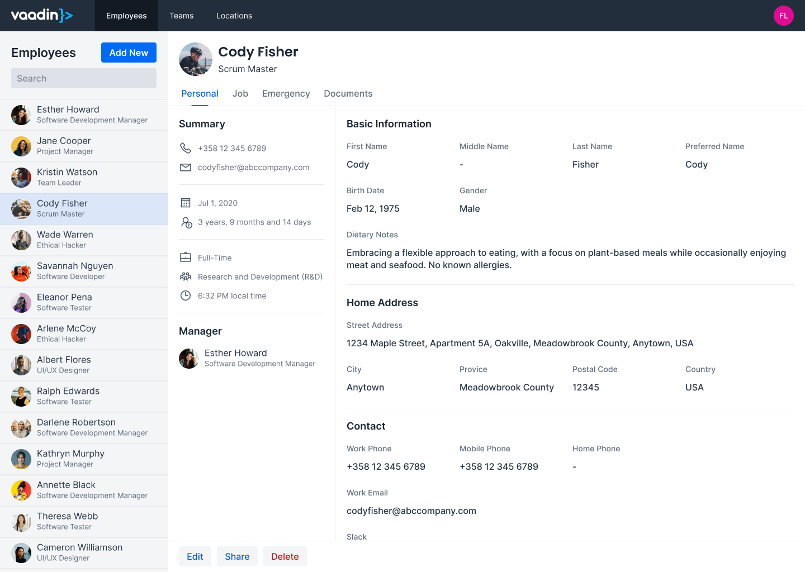
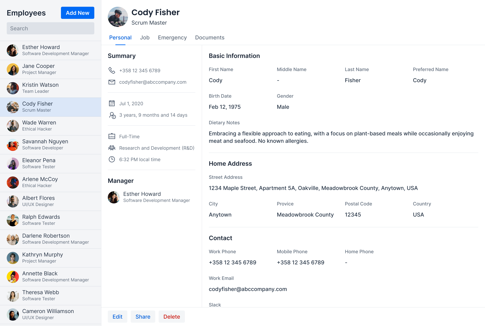
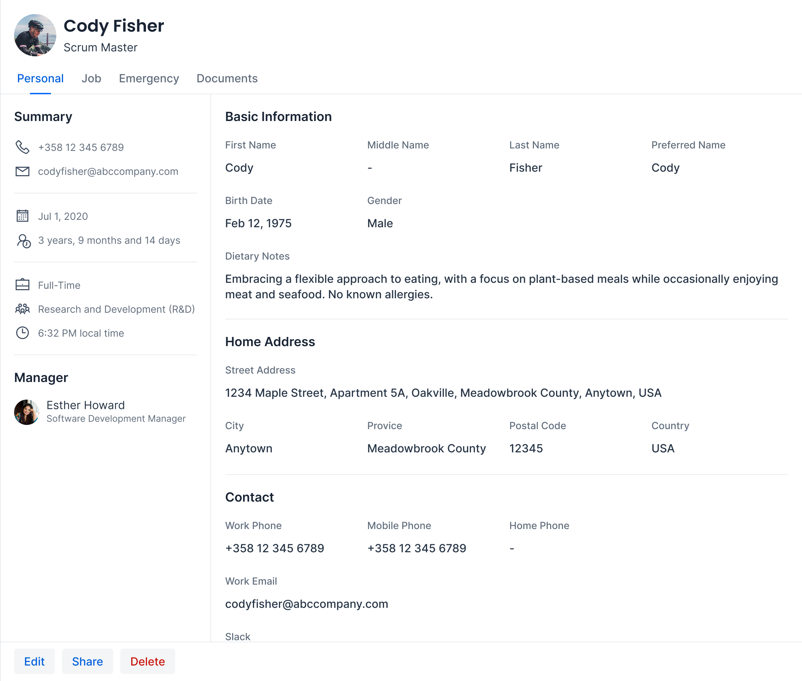
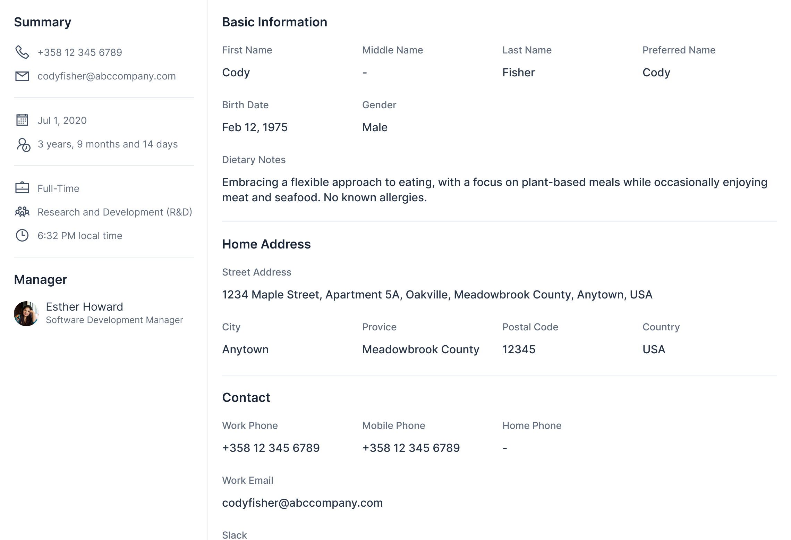

= Compose with Components
:toclevels: 2

This article teaches you how to decompose a user interface into a tree of components and how to connect those components so that data and actions flow through the tree. The focus is conceptual — you learn to _think in components_ rather than implement them in detail. For implementation specifics, see the <</flow/component-internals#,Component Internals Reference>>.
// TODO Replace with link to upcoming how-to guides on implementing components.

== What Is a Component?

Vaadin UIs are built from components. Think of them as building blocks: individually simple, but capable of forming complex interfaces when combined. Each component is a server-side Java object paired with a client-side HTML element.

The most basic components correspond to plain HTML elements — `Div`, `Span`, `H1`, and `Paragraph` (see <<write-html#,Write HTML>>). On top of these, Vaadin provides <<layouts#,layout components>> for arranging UIs in rows, columns, and grids, plus a rich set of ready-made components for common needs like buttons, text fields, grids, and dialogs. See the <</components#,Components documentation>> for details.

You also create your own components. Some are one-off parts of a specific view. Others are reusable across the application. Both kinds follow the same principles covered in this article.

== Views

A _view_ is a component that forms a logical whole of the user interface. A page shows one view at a time, and the view typically occupies most of the page. See the <<../views/add-view#,Add a View>> guide to learn how to create one.

Views are entry points, not reusable building blocks. You don't extend or embed a view inside another view. For simple screens, you can build everything directly inside the view class. For complex screens, delegate to smaller components — the next section shows how.

== Decomposing a View

The key skill in component-based UI development is looking at a design and identifying which parts should become separate components. The goal is to break a large, complex view into smaller, manageable pieces.

The following example walks through a page from an HR application, splitting it step by step into a tree of components.

=== The Full Page

Here is the full page as the user sees it:

[.device]

Three regions stand out: a navigation bar across the top, a list on the left, and a detail panel on the right. But not all of these belong to the view.

=== Router Layout vs. View

The navigation bar is shared across every view in the application. It belongs to the <<../views/add-router-layout#,router layout>>, not the view itself:

[.fill]

What the view actually renders is the content area below:

[.fill]

You can express this in code as a view with two child components:

[source,java]
----
@Route("employees")
public class EmployeesView extends Div {
    private final EmployeeMaster master = new EmployeeMaster();
    private final EmployeeDetail detail = new EmployeeDetail();

    public EmployeesView() {
        add(master, detail);
    }
}
----

=== Splitting the View

The master and detail panels have distinct responsibilities, so each becomes its own class.

The master panel shows a searchable list of employees:

[.fill]

The detail panel shows everything about the selected employee:

[.fill]

The detail panel is large enough to warrant further splitting. It has a clear header, content area, and footer:

[source,java]
----
public class EmployeeDetail extends Div {
    private final DetailHeader header = new DetailHeader();
    private final DetailContent content = new DetailContent();
    private final DetailFooter footer = new DetailFooter();

    public EmployeeDetail() {
        add(header, content, footer);
    }
}
----

=== Breaking Down the Detail Panel

Each part of the detail panel becomes its own class. The header shows the employee's name, photo, and navigation tabs:

[.fill]

The content area displays contact information and other details:

[.fill]

The footer contains action buttons:

[.fill]

These components are not reusable — they exist only inside `EmployeeDetail`. Separating them into classes keeps each one focused and easier to maintain.

=== Identifying Reusable Components

Looking at the full page again, two patterns repeat across different areas.

The first is a person card. It appears in the master list, the detail header, and the detail content area (for the manager):

[.fill]

The second is an icon item, used in the summary section of the detail content:

[.fill]

Reusable components accept data through their constructor or setters. They know nothing about employees — they work with generic inputs like names, titles, and icons:

[source,java]
----
public class PersonCard extends Div {
    public PersonCard(String name, String title, String avatarUrl) {
        // Build the card layout from name, title, and avatar
    }
}
----

[source,java]
----
public class IconItem extends Div {
    public IconItem(VaadinIcon icon, String label) {
        // Build the item layout from icon and label
    }
}
----

=== The Component Tree

After the decomposition exercise, these are the components that make up the page:

----
MainLayout (router layout)
└── EmployeesView
    ├── EmployeeMaster
    │   └── PersonCard (reusable)
    └── EmployeeDetail
        ├── DetailHeader
        │   └── PersonCard (reusable)
        ├── DetailContent
        │   ├── PersonCard (reusable, for manager)
        │   └── IconItem (reusable, for summary items)
        └── DetailFooter
----

Each line is a Java class you create. Reusable components appear at multiple levels of the tree. One-off components like `DetailHeader` and `DetailFooter` exist to keep each class focused.

These custom components also contain built-in Vaadin components internally. For example, `EmployeeMaster` uses a `Grid` to display the list, `DetailHeader` uses `Tabs` for navigation, and `DetailFooter` uses `Button` components for its actions. Built-in components don't need to appear in the tree — they are implementation details inside each class.

This tree is not exhaustive, either. Implementing the view is likely to reveal further components. For instance, `EmployeeDetail` has multiple tabs, and each tab's content would become at least its own component. Decomposition is an ongoing process, not a one-time exercise.

[TIP]
You don't need to identify every component upfront. Start with the view and its immediate children. Split further when a component grows too large or when you spot repeated patterns.

== Component Communication

Components in a tree need to communicate. Data flows in two directions: the view pushes data _down_ to its children, and children push user actions _up_ to the view. The view maintains state and calls application <<../business-logic/add-service#,services>>. Child components stay simple and business-logic-agnostic.

=== Passing Data to Components

Parent components pass data down to their children. Vaadin offers two mechanisms for this.

==== Setters

Setters are the most straightforward approach. The parent calls a setter on the child whenever data changes:

[source,java]
----
public class EmployeeDetail extends Div {
    private final DetailHeader header = new DetailHeader();
    private final DetailContent content = new DetailContent();

    public void setEmployee(Employee employee) { // <1>
        header.setEmployee(employee);
        content.setEmployee(employee);
    }
}
----
<1> The view calls this method when the user selects an employee.

In the view, call the setter in response to a user action:

[source,java]
----
public class EmployeesView extends Div {
    private final EmployeeMaster master = new EmployeeMaster();
    private final EmployeeDetail detail = new EmployeeDetail();

    public EmployeesView() {
        add(master, detail);

        master.addEmployeeSelectedListener(event -> {
            detail.setEmployee(event.getEmployee());
        });
    }
}
----

Setters are explicit, easy to follow, and work well when updates are triggered by specific events.

==== Signals

Signals are a reactive alternative. Instead of calling setters explicitly, you define a signal and bind components to it. When the signal value changes, all bound components update automatically:

[source,java]
----
public class EmployeesView extends Div {
    private final ValueSignal<String> employeeName = new ValueSignal<>("");

    public EmployeesView() {
        // ...
        Span nameLabel = new Span();
        nameLabel.bindText(employeeName); // <1>
    }
}
----
<1> The label updates automatically whenever `employeeName` changes.

Signals are useful when multiple components depend on the same piece of state. See <</flow/ui-state#,Signals>> for details.

=== Reacting to User Actions

Child components inform their parent about user interactions. Vaadin offers two mechanisms for this.

==== Events

Events are the standard Vaadin pattern. You define an event class, add a listener method to the component, and fire the event when something happens:

[source,java]
----
public class EmployeeMaster extends Div {

    public static class EmployeeSelectedEvent
            extends ComponentEvent<EmployeeMaster> {
        private final Employee employee;

        public EmployeeSelectedEvent(EmployeeMaster source,
                Employee employee) {
            super(source, false);
            this.employee = employee;
        }

        public Employee getEmployee() {
            return employee;
        }
    }

    public Registration addEmployeeSelectedListener(
            ComponentEventListener<EmployeeSelectedEvent> listener) {
        return addListener(EmployeeSelectedEvent.class, listener);
    }
}
----

Events are type-safe, provide a `Registration` handle for removing the listener, and are the right choice for reusable components. See <</flow/component-internals/events#,Events>> for details.

==== Callbacks

Callbacks are a simpler alternative. The component accepts a functional interface — typically `Runnable` or `Consumer<T>` — and calls it when the user interacts:

[source,java]
----
public class DetailFooter extends Div {
    public DetailFooter(Runnable onEdit, Runnable onDelete) {
        Button editButton = new Button("Edit", event -> onEdit.run());
        Button deleteButton = new Button("Delete", event -> onDelete.run());
        add(editButton, deleteButton);
    }
}
----

The view provides the implementations:

[source,java]
----
DetailFooter footer = new DetailFooter(
    () -> openEditor(currentEmployee),
    () -> deleteEmployee(currentEmployee)
);
----

Callbacks are lightweight — no event class needed. Use `Runnable` for no-argument actions and `Consumer<T>` when passing data. They work well for one-off components where defining a full event class would be overkill.

=== Choosing a Pattern

* *Setters*: Simplest way to push data down. Use by default.
* *Signals*: Reduce boilerplate when multiple components share the same state.
* *Events*: Standard Vaadin pattern for child-to-parent communication. Use for reusable components.
* *Callbacks*: Lighter than events. Use for one-off components.

[TIP]
You can mix patterns in the same view. For example, use signals for shared state, setters for one-off updates, events for a reusable component, and callbacks for simple action buttons.
