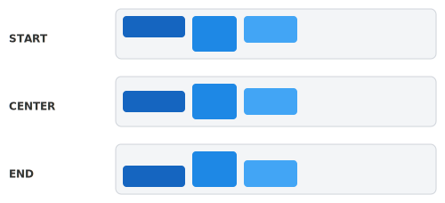
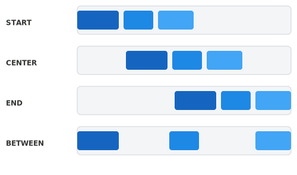

= Arrange with Layouts
:toclevels: 2

Vaadin provides layout components that arrange child components in rows, columns, and responsive grids. You build page structure by nesting these layouts and adding components to them. This article covers the three built-in layouts: `HorizontalLayout`, `VerticalLayout`, and `FormLayout`. For the full API details, see the <</components/horizontal-layout#,Horizontal Layout>>, <</components/vertical-layout#,Vertical Layout>>, and <</components/form-layout#,Form Layout>> reference documentation.

== Copy-Paste into Your Project

A self-contained view that demonstrates common layout patterns:

[source,java]
----
import com.vaadin.flow.component.button.Button;
import com.vaadin.flow.component.button.ButtonVariant;
import com.vaadin.flow.component.html.H2;
import com.vaadin.flow.component.html.Paragraph;
import com.vaadin.flow.component.html.Span;
import com.vaadin.flow.component.orderedlayout.FlexComponent;
import com.vaadin.flow.component.orderedlayout.HorizontalLayout;
import com.vaadin.flow.component.orderedlayout.VerticalLayout;
import com.vaadin.flow.router.Route;

@Route("layout-example")
public class LayoutExampleView extends VerticalLayout {

    public LayoutExampleView() {
        // Header bar: title pushed to the left, button to the right
        H2 title = new H2("Dashboard");
        Button settings = new Button("Settings");
        HorizontalLayout header = new HorizontalLayout(title, settings);
        header.setWidthFull();
        header.setAlignItems(FlexComponent.Alignment.CENTER);
        header.expand(title);

        // Content area: sidebar and main panel side by side
        VerticalLayout sidebar = new VerticalLayout(
                new Span("Menu Item 1"),
                new Span("Menu Item 2"),
                new Span("Menu Item 3"));
        sidebar.setWidth("200px");
        sidebar.setPadding(true);

        VerticalLayout main = new VerticalLayout(
                new Paragraph("Main content goes here."));
        main.setPadding(true);

        HorizontalLayout content = new HorizontalLayout(sidebar, main);
        content.setWidthFull();
        content.expand(main);

        // Footer bar: buttons aligned to the right
        Button cancel = new Button("Cancel");
        Button save = new Button("Save");
        save.addThemeVariants(ButtonVariant.LUMO_PRIMARY);
        HorizontalLayout footer = new HorizontalLayout(cancel, save);
        footer.setJustifyContentMode(
                FlexComponent.JustifyContentMode.END);
        footer.setWidthFull();

        add(header, content, footer);
        expand(content);
        setSizeFull();
    }
}
----

== Horizontal Layout

`HorizontalLayout` places components side by side in a row. It has spacing between items enabled by default:

[source,java]
----
HorizontalLayout row = new HorizontalLayout();
row.add(new Button("First"), new Button("Second"), new Button("Third"));
----

You can also pass components directly to the constructor:

[source,java]
----
HorizontalLayout row = new HorizontalLayout(
        new Button("First"),
        new Button("Second"),
        new Button("Third"));
----

By default, a `HorizontalLayout` sizes itself to fit its content. To make it fill the available width, call `setWidthFull()`.

== Vertical Layout

`VerticalLayout` stacks components from top to bottom. It also has spacing enabled by default:

[source,java]
----
VerticalLayout column = new VerticalLayout(
        new H2("Title"),
        new Paragraph("Description text"),
        new Button("Action"));
----

By default, a `VerticalLayout` takes up the full available width but only as much height as its content needs. To make it fill the full height as well, call `setSizeFull()`.

[TIP]
`VerticalLayout` is the most common base class for views, since most pages are arranged as a vertical stack of sections.

== Spacing, Padding, and Margin

Both `HorizontalLayout` and `VerticalLayout` support three spacing properties:

- *Spacing* — the gap between child components. Enabled by default.
- *Padding* — space inside the layout, between its border and its children.
- *Margin* — space outside the layout, between the layout and its surroundings.

[source,java]
----
VerticalLayout layout = new VerticalLayout();
layout.setSpacing(true);   // gap between children (default: true)
layout.setPadding(true);   // inner space
layout.setMargin(false);   // outer space (default: false)
----

You can set a custom spacing value instead of using the default:

[source,java]
----
layout.setSpacing(24, Unit.PIXELS);
----

== Alignment

Use `setAlignItems()` to align children along the cross axis — vertically in a `HorizontalLayout`, horizontally in a `VerticalLayout`:

[source,java]
----
HorizontalLayout header = new HorizontalLayout(icon, title, badge);
header.setAlignItems(FlexComponent.Alignment.CENTER); // <1>
----
<1> Centers items vertically in the row.

Common alignment values:

- `START` — align to the start (top or left)
- `CENTER` — center items
- `END` — align to the end (bottom or right)
- `STRETCH` — stretch items to fill the cross axis (default for `HorizontalLayout`)
- `BASELINE` — align along the text baseline (useful for mixing text and components of different sizes)

The following diagram shows how `setAlignItems()` positions items of different heights vertically within a `HorizontalLayout`:

To override alignment for a single child, use `setAlignSelf()`:

[source,java]
----
layout.setAlignSelf(FlexComponent.Alignment.END, closeButton);
----

Use `setJustifyContentMode()` to distribute children along the main axis — horizontally in a `HorizontalLayout`, vertically in a `VerticalLayout`:

[source,java]
----
HorizontalLayout footer = new HorizontalLayout(cancel, save);
footer.setWidthFull();
footer.setJustifyContentMode(
        FlexComponent.JustifyContentMode.END); // <1>
----
<1> Pushes buttons to the right end of the row.

Common justification values:

- `START` — pack items at the start (default)
- `CENTER` — center items
- `END` — pack items at the end
- `BETWEEN` — distribute space evenly between items, no space at the edges

The following diagram shows how `setJustifyContentMode()` distributes items horizontally within a `HorizontalLayout`:

== Expanding Components

Use `expand()` or `setFlexGrow()` to make a component grow to fill the remaining space in a layout:

[source,java]
----
TextField search = new TextField();
search.setPlaceholder("Search...");
Button go = new Button("Go");

HorizontalLayout bar = new HorizontalLayout(search, go);
bar.setWidthFull();
bar.expand(search); // <1>
----
<1> The search field expands to fill all available width. The button keeps its natural size.

`expand(component)` is shorthand for `setFlexGrow(1, component)`. When multiple components have flex-grow values, space is distributed proportionally:

[source,java]
----
layout.setFlexGrow(2, mainPanel);   // gets 2/3 of the space
layout.setFlexGrow(1, sidePanel);   // gets 1/3 of the space
----

[TIP]
Prefer `expand()` over setting a component's width to `100%`. Expanding distributes space correctly when multiple components share a layout, while percentage widths can cause overflow.

== Sizing

Set explicit sizes on layouts and components with `setWidth()`, `setHeight()`, and their shorthand methods:

[source,java]
----
sidebar.setWidth("250px");
sidebar.setHeightFull();       // 100% height

main.setSizeFull();            // 100% width and height
----

The most common sizing methods:

- `setWidthFull()` — set width to 100%
- `setHeightFull()` — set height to 100%
- `setSizeFull()` — set both width and height to 100%
- `setWidth(String)` / `setHeight(String)` — set a specific size, for example, `"200px"`, `"50%"`, or `"auto"`
- `setMinWidth(String)` / `setMinHeight(String)` — set a minimum size
- `setMaxWidth(String)` / `setMaxHeight(String)` — set a maximum size

== Form Layout

`FormLayout` arranges input fields in a responsive column grid. It automatically adjusts the number of columns based on the available width:

[source,java]
----
TextField firstName = new TextField("First name");
TextField lastName = new TextField("Last name");
TextField email = new TextField("Email");
TextField phone = new TextField("Phone");

FormLayout form = new FormLayout();
form.add(firstName, lastName, email, phone);
----

By default, fields are laid out in one column on narrow screens and two columns on wider screens.

=== Configuring Columns

Use responsive steps to define how many columns appear at different widths:

[source,java]
----
FormLayout form = new FormLayout();
form.setResponsiveSteps(
        new FormLayout.ResponsiveStep("0", 1),      // 1 column by default
        new FormLayout.ResponsiveStep("500px", 2),   // 2 columns at 500px
        new FormLayout.ResponsiveStep("800px", 3));   // 3 columns at 800px
----

=== Column Spanning

Make a field span multiple columns with `setColspan()`:

[source,java]
----
TextArea description = new TextArea("Description");
form.add(firstName, lastName, email, phone, description);
form.setColspan(description, 2);
----

For the full API including auto-responsive mode and side-labels, see the <</components/form-layout#,Form Layout>> reference.

== Choosing a Layout

- *`VerticalLayout`* — default choice for stacking sections top to bottom. Use as the base for most views.
- *`HorizontalLayout`* — place items side by side, such as button bars, toolbars, or header rows.
- *`FormLayout`* — arrange input fields in a responsive column grid. Use for forms.
- *Nesting* — combine layouts by nesting them. A `VerticalLayout` with `HorizontalLayout` rows is the most common pattern.

For raw HTML structure beyond what the layout components provide — headings, paragraphs, lists, and semantic elements — see <<write-html#,Write HTML>>.
