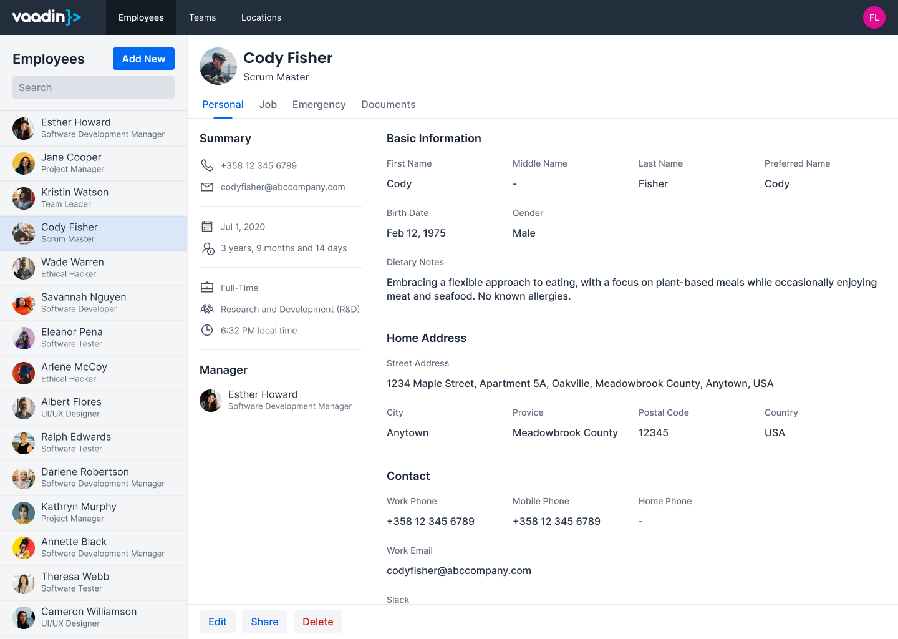
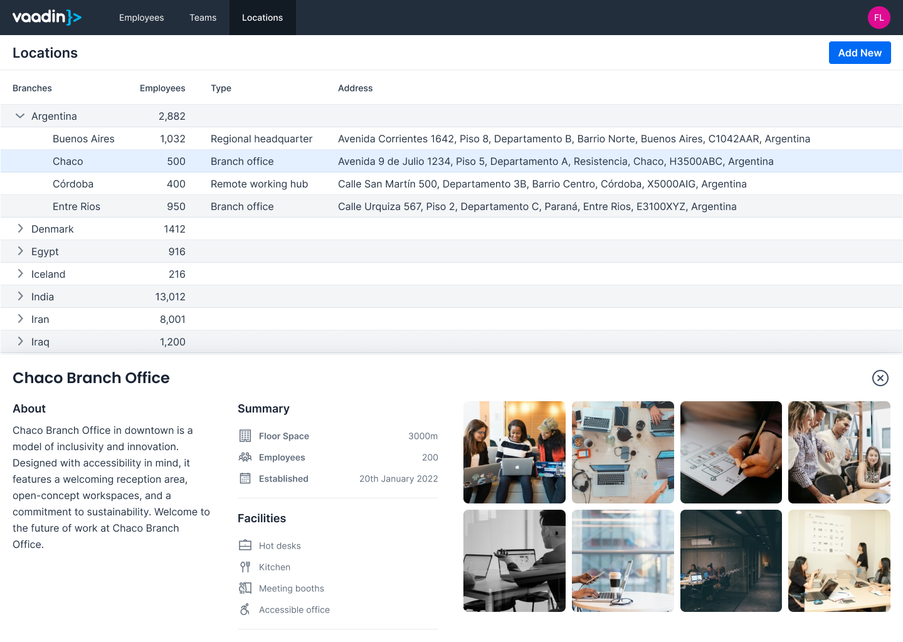

= Add a Master-Detail View
:toclevels: 2

This guide teaches you how to build a rudimentary master-detail view in Vaadin. It focuses on the UI pattern only: how to structure the layout, represent selection in the URL, and synchronize the two. It does not define data models, persistence, or form/grid configuration. 

== Copy-Paste into Your Project

If you want to quickly try out a master-detail view, you can copy-paste the following class into your Vaadin project:

[source,java]
----
include::{root}/src/main/java/com/vaadin/demo/buildingapps/masterdetail/MasterDetailView.java[tags=full,indent=0]]
----

For more detailed instructions on how to build a master-detail view from scratch, continue reading below. The guide uses the same code as in the copy-paste example, but breaks it down into smaller parts with explanations.

== What is a Master-Detail View?

In a master-detail view, the user selects an item from a list (the master), and the details of the selected item are shown in another area (the detail). When no item is selected, the detail area is either hidden or shows a placeholder message. 

In the following mock-up, the master is a list of employees, and the detail shows information about the selected employee to the right of the list:

[.device]

Master-detail views can look different depending on the application. In the following mock-up, the master is a list of offices, and the detail shows information about the selected office below the list:

[.device]

The example code in this guide does not look like the mock-ups above. It uses simple components and focuses only on the UI pattern. Substitute your own components where indicated.

== Scaffolding the View

When creating a master-detail view, start with the general structure. You'll need:

* a layout to arrange the master and detail components side by side,
* a master component (e.g., a <</components/grid#,Grid>>),
* a detail component (e.g., a form),
* a placeholder component to show when no detail is selected, and
* a way to represent the selected item's ID in the URL. 

Because the selected item's ID appears in the URL, the view can always reconstruct the correct UI state after navigation, a refresh, or a shared link.

The following listing shows the minimal structure of a master-detail view, using the same class as in the full example but with the implementation omitted for clarity. It uses a <</components/split-layout#,Split Layout>> to arrange the master and detail components side by side, and a
<<pass-data/route-parameters#,route parameter>> to represent the selected item's ID:

[source,java]
----
include::{root}/src/main/java/com/vaadin/demo/buildingapps/masterdetail/MasterDetailView.java[tags=scaffolding,indent=0]
----

With the class structure in place, the next step is to implement the master, detail, and placeholder components that the layout will display.

[NOTE]
You can use any layout you like to arrange the master and detail components in your application. Split Layout is not the only option, but it works well for this simple example.

== Creating the Master Component

To keep this example simple, the master component is a list of buttons. The buttons represent user selections; each button simulates selecting a different item by navigating to a URL containing its ID:

[source,java]
----
include::{root}/src/main/java/com/vaadin/demo/buildingapps/masterdetail/MasterDetailView.java[tags=master,indent=0]
----

In a real application, the master component would be a Grid with data loaded from a database. Adding such a Grid is covered in the <<../forms-data/add-grid#,Add a Grid>> guide.

=== Implementing Navigation Methods

The master uses <<navigate#your-own-api,navigation utility methods>> for showing the master and detail views. These methods either set or clear the URL parameter, resulting in the `setParameter()` method being called with the appropriate value:

[source,java]
----
include::{root}/src/main/java/com/vaadin/demo/buildingapps/masterdetail/MasterDetailView.java[tags=navigation,indent=0]
----

The implementation of `setParameter()` is covered later in this guide.

== Creating the Detail Component

The detail component in this example is even simpler: it shows the selected ID in a paragraph:

[source,java]
----
include::{root}/src/main/java/com/vaadin/demo/buildingapps/masterdetail/MasterDetailView.java[tags=detail,indent=0]
----

In a real application, the detail component would be a form. How to build such a form is covered in the <<../forms-data/add-form#,Add a Form>> guide.

== Creating the Placeholder

When no detail is selected, it's good practice to show a placeholder message. Here's a simple implementation that shows a message in a paragraph:

[source,java]
----
include::{root}/src/main/java/com/vaadin/demo/buildingapps/masterdetail/MasterDetailView.java[tags=nodetail,indent=0]
----

This is helpful when a user opens the list view without selecting anything.

== Implementing View Logic

With the components in place, the next step is to implement the view logic that ties everything together. Since the master is always visible, add it to the primary area of the Split Layout in the constructor:

[source,java]
----
include::{root}/src/main/java/com/vaadin/demo/buildingapps/masterdetail/MasterDetailView.java[tags=constructor,indent=0]
----

The secondary area of the Split Layout should be updated based on the user's selection:

* If the user has selected an item, show the detail component. 
* If no item is selected, show the placeholder component. 

Because you're using a route parameter to represent the selected item's ID, implement this logic in the `setParameter()` method - remove the old detail area, check whether the ID is present, then show either the detail or the placeholder accordingly:

[source,java]
----
include::{root}/src/main/java/com/vaadin/demo/buildingapps/masterdetail/MasterDetailView.java[tags=setparameter,indent=0]
----

In this simple example, the selection is not visible in the master component. In a real application, you'd want to reflect the selection state in the master component as well. 

For example, if you're using a Grid, you could select the corresponding row when an item is selected, and clear the selection when no item is selected. All this logic would also go into the `setParameter()` method.

With these methods in place, the master-detail view is complete. The next step is to integrate it into your application and enhance it with real data and more complex UI components as needed.
