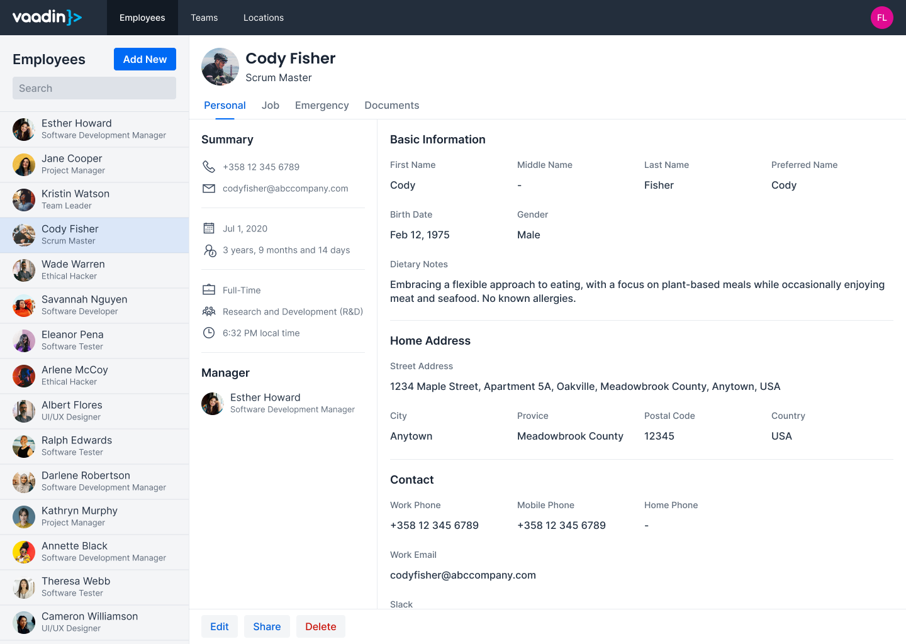
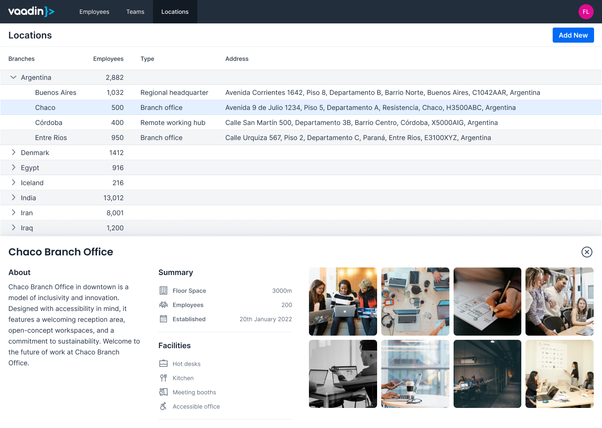

= Add a Master-Detail View
:toclevels: 2

This guide teaches you how to build a rudimentary master-detail view in Vaadin. It uses the <</components/master-detail-layout#,Master-Detail Layout>> component to arrange the two areas and to handle responsive behavior, and a <</flow/ui-state#,signal>> to hold the selection so the detail updates reactively. It focuses on the UI pattern only: it does not define data models, persistence, or form/grid configuration.

== Copy-Paste into Your Project

If you want to quickly try out a master-detail view, you can copy-paste the following class into your Vaadin project:

[source,java]
----
include::{root}/src/main/java/com/vaadin/demo/buildingapps/masterdetail/MasterDetailView.java[tags=full,indent=0]
----

For more detailed instructions on how to build a master-detail view from scratch, continue reading below. The guide uses the same code as in the copy-paste example, but breaks it down into smaller parts with explanations.

== What is a Master-Detail View?

In a master-detail view, the user selects an item from a list (the master), and the details of the selected item are shown in another area (the detail). When no item is selected, the detail area is either hidden or shows a placeholder message.

In the following mock-up, the master is a list of employees, and the detail shows information about the selected employee to the right of the list:

[.device]

Master-detail views can look different depending on the application. In the following mock-up, the master is a list of offices, and the detail shows information about the selected office below the list:

[.device]

The example code in this guide does not look like the mock-ups above. It uses simple components and focuses only on the UI pattern. Substitute your own components where indicated.

== Extending Master-Detail Layout

The <</components/master-detail-layout#,Master-Detail Layout>> component arranges the master and detail areas, and switches the detail to an overlay when there isn't enough room to show both side by side. Because it handles this responsive behavior for you, you don't need to manage a separate layout or decide when to hide the detail.

The view extends `MasterDetailLayout` directly, so the view _is_ the layout:

[source,java]
----
@Route("building-apps/master-detail")
public class MasterDetailView extends MasterDetailLayout {

    MasterDetailView() {
        setSizeFull();
        // ...
    }
}
----

With the layout in place, the next step is to create the master component, hold the selection, and show the detail.

== Creating the Master Component

To keep this example simple, the master component is a list of buttons. Each button represents a user selection; clicking one stores that item's ID in the selection signal, and the "Master only" button clears it:

[source,java]
----
include::{root}/src/main/java/com/vaadin/demo/buildingapps/masterdetail/MasterDetailView.java[tags=master,indent=0]
----

In a real application, the master component would be a Grid with data loaded from a database. Selecting a row would set the selection, and the Grid would also reflect the current selection. Adding such a Grid is covered in the <<../forms-data/add-grid#,Add a Grid>> guide.

== Holding the Selection in a Signal

Rather than tracking the selection with a mutable field and manually updating the detail whenever it changes, store it in a <</flow/ui-state#,signal>>. The signal is the single source of truth for what's selected; everything that depends on the selection - the detail, the placeholder, and, in a real application, the highlighted row in the master - derives from it.

Here, the selection is the selected item's ID. A `null` value means nothing is selected:

[source,java]
----
include::{root}/src/main/java/com/vaadin/demo/buildingapps/masterdetail/MasterDetailView.java[tags=signal,indent=0]
----

In a real application, you might store the selected item itself instead of its ID.

== Showing the Detail Reactively

With the selection in a signal, the detail area follows automatically. Set the master, provide a placeholder for the empty state, and use a <</flow/ui-state/effects-computed#,signal effect>> to keep the detail in sync with the selection:

[source,java]
----
include::{root}/src/main/java/com/vaadin/demo/buildingapps/masterdetail/MasterDetailView.java[tags=viewlogic,indent=0]
----

Here's how the pieces fit together:

- [methodname]`setDetailPlaceholder()` sets the component to show when no detail is set. The layout displays it whenever the detail area is empty, and hides it once a detail is set.
- The [methodname]`Signal.effect()` runs once immediately and then again every time `selectedId` changes. When an ID is selected, it populates the detail and calls [methodname]`setDetail()`; when the selection is cleared, [methodname]`setDetail(null)` empties the detail area, and the placeholder is shown again.
- In a real application, the detail component would be a form. How to build one is covered in the <<../forms-data/add-form#,Add a Form>> guide.

The [methodname]`addBackdropClickListener()` and [methodname]`addDetailEscapePressListener()` calls clear the selection when the user dismisses the detail. These events fire when the detail is shown as an overlay - that is, when the layout is too narrow to show both areas side by side. Because the detail is derived from `selectedId`, clearing the signal is all that's needed to close it.

== Representing Selection in the URL

The signal keeps the selection in memory, which is enough for many views. It isn't preserved across a page reload, though, and it can't be shared as a link. If you need the selected item to be bookmarkable or to survive a refresh, represent it in the URL.

To do this, keep the selection signal as the source of truth and synchronize it with a <<pass-data/route-parameters#,route parameter>> or <<pass-data/query-parameters#,query parameter>>: initialize the signal from the URL when the view is entered, and navigate to a new URL when the signal changes. The detail area still follows the signal reactively; only the source that drives the signal changes.

[NOTE]
The current route and query parameters are available as a read-only signal through [methodname]`UI.getCurrentOrThrow().routerStateSignal()`, so the URL can drive the selection reactively; you write changes back by navigating. The <<pass-data/route-parameters#,Route Parameters>>, <<pass-data/route-templates#,Route Templates>>, and <<pass-data/query-parameters#,Query Parameters>> guides show the patterns for each.

With the master, the selection signal, and the reactive detail in place, the master-detail view is complete. The next step is to integrate it into your application and enhance it with real data and more complex UI components as needed.
