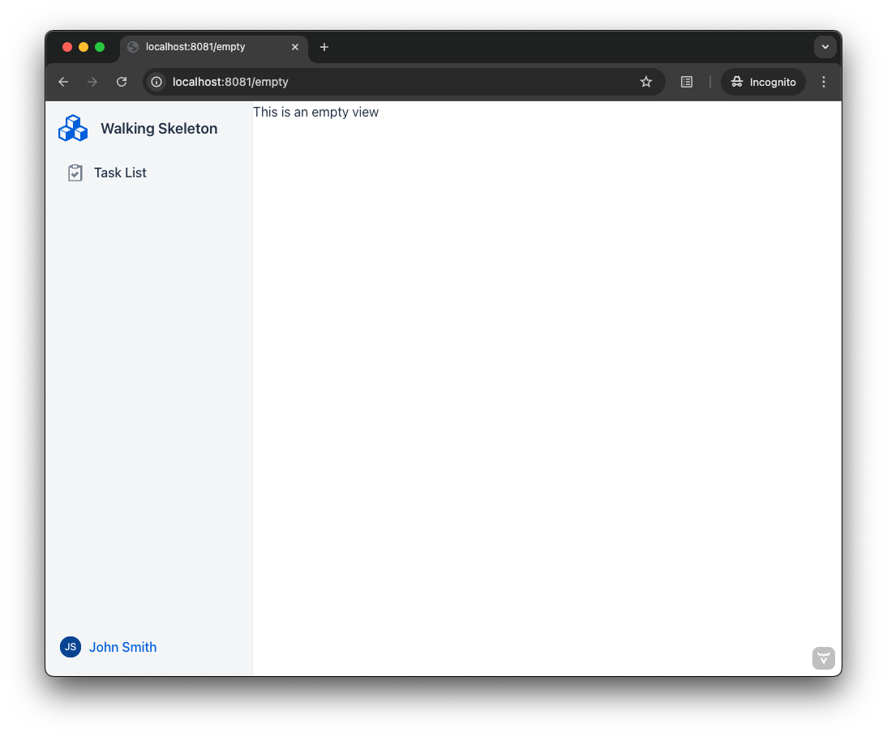

= Add a Router Layout
:toclevels: 2

This guide teaches you how to create a router layout in Vaadin, apply it to views automatically and explicitly, and use route prefixes for structured navigation.

== Copy-Paste into Your Project

If you want to quickly try out a router layout, you can copy-paste the following two classes into your Vaadin project:

[source,java]
----
include::{root}/src/main/java/com/vaadin/demo/buildingapps/routerlayout/MainLayout.java[tags=snippet,indent=0]
----
[source,java]
----
include::{root}/src/main/java/com/vaadin/demo/buildingapps/routerlayout/HomeView.java[tags=snippet,indent=0]
----

For more detailed instructions on how to use router layouts, continue reading below.

== What is a Router Layout?

Most business applications have interface elements that remain visible across different views, such as a navigation menu, header, or footer. Instead of duplicating these elements on every view, you can use a _router layout_.

A router layout ensures that the router *renders views inside a predefined layout*, reducing redundancy. The screenshot below illustrates an empty view rendered within a router layout. The layout includes a sidebar with the application name, a navigation menu, and a user menu. Views are displayed in the white area on the right:

== Creating a Router Layout

Router layouts are UI components that implement the [interfacename]`RouterLayout` interface, which provides two key methods:

* [methodname]`showRouterLayoutContent(HasElement)` -- shows the given view in the router layout.
* [methodname]`removeRouterLayoutContent(HasElement)` -- removes the given view in the router layout.

When you navigate to a view, the router first determines which layout to use -- if any. If you're navigating from one view to another inside the same router layout, the *existing router layout instance is reused*. Otherwise, a new instance is created. The router then calls [methodname]`showRouterLayoutContent()`, passing in the new view instance.

[TIP]
The router layout becomes the parent of the view in the component hierarchy. You can use `Component.getParent()` method to access the layout from the view after the view has been added to the layout.

== Automatic Layouts

To create an automatic layout, add the [annotationname]`@Layout` annotation to a router layout. This layout is automatically applied to all views unless explicitly disabled.

The following example applies [classname]`MainLayout` to *all views*:

[source,java]
----
// tag::snippet[]
@Layout
// end::snippet[]
public class MainLayout extends AppLayout { // <1>
    ...
}
----
<1> `AppLayout` is a built-in router layout. See its <<{articles}/components/app-layout#,documentation page>> for more details.

=== Opting Out

Sometimes, you may want to exclude specific views from the automatic layout. For example, displaying a login view within an application layout might not be appropriate.

To *prevent a view from using the automatic layout*, set the `autoLayout` attribute of the [annotationname]`@Route` annotation to `false`:

[source,java]
----
@Route(value = "login", autoLayout = false)
public class LoginView extends Main {
    ...
}
----

[NOTE]
[annotationname]`@RouteAlias` also has the `autoLayout` attribute. You can disable or enable the automatic layout for a single view depending on the route used to access it.

=== Scoping to a Path

You can restrict an automatic layout to views with routes that start with a specific path.

The following example applies [classname]`AdminLayout` *only to views with routes starting with `/admin`*:

[source,java]
----
// tag::snippet[]
@Layout("/admin")
// end::snippet[]
public class AdminLayout extends AppLayout {
    ...
}
----

If a route matches multiple layouts, the layout with the longest matching path takes precedence. For example, given a main layout scoped to `/` (default) and an admin layout scoped to `/admin`, the layouts apply as follows:

* `/` -> rendered inside the main layout
* `/customers` -> rendered inside the main layout
* `/admin/users` -> rendered inside the admin layout
* `/admin/groups` -> rendered inside the admin layout

Defining multiple layouts with the exact same path results in an exception.

[NOTE]
The path specified in `@Layout` need a leading slash (`/`), unlike the path in [annotationname]`@Route`.

== Explicit Layouts

You can declare a view to use *a specific router layout* using the `layout` attribute of the [annotationname]`@Route` annotation:

[source,java]
----
// tag::snippet[]
@Route(layout = MyLayout.class)
// end::snippet[]
public class DefinedLayoutView extends Main {
    ...
}
----

Declaring a layout explicitly also disables the automatic layout for the view.

[NOTE]
[annotationname]`@RouteAlias` also has the `layout` attribute. You can render the same view in different layouts depending on the route used to access it.

== Nested Layouts

Layouts can be nested within other layouts, for example when creating <<add-master-detail#,master-detail user interfaces>>. The following screenshot demonstrates a view inside a router layout, which itself is inside another router layout:

image::images/nested-layout.png[Example of a nested router layout]

To *render a router layout inside another router layout*, use the [annotationname]`@ParentLayout` annotation:

[source,java]
----
// tag::snippet[]
@ParentLayout(MainLayout.class)
// end::snippet[]
public class NestedLayout extends Div implements RouterLayout {
    ...
}
----

Parent layouts are always explicit. That is, automatic layouts never apply to other layouts.

== Route Prefixes

By default, router layouts do not affect the routes of the views that they are applied to. You can change this with the [annotationname]`@RoutePrefix` annotation, which adds a prefix to all its routes.

In the following example, `MyView` receives the `some` prefix from its router layout, resulting in `some/path` being its actual path:

[source,java]
----
@Route(value = "path", layout = MyLayout.class)
public class MyView extends Main {
    ...
}

// tag::snippet[]
@RoutePrefix("some")
// end::snippet[]
public class MyLayout extends Div implements RouterLayout {
    ...
}
----

=== Opting Out

A view can opt out from a route prefix by setting the `absolute` attribute of [annotationname]`@Route` to `true`.

In the following example, the path of `MyView` is `path`, ignoring the prefix coming from `MyLayout`:

[source,java]
----
// tag::snippet[]
@Route(value = "path", layout = MyLayout.class, absolute = true)
// end::snippet[]
public class MyView extends Main {
    ...
}

@RoutePrefix("some")
public class MyLayout extends Div implements RouterLayout {
    ...
}
----

Nested router layouts can also opt out from route prefixes.

In the following example, the path of `MyView` is in fact `nested/path`, as opposed to `some/nested/path`:

[source,java]
----
@Route(value = "path", layout = MyNestedLayout.class)
public class MyView extends Main {
    ...
}

// tag::snippet[]
@RoutePrefix(value = "nested", absolute = true)
// end::snippet[]
@ParentLayout(MyLayout.class)
public class MyNestedLayout extends Div implements RouterLayout {
    ...
}

@RoutePrefix("some")
public class MyLayout extends Div implements RouterLayout {
    ...
}
----

[NOTE]
[annotationname]`@RouteAlias` also has the `absolute` attribute.
