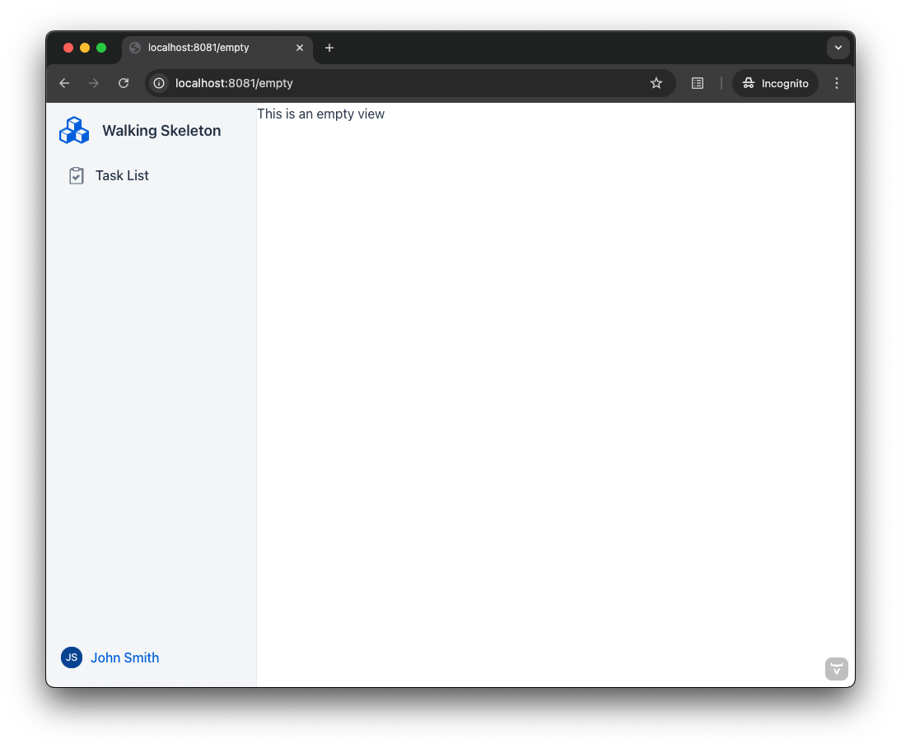
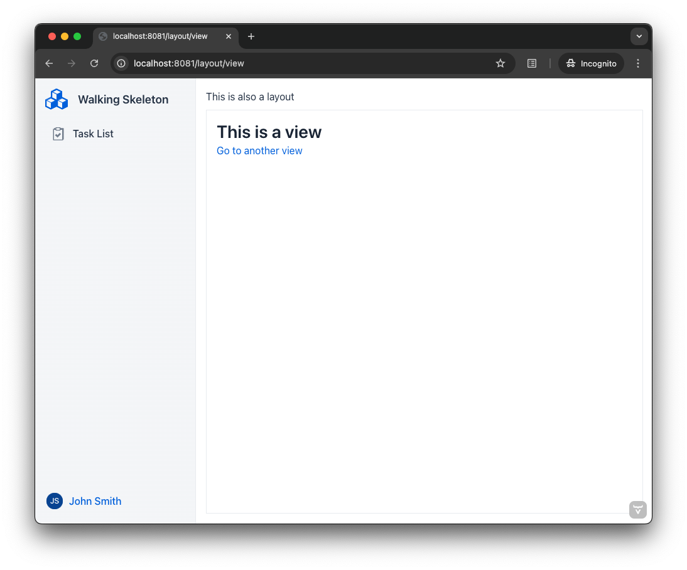

= Add a Router Layout

Most business applications have interface elements that remain visible across different views, such as a navigation menu, header, or footer. Instead of duplicating these elements on every view, you can use a _router layout_.

A router layout ensures that the router *renders views inside a predefined layout*, reducing redundancy. The screenshot below illustrates an empty view rendered within a router layout:

The router layout includes a sidebar with the application name, a navigation menu, and a user menu. Views are displayed in the white area on the right.

== Nested Layouts

Layouts can be nested within other layouts. The following screenshot demonstrates a view inside a router layout, which itself is inside another router layout:

Nested layouts are useful for creating primary-detail interfaces, among other use cases.

== Flow and React

You can implement router layouts in both Vaadin Flow and React. Additionally, Flow views can be rendered inside React layouts, and vice versa.

.Consistency Matters
[TIP]
If most of your application is built with Flow, implement the router layouts in Flow. If it's primarily in React, use React for router layouts. This ensures code consistency.

The following guides provide step-by-step instructions for implementing router layouts:

* <<flow#,Router Layouts in Flow>>
* <<react#,Router Layouts in React>>
