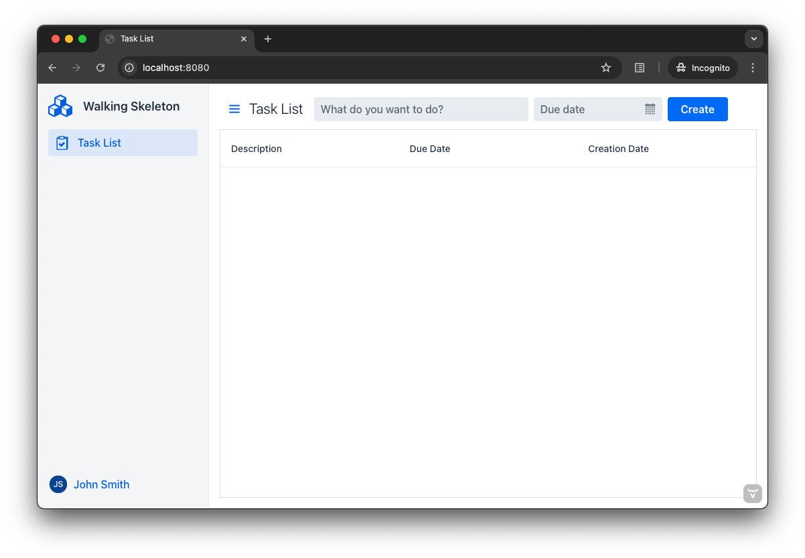
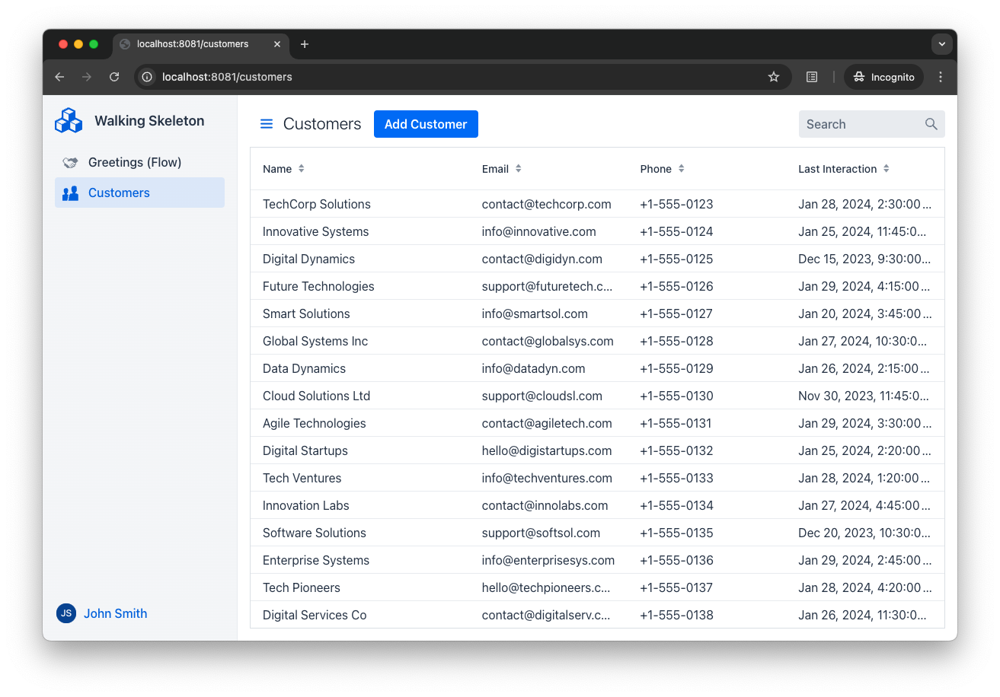

= Add a View

In a Vaadin application, a _view_ is a user interface component that forms a logical whole of the user interface. A page can contain other components than a view, but only one view at a time. Typically, the view takes up most of the page.

Each view is associated with its own URL path. When the user navigates from one view to another, the URL of the page changes. The mapping between a URL path and a view is called a _route_, where the view is the _target_ of the route.

[NOTE]
All routes must be unique to allow the routing logic to determine the view to render without any disambiguation. When conflicts are detected, the application fails to start and logs a message explaining the reason for the conflict.

In this screenshot, the visible view is the _root_ view. It is mapped to the `""` path:

In this screenshot, the visible view is mapped to the `"customers"` path:

You can write your views using either Flow and Java, or Hilla, React and TypeScript -- in the same application. The following guides show you how:

* <<flow#,Add a Flow View>>
* <<hilla#,Add a Hilla View>>
