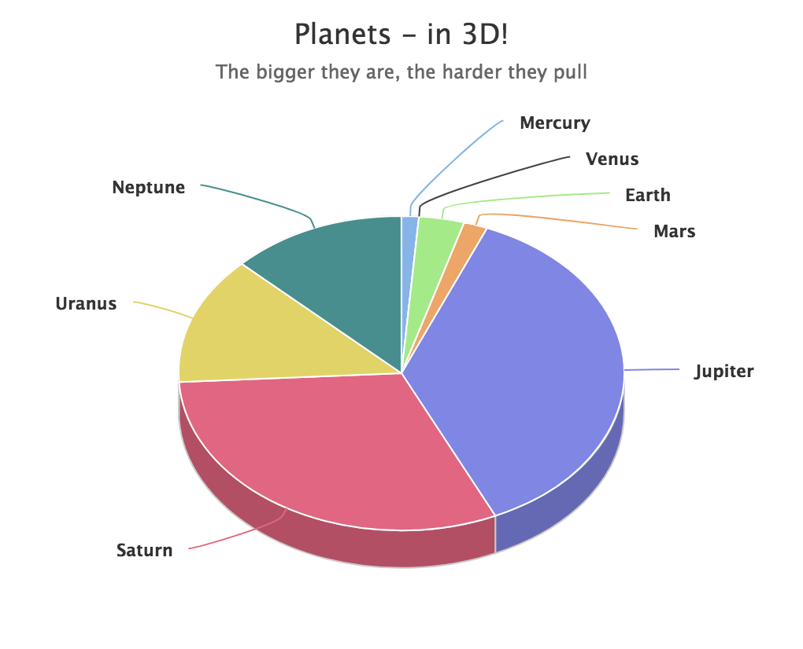
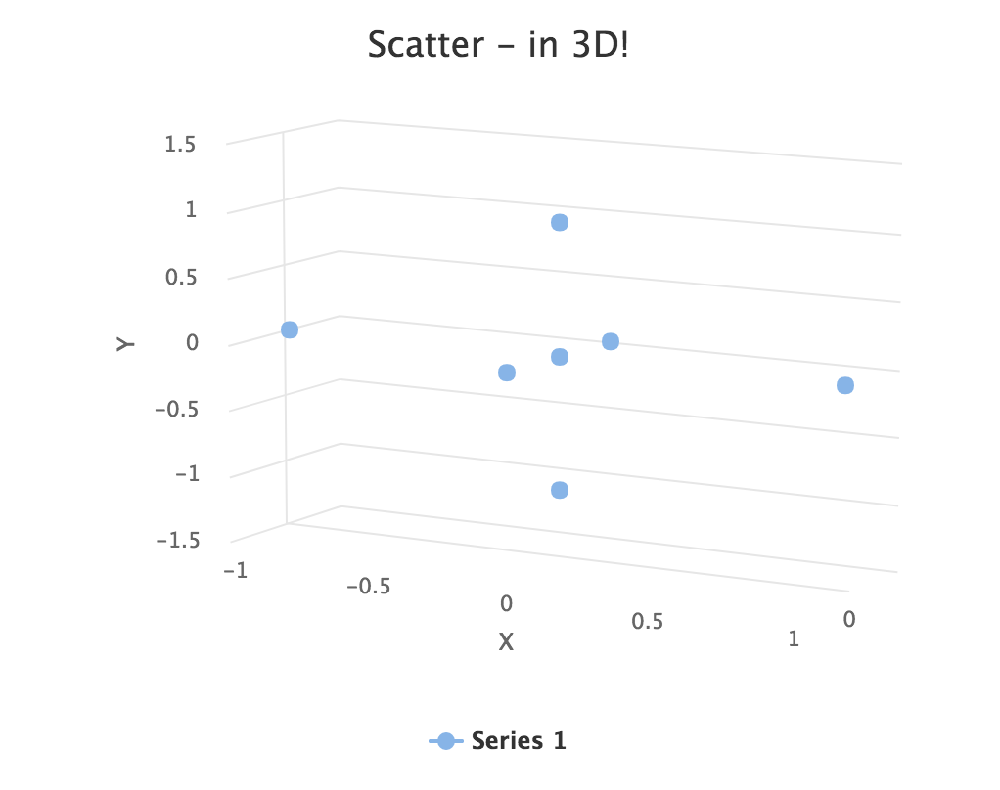
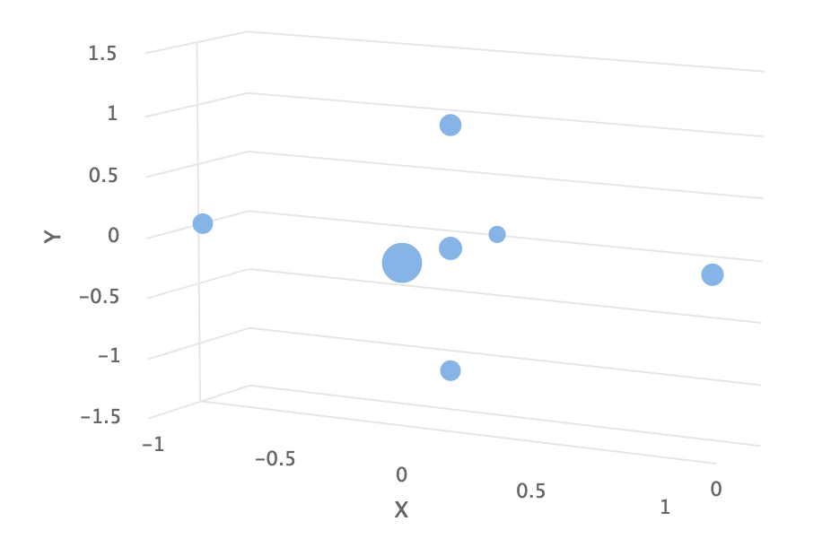

[[charts.charttypes.3d]]
= 3D Charts

Most chart types can be made 3-dimensional by adding 3D options to the chart. You can rotate the charts, set up the view distance, and define the thickness of the chart features, among other things. You can also set up a 3D axis frame around a chart.

[[figure.charts.charttypes.3d.pie]]
.3D Charts
[.fill.white]

[[charts.charttypes.3d.options]]
== 3D Options

3D view has to be enabled in the [classname]`Options3d` configuration, along with other parameters. As a minimum, to have some 3D effect, you need to rotate the chart according to the _alpha_ and _beta_ parameters.

Consider a basic scatter chart as an example. The basic configuration for scatter charts is described elsewhere, but consider how to make it 3D.

[source,java]
----
Chart chart = new Chart(ChartType.SCATTER);
Configuration conf = chart.getConfiguration();
... other chart configuration ...

// In 3D!
Options3d options3d = new Options3d();
options3d.setEnabled(true);
options3d.setAlpha(10);
options3d.setBeta(30);
options3d.setDepth(135); // Default is 100
options3d.setViewDistance(100); // Default
conf.getChart().setOptions3d(options3d);
----

The 3D options are as follows:

[parameter]`alpha`:: The vertical tilt (pitch) in degrees.
[parameter]`beta`:: The horizontal tilt (yaw) in degrees.
[parameter]`depth`:: Depth of the third (Z) axis in pixel units.
[parameter]`enabled`:: Whether 3D plot is enabled. The default is [parameter]`false`.
[parameter]`frame`:: Defines the 3D frame, which consists of a back, bottom, and side panels that display the chart grid.

[source,java]
----
Frame frame = new Frame();
Back back=new Back();
back.setColor(SolidColor.BEIGE);
back.setSize(1);
frame.setBack(back);
options3d.setFrame(frame);
----
[parameter]`viewDistance`:: View distance for creating perspective distortion. The default is 100.

[[charts.charttypes.3d.plotoptions]]
== 3D Plot Options

The above sets up the general 3D view, but you also need to configure the 3D properties of the actual chart type. The 3D plot options are chart-type-specific. For example, a pie has _depth_ (or thickness), which you can configure as follows:

[source,java]
----
// Set some plot options
PlotOptionsPie options = new PlotOptionsPie();
... Other plot options for the chart ...

options.setDepth(45); // Our pie is quite thick

conf.setPlotOptions(options);
----

[[charts.charttypes.3d.data]]
== 3D Data

For some chart types, such as pies and columns, the 3D view is merely a visual representation for one- or two-dimensional data. Some chart types, such as scatter charts, also feature a third, _depth axis_, for data points. Such data points can be given as [classname]`DataSeriesItem3d` objects.

The Z parameter is _depth_ and isn't scaled; there is no configuration for the depth or Z axis. You need to handle scaling yourself, as in the following.

[source,java]
----
// Orthogonal data points in 2x2x2 cube
double[][] points = { {0.0, 0.0, 0.0}, // x, y, z
                      {1.0, 0.0, 0.0},
                      {0.0, 1.0, 0.0},
                      {0.0, 0.0, 1.0},
                      {-1.0, 0.0, 0.0},
                      {0.0, -1.0, 0.0},
                      {0.0, 0.0, -1.0}};

DataSeries series = new DataSeries();
for (int i=0; i<points.length; i++) {
    double x = points[i][0];
    double y = points[i][1];
    double z = points[i][2];

    // Scale the depth coordinate, as the depth axis is
    // not scaled automatically
    DataSeriesItem3d item = new DataSeriesItem3d(x, y,
        z * options3d.getDepth().doubleValue());
    series.add(item);
}
conf.addSeries(series);
----

The example above defines seven orthogonal data points in the 2&times;2&times;2 cube centered at the origin. The 3D depth was set to 135 earlier. The result is illustrated in <<figure.charts.charttypes.3d.scatter>>.

[[figure.charts.charttypes.3d.scatter]]
.3D Scatter Chart
[.fill.white]

ifdef::web[]
[[charts.charttypes.3d.distance]]
== Distance Fade

To add a bit more 3D effect, you can do some tricks, such as calculate the distance of the data points from a viewpoint and set the marker size and color according to the distance.

[source,java]
----
public double distanceTo(double[] point, double alpha,
                         double beta, double viewDist) {
    final double theta = alpha * Math.PI / 180;
    final double phi   = beta * Math.PI / 180;
    double x = viewDist * Math.sin(theta) * Math.cos(phi);
    double y = viewDist * Math.sin(theta) * Math.sin(phi);
    double z = - viewDist * Math.cos(theta);
    return Math.sqrt(Math.pow(x - point[0], 2) +
                     Math.pow(y - point[1], 2) +
                     Math.pow(z - point[2], 2));
}
----

Using the distance requires some assumptions about the scaling and such, but for the data points (as defined earlier) in range -1.0 to +1.0, we could do as follows:

[source,java]
----
...
DataSeriesItem3d item = new DataSeriesItem3d(x, y,
    z * options3d.getDepth().doubleValue());

double distance = distanceTo(new double[]{x,y,z},
                             alpha, beta, 2);

Marker marker = new Marker(true);
marker.setRadius(1 + 10 / distance);
item.setMarker(marker);

series.add(item);
----

Here the view distance is in the scale of the data coordinates, while the distance defined in the 3D options has different definition and scaling. With the above settings, which are somewhat exaggerated to illustrate the effect, the result is shown in <<figure.charts.charttypes.3d.fade>>.

[[figure.charts.charttypes.3d.fade]]
.3D Distance Fade
[.fill.white]

endif::web[]
