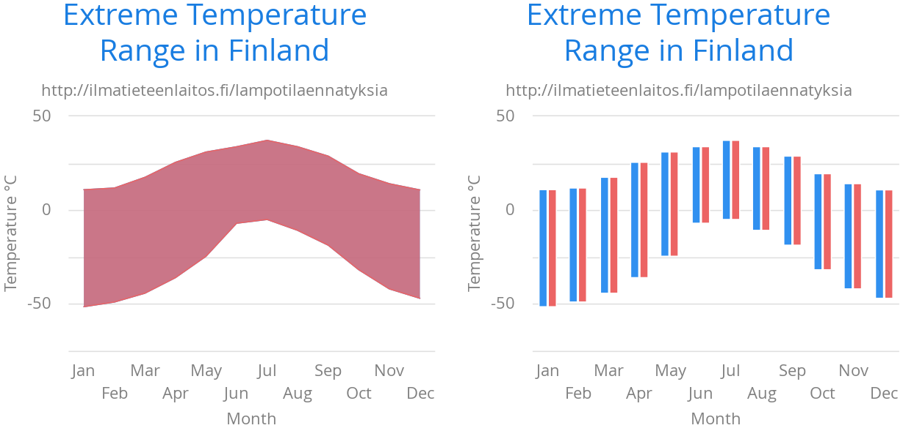

[[charts.charttypes.rangecharts]]
= Area & Column Range Charts

Ranged charts display an area or column between a minimum and maximum value, instead of a single data point. They require the use of [classname]`RangeSeries`, as described in <<../data#charts.data.rangeseries,"Range Series">>. An area range is created with the [parameter]`AREARANGE` chart type, and a column range with the [parameter]`COLUMNRANGE` chart type.

Consider the following example:

[source,java]
----
Chart chart = new Chart(ChartType.AREARANGE);

// Modify the default configuration a bit
Configuration conf = chart.getConfiguration();
conf.setTitle("Extreme Temperature Range in Finland");
...

// Create the range series
// Source: https://ilmatieteenlaitos.fi/lampotilaennatyksia
RangeSeries series = new RangeSeries("Temperature Extremes",
    new Double[]{-51.5,10.9},
    new Double[]{-49.0,11.8},
    ...
    new Double[]{-47.0,10.8});//
conf.addSeries(series);
----

The resulting chart, and the same chart with a column range, are shown in <<figure.charts.charttypes.rangecharts>>.

[[figure.charts.charttypes.rangecharts]]
.Area and Column Range Chart
[.fill.white]

== Area Range Example

[.example]
--
[source,typescript]
----
include::{root}/frontend/demo/component/charts/charttypes/chart-type-libraries.ts[preimport,hidden]
----

ifdef::flow[]
[source,java]
----
include::{root}/src/main/java/com/vaadin/demo/component/charts/charttypes/ChartTypeAreaRange.java[render,tags=snippet,indent=0,group=Flow]
----
endif::[]
--

== Column Range Example

[.example]
--
[source,typescript]
----
include::{root}/frontend/demo/component/charts/charttypes/chart-type-libraries.ts[preimport,hidden]
----

ifdef::flow[]
[source,java]
----
include::{root}/src/main/java/com/vaadin/demo/component/charts/charttypes/ChartTypeColumnRange.java[render,tags=snippet,indent=0,group=Flow]
----
endif::[]
--
