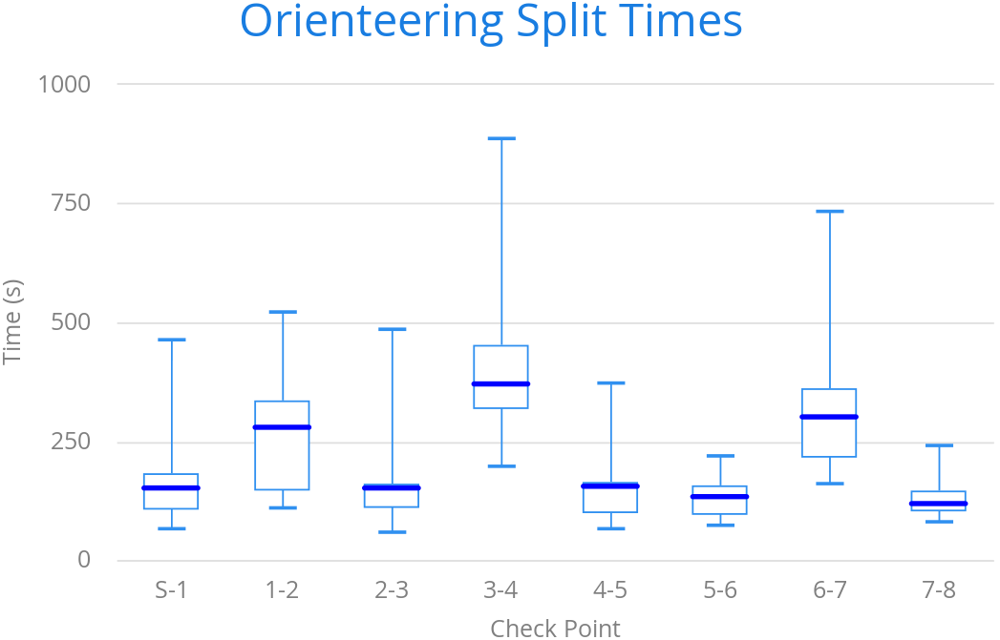

[[charts.charttypes.boxplot]]
= Box Plot Charts

Box plot charts display the distribution of statistical variables. A data point has a median, represented with a horizontal line, upper and lower quartiles, represented by a box, and a low and high value, represented with T-shaped "whiskers". The exact semantics of the box symbols are up to you.

Box plot chart is related to the error bar chart described in <<error-bars#charts.charttypes.errorbar,Error Bars>>, sharing the box and whisker elements.

[[figure.charts.charttypes.boxplot]]
.Box Plot Chart
[.fill.white]

The chart type for box plot charts is [literal]`++ChartType.BOXPLOT++`. You normally have only one data series, so it's meaningful to disable the legend.

[source,java]
----
Chart chart = new Chart(ChartType.BOXPLOT);

// Modify the default configuration a bit
Configuration conf = chart.getConfiguration();
conf.setTitle("Orienteering Split Times");
conf.getLegend().setEnabled(false);
----

[[charts.charttypes.boxplot.plotoptions]]
== Plot Options

The plot options for box plots have type [classname]`PlotOptionsBoxPlot`, which extends the more generic [classname]`PlotOptionsErrorBar`.

For example:

[source,java]
----
// Set median line color and thickness
PlotOptionsBoxplot plotOptions = new PlotOptionsBoxplot();
plotOptions.setWhiskerLength("80%");
conf.setPlotOptions(plotOptions);
----

[[charts.charttypes.boxplot.datamodel]]
== Data Model

As the data points in box plots have five different values instead of the usual one, they require you to use a special [classname]`BoxPlotItem`. You can give the different values with the setters, or all at once in the constructor.

[source,java]
----
// Orienteering control point times for runners
double data[][] = orienteeringdata();

DataSeries series = new DataSeries();
for (double cpointtimes[]: data) {
    StatAnalysis analysis = new StatAnalysis(cpointtimes);
    series.add(new BoxPlotItem(analysis.low(),
                               analysis.firstQuartile(),
                               analysis.median(),
                               analysis.thirdQuartile(),
                               analysis.high()));
}
conf.setSeries(series);
----

== Box Plot Example

[.example]
--
[source,typescript]
----
include::{root}/frontend/demo/component/charts/charttypes/chart-type-libraries.ts[preimport,hidden]
----

ifdef::flow[]
[source,java]
----
include::{root}/src/main/java/com/vaadin/demo/component/charts/charttypes/ChartTypeBoxPlot.java[render,tags=snippet,indent=0,group=Flow]
----
endif::[]
--
