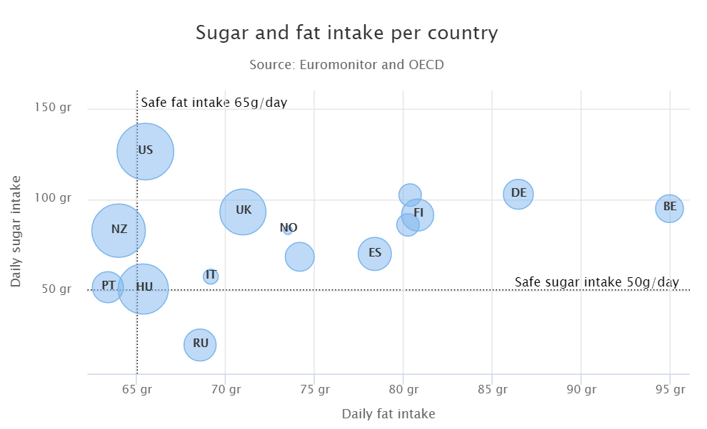

[[charts.charttypes.bubble]]
= Bubble Charts

Bubble charts are a special type of scatter chart for representing three-dimensional data points with different point sizes. <<scatter#charts.charttypes.scatter,Scatter charts>> can serve the same purpose, but bubble charts make it easier to define the size of a point by its third (Z) dimension, instead of the radius property. The bubble size is scaled automatically, similarly as for other dimensions. The default point style is also more bubbly.

[[figure.charts.charttypes.bubble]]
.Bubble Chart
[.fill.white]

The chart type of a bubble chart is [parameter]`ChartType.BUBBLE`. Its options can be configured in a [classname]`PlotOptionsBubble` object, which has a single, chart-specific property, [parameter]`displayNegative`, which controls whether bubbles with negative values are displayed at all.

More typically, you want to configure the bubble [parameter]`marker`. The bubble tooltip is configured in the basic configuration. The Z coordinate value is available in the formatter JavaScript with the [literal]`++this.point.z++` reference.

The bubble radius is scaled linearly between a minimum and maximum radius. If you would rather scale by the area of the bubble, you can approximate this by taking the square root of the Z values.

ifdef::web[]
[source,java]
----
// Create a bubble chart
Chart chart = new Chart(ChartType.BUBBLE);

// Modify the default configuration a bit
Configuration conf = chart.getConfiguration();
conf.setTitle("Sugar and fat intake per country");
conf.setSubTitle("Source: <a href=\"https://www.euromonitor.com/\">Euromonitor</a> and <a href=\"https://data.oecd.org/\">OECD</a>");
conf.getLegend().setEnabled(false); // Disable legend
conf.getTooltip().setHeaderFormat("{point.country}");
conf.getTooltip().setPointFormat("Obesity (adults): {point.z}%");

PlotOptionsBubble plotOptions = new PlotOptionsBubble();
DataLabels chartLabels = new DataLabels();
chartLabels.setEnabled(true);
chartLabels.setFormat("{point.name}");
plotOptions.setDataLabels(chartLabels);
conf.setPlotOptions(plotOptions);

public static class MyDataSeriesItem extends DataSeriesItem3d {
  private String country;

  public MyDataSeriesItem(Number x, Number y, Number z, String name, String country) {
    super(x, y, z);
    setName(name);
    this.country = country;
  }

  public String getCountry() {
    return country;
  }
}

DataSeries series = new DataSeries("Countries");
series.add(new MyDataSeriesItem(95.0, 95.0, 13.8, "BE", "Belgium"));
series.add(new MyDataSeriesItem(86.5, 102.9, 14.7, "DE", "Germany"));
series.add(new MyDataSeriesItem(80.8, 91.5, 15.8, "FI", "Finland"));
...

conf.addSeries(series);

// Set the category labels on the axis correspondingly
XAxis xaxis = new XAxis();
xaxis.setTitle("Daily fat intake");
xaxis.getLabels().setFormat("{value} gr");
PlotLine xPlotLine = new PlotLine();
xPlotLine.setValue(65);
Label xLabel = new Label("Safe fat intake 65g/day");
xLabel.setRotation(0);
xLabel.setY(15);
xPlotLine.setLabel(xLabel);
xaxis.setPlotLines(xPlotLine);
conf.addxAxis(xaxis);

// Set the Y axis title
YAxis yaxis = new YAxis();
yaxis.setMax(160);
yaxis.setTitle("Daily sugar intake");
yaxis.getLabels().setFormat("{value} gr");
yaxis.setStartOnTick(false);
yaxis.setEndOnTick(false);
PlotLine yPlotLine = new PlotLine();
yPlotLine.setValue(50);
Label yLabel = new Label("Safe sugar intake 50g/day");
yLabel.setX(-10);
yLabel.setAlign(HorizontalAlign.RIGHT);
yPlotLine.setLabel(yLabel);
yaxis.setPlotLines(yPlotLine);
conf.addyAxis(yaxis);
----
endif::web[]

== Bubble Example

[.example]
--
[source,typescript]
----
include::{root}/frontend/demo/component/charts/charttypes/chart-type-libraries.ts[preimport,hidden]
----

ifdef::flow[]
[source,java]
----
include::{root}/src/main/java/com/vaadin/demo/component/charts/charttypes/ChartTypeBubble.java[render,tags=snippet,indent=0,group=Flow]
----
endif::[]
--
