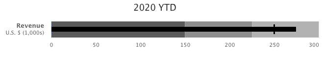

[[charts.charttypes.bullet]]
= Bullet Charts

Bullet charts display a value and a target value. They require the use of [classname]`DataSeriesItemBullet`.

<<figure.charts.charttypes.bullet>> shows a configured bullet chart.

[[figure.charts.charttypes.bullet]]
.Bullet Chart
[.fill.white]

The chart type of a bullet chart is [parameter]`ChartType.BULLET`. Its options can be configured in a [classname]`PlotOptionsBullet` object.

ifdef::web[]
[source,java]
----
// Create a bullet chart
Chart chart = new Chart(ChartType.BULLET);
chart.setHeight("115px");

// Modify the default configuration
Configuration conf = chart.getConfiguration();
conf.setTitle("2020 YTD");
conf.getChart().setInverted(true);
conf.getLegend().setEnabled(false);
conf.getTooltip().setPointFormat(
        "<b>{point.y}</b> (with target at {point.target})");

// Add data
PlotOptionsBullet options = new PlotOptionsBullet();
options.setPointPadding(0.25);
options.setBorderWidth(0);
options.setColor(SolidColor.BLACK);
options.getTargetOptions().setWidth("200%");
DataSeries series = new DataSeries();
series.add(new DataSeriesItemBullet(275, 250));
series.setPlotOptions(options);
conf.addSeries(series);

// Configure the axes
YAxis yAxis = conf.getyAxis();
yAxis.setGridLineWidth(0);
yAxis.setTitle("");
yAxis.addPlotBand(new PlotBand(0, 150, new SolidColor("#666666")));
yAxis.addPlotBand(new PlotBand(150, 225, new SolidColor("#999999")));
yAxis.addPlotBand(new PlotBand(225, 9e9, new SolidColor("#bbbbbb")));
conf.getxAxis().addCategory(
        "Revenue U.S. $ (1,000s)");

----
endif::web[]

== Bullet Example

[.example]
--
[source,typescript]
----
include::{root}/frontend/demo/component/charts/charttypes/chart-type-libraries.ts[preimport,hidden]
----

ifdef::flow[]
[source,java]
----
include::{root}/src/main/java/com/vaadin/demo/component/charts/charttypes/ChartTypeBullet.java[render,tags=snippet,indent=0,group=Flow]
----
endif::[]
--
