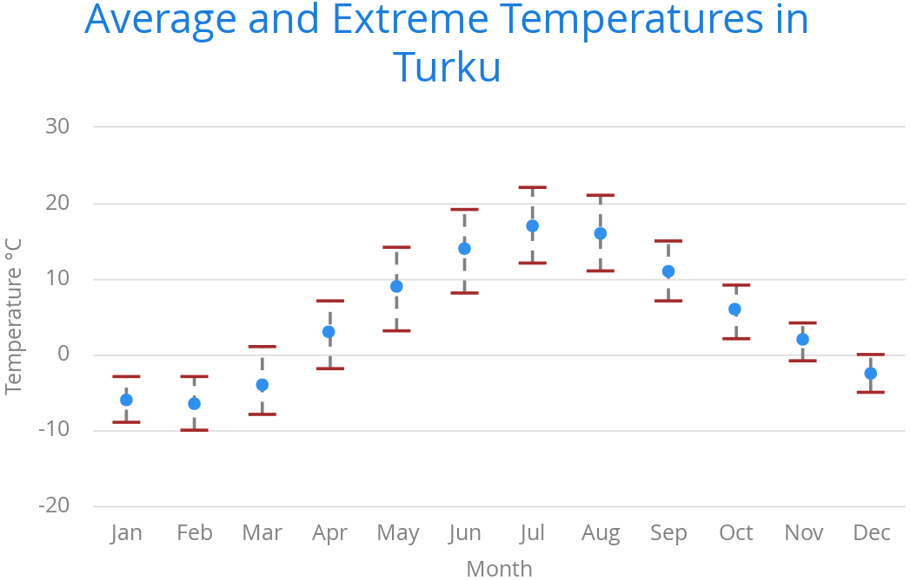

[[charts.charttypes.errorbar]]
= Error Bars

Error bars visualize errors, or high and low values, in statistical data. They typically represent high and low values in data, or a standard deviation, a percentile, or a quantile. The high and low values are represented as horizontal lines, or "whiskers", connected by a vertical stem.

Although error bars are technically a chart type ([literal]`++ChartType.ERRORBAR++`), you normally use them together with some primary chart type, such as a scatter or column chart.

[[figure.charts.charttypes.errorbar]]
.Error Bars in a Scatter Chart
[.fill.white]

To display the error bars for data points, you need to have a separate data series for the low and high values. The data series needs to use the [classname]`PlotOptionsErrorBar` plot options type.

[source,java]
----
// Create a chart of some primary type
Chart chart = new Chart(ChartType.SCATTER);

// Modify the default configuration a bit
Configuration conf = chart.getConfiguration();
conf.setTitle("Average Temperatures in Turku");
conf.getLegend().setEnabled(false);

// The primary data series
ListSeries averages = new ListSeries(
    -6, -6.5, -4, 3, 9, 14, 17, 16, 11, 6, 2, -2.5);

// Error bar data series with low and high values
DataSeries errors = new DataSeries();
errors.add(new DataSeriesItem(0,  -9, -3));
errors.add(new DataSeriesItem(1, -10, -3));
errors.add(new DataSeriesItem(2,  -8,  1));
...

// Need to be used for series to be recognized as error bar
PlotOptionsErrorbar barOptions = new PlotOptionsErrorbar();
errors.setPlotOptions(barOptions);

// The errors should be drawn lower
conf.addSeries(errors);
conf.addSeries(averages);
----

You should add the error bar series first, to have it rendered lower in the chart.

[[charts.charttypes.errorbar.plotoptions]]
== Plot Options

Plot options for error bar charts have type [classname]`PlotOptionsErrorBar`. See the API documentation for details of the plot options.

NOTE: Although most <<../styling#css.styling,visual styles are defined in CSS>>, some options, such as [parameter]`whiskerLength`, are set through the Java API.

== Error Bar Example

[.example]
--
[source,typescript]
----
include::{root}/frontend/demo/component/charts/charttypes/chart-type-libraries.ts[preimport,hidden]
----

ifdef::flow[]
[source,java]
----
include::{root}/src/main/java/com/vaadin/demo/component/charts/charttypes/ChartTypeErrorBar.java[render,tags=snippet,indent=0,group=Flow]
----
endif::[]
--
